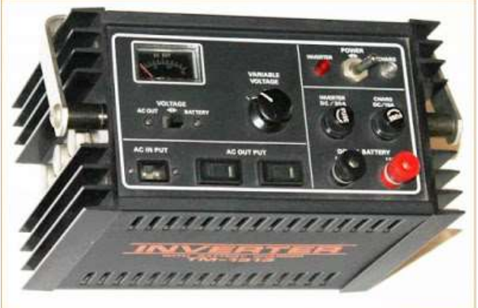
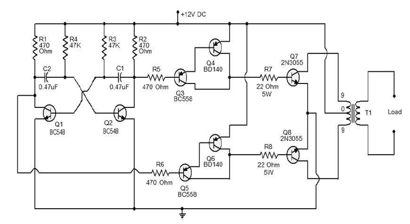
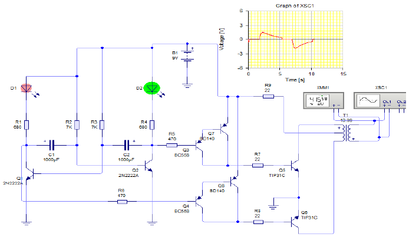
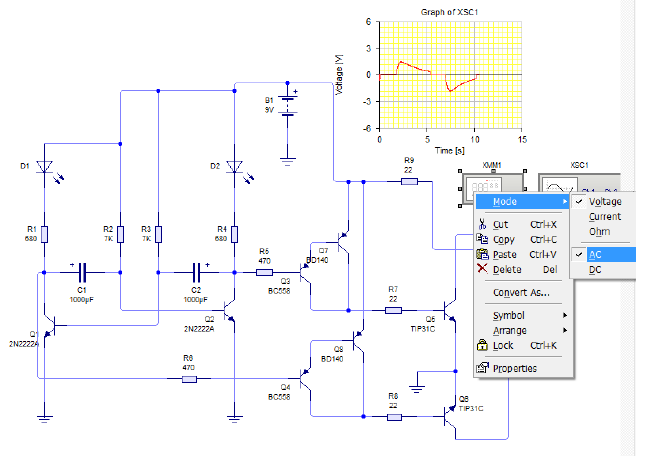
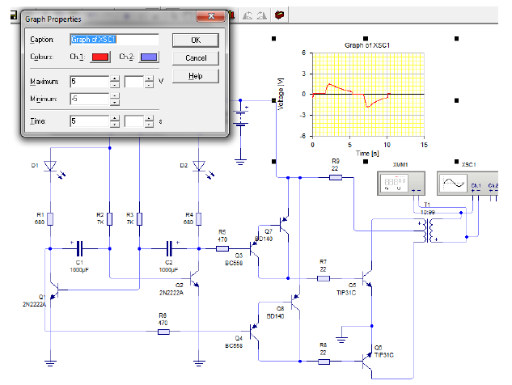

## Cara Ukur Inventer DC ke AC

## Inventer

Rectifier (adaptor) adalah perangkat elektronik  yang digunakan untuk mengubah AC ke DC.

Inventer adalah perangkat elektronik yang digunakan untuk mengubah DC ke AC.

## Apa itu Inventer DC ke AC?

Inventer DC ke AC dirancang untuk mengubah catu daya DC menjadi catu daya AC.

Catu daya DC sebagai sumber tegangan positif, menggunakan transformator dan perangkat switching yang diaktifkan oleh osilator.

Karena terdapat aliran arus bolah-balik (input) pada kumparan primer transformator, maka pada kumparan sekunder transformator menghasilkan sinyal arus bolak-balik pula (output).

Inventer untuk mengubah catu daya DC menjadi catu daya AC.

## Bagaimana Rangkaian Inventer DC ke AC?

Rangkaian inventer DC ke AC menggunakan Transistor. Fungsi dasar dari rangkaian inventer adalah untuk menghasilkan osilasi dengan DC yang dilewatkan melalui transformator primer.

Komponen R1, R2, R3, R4, C1, C2, Q1, dan Q2 merupakan rangkaian osilator yang digunakan untuk membankitkan frekuensi, sinyal frekuensi dari osilator tersebut dikuatkan dayanya oleh transistor Q7 dan Q8.

Penguatan gelombang ini nanti diumpankan kepada gulungan traffo step-up jenis CT (center tape) input dari tegangan sumber.

## Aplikasi Inventer DC ke AC

Aplikasi rangkaian inventer DC ke AC meliputi yang berikut ini : 

1. Inventer DC ke AC digunakan untuk mengerakan motor AC.
2. Rangkaian Inventer terutama digunakan untuk menggerakkan motor AC.
3. Rangkaian Inventer bisa digunakan dalam sistem listrik tenaga surya.

## Mangukur Tegangan dan Frekuensi Inventer

