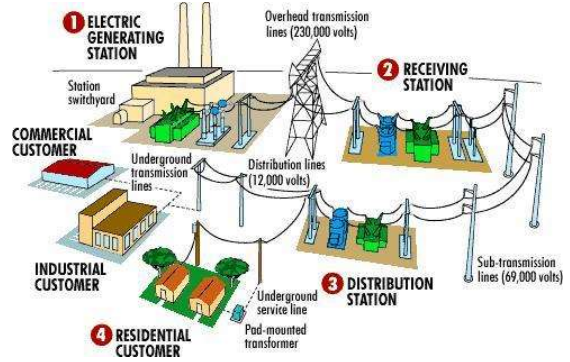
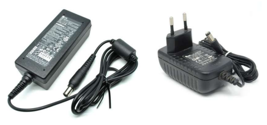
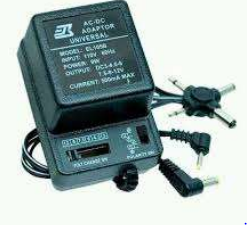
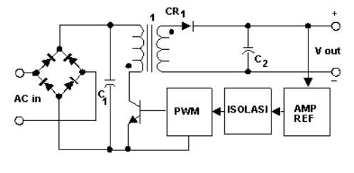
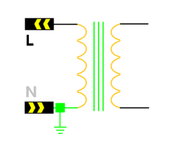
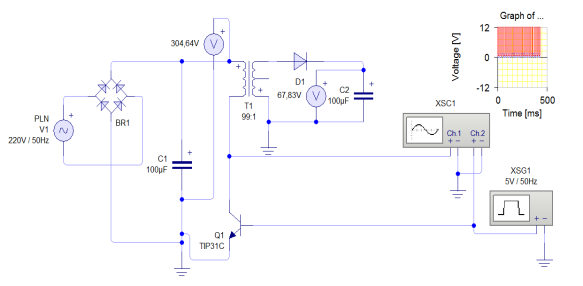
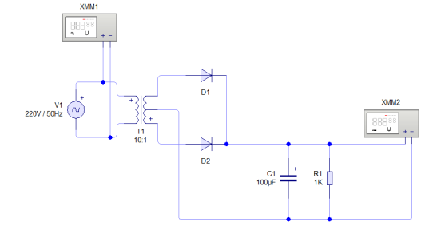

# Cara Mengukur Arus AC dan Dc

## Pembangkit Listrk (Generator)

Generator adalah alat yang berfungsi mengubah energi gerak (Mekanik) menjadi energi listrk. Arus listrik `Alternating Current (AC)` dihasilkan dari hasil induksi elektromagnetik, sebuah lilitan kawat yang berdekatan dengan kutub magnet permanen.
PT Indonesia Powet Unit Bisnis Pembangkitan Semarang beralamat di Ronggowarsito Pelabuhan Tanjung Emas Tanjungmas memiliki kapasitas 1468 MW mencakup Pembangkit Listrik Tenaga Uap (PLTU), Gas (PLTG) serta Gas dan Uap (PLTGU)

## Sistem ditribusi tenaga listrik

Sistem distribusi tenaga listrik mengubungkan pusat pembangkit listrik (1) denan konsumen (4) melalui jaringan distribusi tenaga listrik (2) & (3)\

## Arus **Alternating Current (AC)**

Arus mengalir berubah arah (bolak-balik) setiap detik. Tegangan PLN mempunyai frekuensi 50 Hz berati arus mengalir berubah arah setiap 50 kali dalam satu detik

## Kebutuhan Arus **Direct Current (DC)**

Perangkat yang membutuhkan tegangan DC.\

 \
 

## Arus **Direct Current (DC)** atau Arus satu arah

Arus mengalir atu arah setiap detik. Tegangan ACCU mempunyai frekuensi 0Hz berati arus mengalir satu arah setiap detik.

## Inverter

Tegangan DC dialirkan sambung-putus ke Kumparan sehingga mampu menginduksi medan elektromagnetik unuk menurunkan tegangan\

## Transformator

Kumparan yang mampu menginduksi medan elektromagnetik unutk menurunkan tegangan.\

## **Alternating Currunt (AC)** dirubah menjadi **Direct Current (DC)** menggunakan **Inverter**

Adaptor atau power suplay\

## **Alternating Currunt (AC)** dirubah menjadi **Direct Current (DC)** menggunakan **Transformator**

Adaptor atau power suplay\

