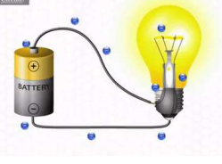
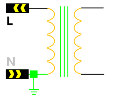
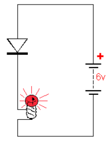
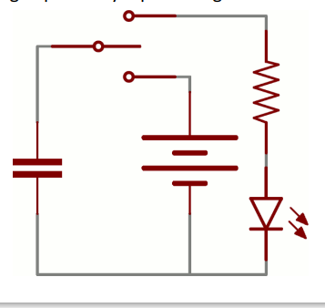
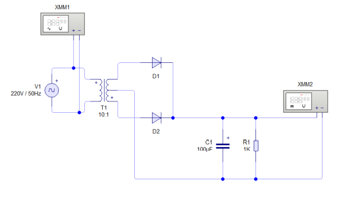

# Cara Mengukur Tegangan pada Adaptor

## Adoptor mensuply arus satu arah Direct Current (DC).

Perangkat yang mensuply Arus searah (DC)

## Arus Direct Current (DC) atau Arus satu arah

Arus mengalir satu arah setiap detik. Tegangan ACCU mempunyai frekuensi 0Hz berati arus mengalir satu arah setiap detik.

## Transformator

**Michael Faraday** 22 September 1791 Newington Butts, Inggris Faraday melilitkan dua kumparan kabel yang terpisah dan menemukan bahwa kumparan pertama dilalui oleh arus maka menghasilkan meda listrik sehingga kumparan kedua mengalirkan arus pula. inilah dikenal sebagai induksi timbal-balik.
Hukum Faraday bahwa "*Perubahan pada medan magnet dapat menghasilkan medan listrik*". Kumparan pertama dialui oleh arus maka menghasilkan medan listrik sehingga kumparan kedua mengalirkan arus pula.

## Dioda

**Karl Ferdinand Braun** Diode kristal ditemukan pada tahun 1874 oleh peneliti Jerman, Karl Ferdinand Braun. Pada waktu penemuan, peranti seperti ini dikenal sebagai penyearah (*rectifier*). Pada tahun 1919, Wiliam Henry Eccles memperkenalkan istilah diode yang berasal dari `di` berati dua, dan `ode` berati jalur.
Diode adalah komponen semikonduktor yang melikan arus listrik ke satu arah dan menghambat arus dari arah sebaliknya.

## Kapasitor

KApasitor pertamakali dibuat pada tahun 1745 oleh ilmuwan Jerman **Ewald Georg von Kleist** dan secara terpisah juga dibuat oleh ilmuwan Belanda **Piter van Musschenbroek** pada tahun 1746. Pieter van Musschenbroek membuat kapasior pertamanya di universitas Layden (*Universitiy og Leyden*) dan menamakannya dengan kapasitor Layden.

Kapasitor elektoit almunium terpolarisasi elektroda anoda (+) yang terbuat dari almunium foil murni yang membentuk lapisan isolasi dari oksida. Elektroid cair menutupi permukaan lapisan oksida sebagai elektorida katoda (-).

Kondensator atau sering disebut sebagai kapasitor adalah suatu bahan/alat yang dapat menyimpan energi listrik.

## Resistor

Resistor dibuat oleh seorang Georg Simon Ohm (lahir 1789) dari kota Erlanga di Bavaria Jerman.
Resistor adalah kompnen elektronika yang berfungsi unutk menghambar atau membatasi aliran listrik yang mengalir.

## Mengukur Tegangan pada Transformator

