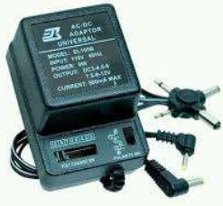
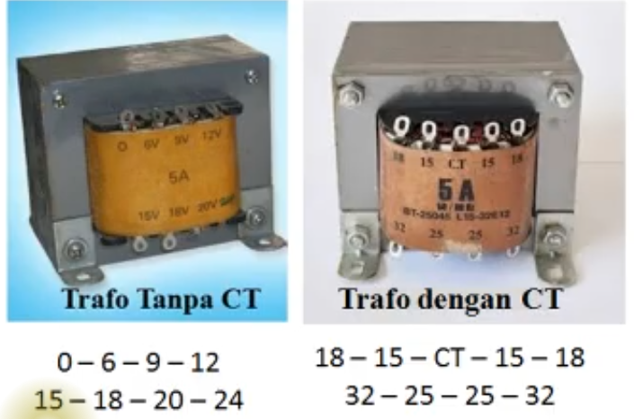
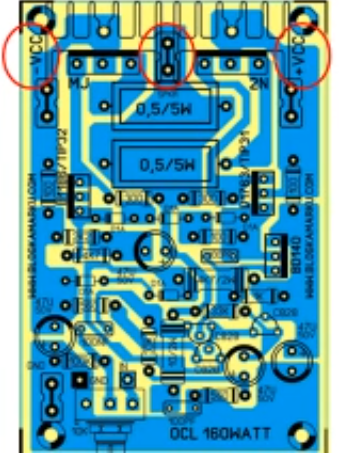
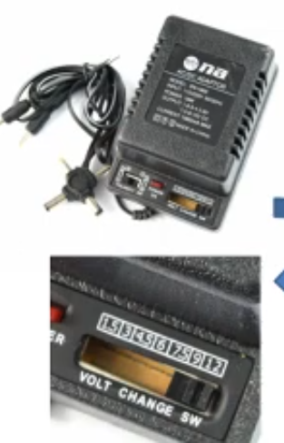
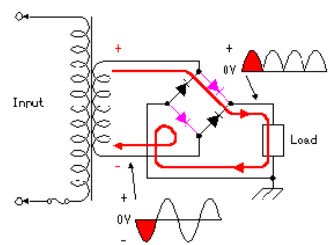
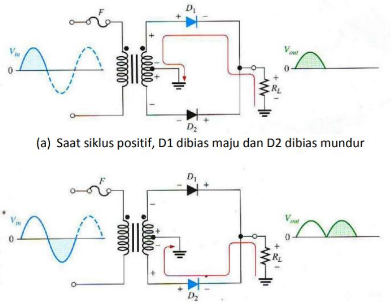
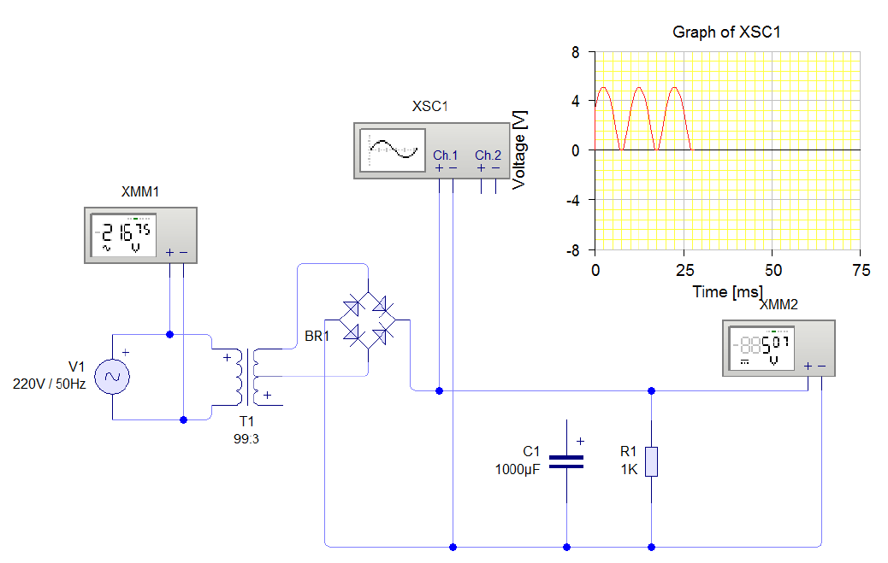

# Cara Mengukur Tegangan Adaptor Trafo CT & Non CT

## Adaptor mensuplay arus satu arah Direct CUrrent (DC)

perangkat yang mensuplay Arus Searah (DC)

Trafo Non Center Tape dan Center Tape.

**Trafo Center Tape** diperlukan untuk power suplay tegangan sistematis / sama besar pada Amplifier Output Capasitor Less.

**Trafo Non Center Tape** diperlukan untuk power suplay tegangan bervariasi.

Adaptor meyearahkan arus Alternating CUrrent (AC) menjadi arus Direct CUrrent (DC) pada trafo Non-Center Tape.

Adaptor menyearahkan arus Alternating CUrrent (AC) menjadi arus Direct CUrrent (DC) pada trafo Center Tape

## Mengukur Tegangan pada Transformator

Adaptor atau power suplay menggunakan trafo Center Tape

