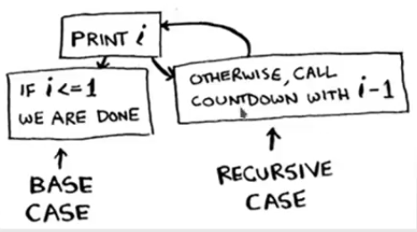

# Chapeter 03. Recursion

## Chapeter Overview

- You learn about recursion. It's a building block for understanding leter chapters in this book.
- You learn how to break a problem down into a base case and a recursive case.
- This chapter also includes a lot of pseudocode.
- Pseudocede is a high-level desciption of the problem you're trying to solve in code.
- It's written like code, but it's meant to be closer to human speech.

## Recursion

- Suppose you're digging through your grandma's attic and come across a mysterious loked suitcase.
- Grandma tells you that the key for the suitcase is probably in this othter box.
- This box contain more boxes, with more boxes inside those boxes.
- The key is in a box somewhere. What's your algorithm to search for the key?
- Think of an algorithm before you read.

### Approach 1

1. Make a pile of boxes to look through.
2. Grab a box, and look through it.
3. If you find a box, add it to the pile to look through later.
4. If you find a key, you're done!
5. Repeat.

### Approach 2

1. Look through the box.
2. If you find a box, go to step 1.
3. If you find a key, you're done!

## Loop vs Recursion

- Which approach seems easier to you?
- The first approach uses a while loop.
- While the pile isn't empty, grap a box and look through it:

```python
def loop_for_key(main_box):
  # This is pseudocode
  pile = main_box.make_a_pile_to_look_trough()
  while pile in not empty:
    box = pile.grap_a_box()
    for item in box:
      if item.is_a_box():
        pile.append(item)
      elif item.is_is_a_key():
        print('Found the key')
```

---

- The second way uses **recursion**
- Recursion is where a function calls itself.
- Here's the second way in pseudocode:

```python
def loop_for_key(box):
  # THis is pseudocode
  for item in box:
    if item.is_a_box():
      loop_for_key(item)
    elif item.is_a_key():
      print('Found the key')
```

---

- Both approachs accomplish the same thing, but the second approach is clearer to me.
- Recursion is used when it make the solution clearer.
- There's no performance benefit to using recursion; in fact, loops are somtimes better for performance.
- Many important algorithms use recursion, so it's important to understand the concept.

## Base case and recursion case

- Because a recursive function calls itself, it's easy to write a function incorrectly that ends up in an **infinite loop**.
- For example, suppose you want to write a function that prints a countdown, like this :\

`3...2...1`

- You can write it recursively, like so:

```python
def countdown(i):
  print(i)
  countdown(i-1)
```

---

- Write out this code and run it. You'll notice a problem: this function will run forever!

`3...2...1...0...-1...-2...-3`

---

- When you write a recursive function, you have to tell it when to stop recursing.
- That's why every recursive function has to parts: the **base case**, and the **recursive case**.
- The recursive case is when the function calls ifself.
- The base case is when the function doesn't call itself again; so it doesn't go into an infinite loop.

---

- Let's add a base case to the countdown function:

```python
def countdown(i):
  print(i)
  if i <= 0 :
    # Base case
    return
  else :
    # Recursive base
    return countdown(i - 1)
```
- Now the function works as expected. It does sometging like this.

\


