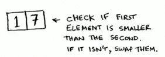
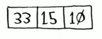
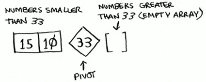
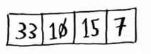
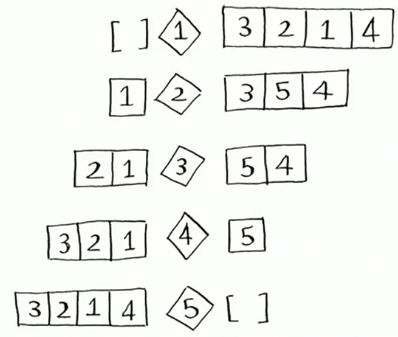
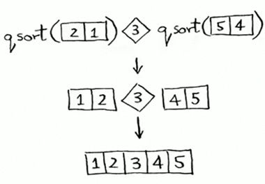
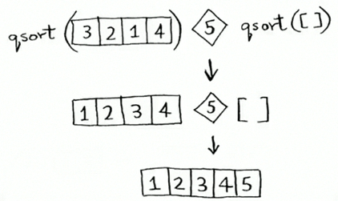

# Mengenal Quicksort

## Quicksort

- Quicksort is a sorting algorithm. It's much faster than selection sort and is frequently used in real life.
- Quicksort also uses D&C.
- Let's use quicksort to sort an array.
- What's the simplest array that a sorting algorithm can handle (remember my tip from previous section)?
- Well, some array don't need to be sorted at all.
- 

---

- Empty arrays and arrays with just one element will be the base case.
- You just return those arrays as is there's nothing to sort:

```python
def quicksort(arr):
  if len(arr) < 2:
    return arr
```

---

- Let's look at bigger arrays.
- An array with two elements is pretty easy to sort, too.
- 
- What about an array of three elements?
- 
- [33, 15, 10]

---

- Remember, you're using D&C. So you want to break down this array until you're at the base case. Here's how quicksort works.
- First, pick an element from the array. This element is called the **pivot**.
- We'll talk about how to pick a goot pivot later. For now, let's say first item in the arrays is the pivot.

---

- Now find the elements smaller than the pivot and the elements larger than the pivot.
- 
- [15, 10, 33]
- This is called partitioning. Now you have:
  * A sub-array of all the numbers less than the pivot.
  * The pivot.
  * A sub-array of all the numbers greater than the pivot.

---

- The two sub-arrays aren't sorted. They're just partitioned.
- Buf if they were sorted, then sorting the whole array would be pretty easy.
- If the sub-arrays are sorted, then you an combine the whole thing like this **left array + pivot + right array** and you get a sorted array.
- In this case, it's [10, 15] + [33] + [] = [10, 15, 33], which is a sorted array.
- 

---

- How do you sort the sub-arrays? Well, the quicksort base case already knows how to sort arrays of two elements (the left sub-array) and empty arrays (the right sub-array).
- So if you call quicksort on the two sub-arrays and then combine the results, you get a sorted array!
- `quicksort([15, 10]) + [33] + quicksort([])`
- `> [10, 15, 33]`

---

- This will work with any pivot. Suppose you shoose 15 as the pivot instead.
- 
- Both sub-arrays have only one element, and you know how to sort those.
- So now you know to sort an array of three elements. Here are the steps:
  * Pick a pivot.
  * Partition the array into two sub-arrays: elements less than the pivot and elements greater than the pivot.
  * Call quicksort recursively on the two sub-arrays.

---

- What about an array of four elements ? 
- [33, 10, 15, 7]
- 
- Suppose you choose 33 as the pivot again.
- 
- The array on the left has three elements. You already know how to sort an array of three elements: call quicksort on it recursively.

---

- So you can sort an array of four elements.
- And if you can sort an array of four elements, you can sort an array of five elements.
- Suppose you have this array of five elements.
- [3, 5, 2, 1, 4]
- Here are all the ways you can partition this array, depending on what pivot you choose.
- 
- Notice that all of those sub-arrays have somewhere between 0 and 4 emlements.
- And you already khow how to sort an array of 0 to 4 elements using quicksort!
- So no matter what pivot you pick, you can call quicksort recursively on the two sub-arrays.

---

- For example, suppose you pick 3 as the pivot. You call quick sort on the sub-arrays.
- 

---

- The sub-arrays get sorted, and then you combine the hole thing to get a sorted array.
- This works even if you choose 5 as the pivot.
- 
- This works with anya elements as the pivot. So you can sort an array of five elements.

---

- Here's the code for quicksort.

```python
def quicksort(arr):
  if len(arr) < 2:
    # Base case: arrays with 0 or 1 element are already "sorted".
    return arr
  else:
    # recursive case
    pivot = array[0]
    # Sub-array of all the elements less than the pivot
    less = [i for i in arr[1:] if i <= pivot]
    # Sub-array of all the elements greater than pivot
    greater = [i for i in arr[1:] if i > pivot]
    return quicksort(less) + [pivot] + quicksort(greater)

print(quicksort([10, 3, 1, 9]))
## 1, 3, 9, 10
```


