## Chapter Overview

- We continue the discussion of graphs, and you learn about weighted graphs: a way to assign more or less weight to some edges.
- You learn Djikstra's algorithm. which let's you answer "What's the shortest path to X?" for weighted graphs.
- You learn about cycles in graphs, where Djikstra's algorithm doesn't work.

## Background

- In the last chapter, you figured out a way to get from point A to point B.
- 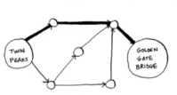
- It's not necessarily the fastest path.
- It's the shortest path, because it has the latest number of segments (three segments).

---

- But suppose you add travel times to those segments. Now you see that there's a fastest path.
- 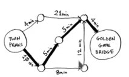
- You used breadth-first search in the last chapter. Breadth-first search will find you the path with fewest segments (the first graph shown here).
- What if you want the fastest path instead (the second graph)? You can do that fastest with different algorithm called **Djikstra's algorithm**.

## Working with Djikstra's algorithm

- Let's see how it works with this graph.
- 
- Each segment has a travel time in minutes.
- You'll use. Djikstra's algorithm to go from start to finish in the shortest possible time.

---

- If you ran breadth-first search on this graph, you'd get this shortest path.
- 
- But that path takes 7 minutes.
- Let's see if you can find a path that takes less time.

---

There are four steps to Djikstra's algorithm:

- Find the "cheapest" node. This is the node you can get in the least amount of time.
- Update the cost of the neighbors of this node.
- Repeat until you've done this for every node in the graph.
- Calculate the final path.

## Step 1

- Find the cheapest node.
- You're standing at the start, wondering if you should go to node A or node B.
- How long does it take to get to each node?
- 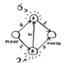
- It takes 6 minutes to get to node A and 2 minutes to get to node B.
- The rest of the nodes, you don't know yet.
- Because you don't how log it takes to get to the finish yet, you put down infinity (you'll see why soon)
- Node B is the closet node ... it's 2 minutes away.

## Step 2

- Calculate how long it takes to get to all of node B's neighbors by following an edge from B.
- 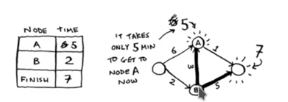
- Hey, you just found a shorter path to node A! it used to take 6 minutes to get to node A.
- 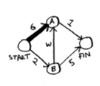
- But if you go through node B, there's a path that only takes 5 minutes!

## Step 3

Step 1 again:

- Find the node that takes the least amount of time to get to.
- You're done with node B, so node A has the next smallest time estimated
- 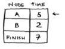

---

Step 2 again:

- Update the cost for node A's neighbors
- Woo, it takes 6 minutes to get to the finish now!
- You've run Dijkstra's algorithm for every node (you don't need to run it for the finish node).
- At this point, you know:

  - It takes 2 minutes to get to node B.
  - It takes 5 minutes to get to node A.
  - It takes 6 minutes to get to the finish.
  
## Step 4

- I'll save the last step, calculating the final path.
- For now, I'll just show you what the final path is.
- 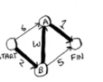 
- Breadth-first search wouldn't have found this as the shortest path, because it has three segments.
- And there's a way to get from the start to the finish in two segments.
- 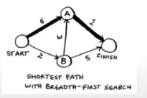 

## Recap: Dijkstra's algorithm

- In the last chapter, you used breadth-first search to find the shortest path between two point.
- Back then, "shortest"
- But in Dijkstra's algorithm, you assign a number or weight to each segment.
- Then Dijkstra's algorithm find the path with whe smallest total weight.
- 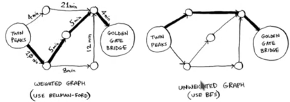 

---

To recap, Dijkstra's algorithm

- Find the cheapest node. This is the node you can get to in the least amount of time.
- Check whether there's cheaper path to the neighbors of this node. If so, update their costs.
- Repeat until you've done this for every node in the graph.
- Calculate the final path. (Coming up in the next solution!)

## Terminology

- When you work with Dijkstra's algorithm, each edge in the graph has a number associated with it.
- These are called **weight** 
- 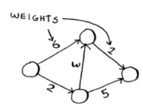 

---

- A graph with weight's is called a **weighted graph**.
- A graph without weights is called an **unweighted graph**.
- 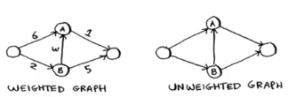 
- To calculate the shortest path in an **unweighted graph**, use **breadth-first search** .
- To calculate the shortest path in a **weighted graph**, use **Dijkstra's algorithm**.

---

- Graphs can also have cycles. A cycle looks like this.
- 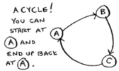
- It means you can start at a node, travel around, and end up at the same node.

---

- Suppose you're trying to find the shortest path this graph that has a cycle.
- 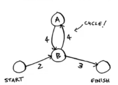 
- Would it make sense to follow the cycle? Well, you can see use the path that avoids the cycle.
- 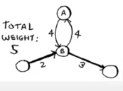 

---

- Or you can follow the cycle.
- 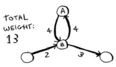 
- You end up at node A either way, but the cycle adds more weight.

---

- You could even follow the cycle twice if you wanted.
- 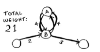 
- But every time you follow cycle, you're just adding 8 to the total weight.
- So following the cycle will never give you the shortest path.

---

- Finally, remember our conversation about **directed** versus **undirected** graphs from chapter 6? 
- 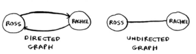 
- An undirected graph means that nodes point to each other. That's a **cycle**!
- 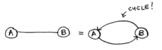 
- With an undirected graph, each edge adds another cycle.
- Dijkstra's algorithm only works with **directed acyclic graphs**, called **DAGs** for short.

## Trading for a piano

- Enough terminology, let's look at another example! This is Rama.
- Rama is trying to trade a music book for a piano.

---

- "I'll give you this poster for your book," says Alex. "it's poster of my favorite band, Destroyer. Or I'll give you this rare LP of Rick Astley for you book and $5 more."
- "Ooh, I've heard that LP has a really great song," says Amy. "I'll trade you my guitar or drum set for the poster or the LP."
- "I've been meaning to get into guitar!" exclainms Beethoven. "Hey, I'll trade you my piano for either of Amy's things."

---

- Perfect! With a little bit of money, Rama can trade his way from a piano book to a real piano.
- Now he just needs to figure out how to spend the least amount of money to make those trades.
- Let's graph out what he's been offered.
- 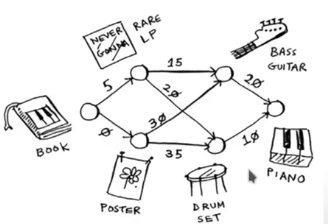

---

- In this graph, the nodes are all the items Rama can trade for.
- The weights on the edges are the amount of money he would have to pay to make the trade.
- So he can trade the poster for the guitar for $30, or trade the LP for the guitar for $15.
- How is Rama going to figure out the path from the book to the piano where he spends the least dough?
- Dijkstra's algorithm to the rescue! Remember, Dijkstra's algorithm has four steps.
- In this example, you'll do all four steps, so you'll calculate the final path at the end, too.

---

- Before you start, you need some setup.
- Make a table of the cost for each node.
- The cost of a node is how expensive it is to get to.
- 
- You'll keep updating this table as the algorithm goes on.

