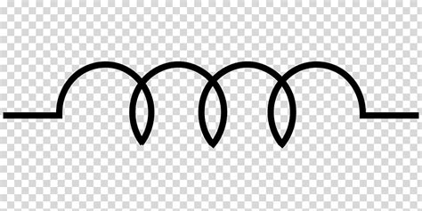
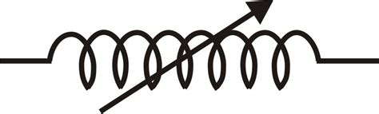

# Pertemuan 3

## Induktor

Induktor / coik merupakan bagian komponen-komponen elektronika pasif. Komponen ini berfungsi untuk filter, pengantur frekuensi, serta penyambung atau kopel. Satuaan dari induktansi adalah henry (H).

### Jenis jenis Induktor

- induktor (tetap) simbol

- induktor (variabel) simbol

## Transformator (Trafo)

adalah suatu alat listrik yang dapat mengubah taraf suatu tegangan AC ke taraf yang lain, Artinya menurunkan tegangan AC dari 200V AC ke 12V AC ataupun menaikan dari 110V AC ke 220V AC. Trafo berkerja berdasarkan prinsip induksi elektromagnet dan hanya dapat bekerja pada teganan yang bolak balik (AC).

### Simbol Trafo

### Prinsip Kerja Transformator (Trafo)

Prinsip kerjanya hampir sama dengan dinamo / motor listrik, jika dinamo / motor listrik mengubah energi listrik menjadi medan magnet lalu diubah ke energi kinetik / gerak. Kalau trafo adalah medan listrik dari arus bolah-balik (AC) yang beredar mengelilingi inti besi mengakibatkan inti besi menjadi magnet, maka lilitan yang berada di trafo akan memiliki perbedaan teganan pada kedua ujungnya. Fungsinya adalah menurunkan teganan listrik(step down), menaikan teganan listrik(step up), merubah tegangan listrik dari AC ke DC atau kebalikan.

## Kapasitor

Merpakan salah satu komponen elektronika pasif, komponen ini memiliki fungsi sebagai alat peyimpan energi / muatan listrik sementara, dan sebagai penstabil teganan. Nilai suatuan dari kapasitor atau kondensator adalah Farad (F).

