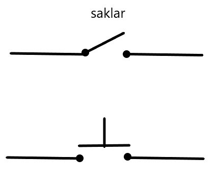
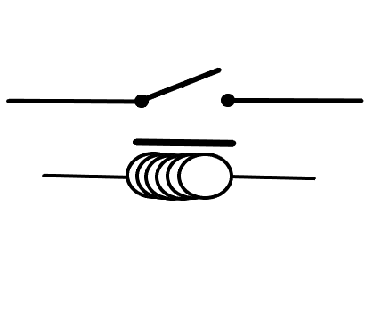
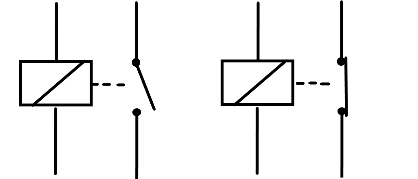
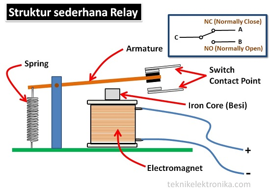
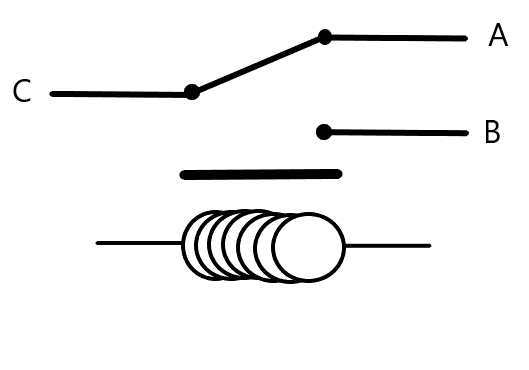
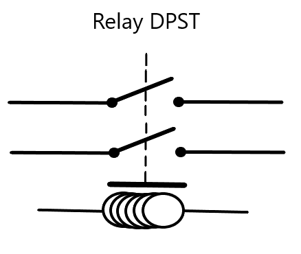
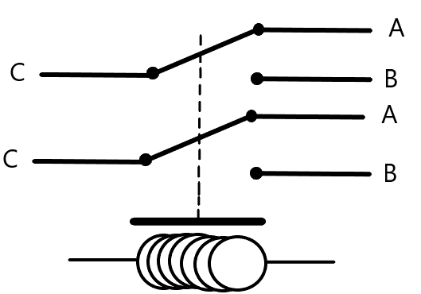
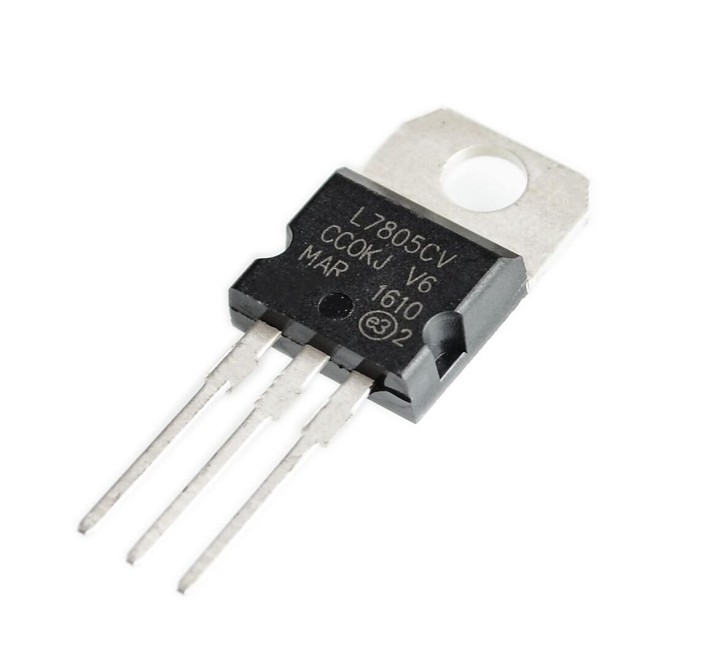
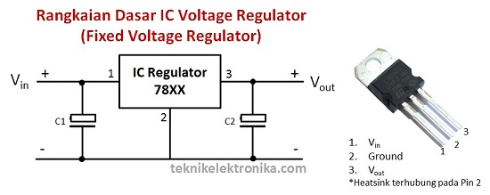
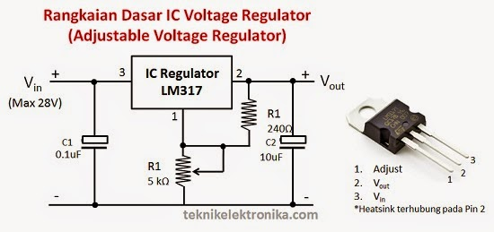

# Apa itu Relay (Saklar Elekromeknikal) dan IC Regulator

## Saklar (Switch)

Saklar atau Switch merupakan salah satu jenis komponen elektronika aktif. Komponen ini berfungsi sebagai penghubung dan pemutus arus listrik. Dalam bahasa mudahnya, saklar bisa disebut sebagai tombol ON/OFF.

## Relay (Saklar Elektormechanical)

**Relay** adalah Saklar (*Switch*) yang dioperasikan secara listrik dan merupakan komponen Elektormechanical yang terdiri dari 2 bagian utama yakini Elektromagnet (*coil*) dan Mechanikal (seperangkat Kontak Saklar/Switch). Relay Menggunakan Prinsip Elektormagnetik unutk menggerakan Kontak Saklar sehingga dengan arus listrik yang kecil (*low power*) dapat menghantarkan listrik yang bertegangan lebih tinggi.

## Prinsip Kerja Relay

Pada dasarnya, Relay terdiri dari 4 komponen dasar yaitu:

- Elektromagnet (*coil*)
- Armature
- Switch Contact Point (Saklar)
- Spring

## Penggolongan Relay Berdasarkan Jumlah Pole dah Throw

**Pole** : Banyaknya Kontak (*Contact*) yang dimiliki oleh sebuah relay
**Throw** : Banyaknya kondisi yang dimiliki oleh sebuah Kontak (*Contact*)

- Relay SPST (Single Pole Single Throw)
  - Relay golongan ini memiliki 4 Terminal, 2 Terminal untuk Saklar dan 2 Terminal lagi untuk *coil*.
  - 
- Relay SPDT (Single Pole Double Throw)
  - Relay golongan ini memiliki 5 Terminal, 3 Terminal unutk Saklar dan 2 Terminal lagi untuk *coil*.
  - 
- Relay DPST (Double Pole Single Throw)
  - Relay golongan ini memiliki 6 Terminal, 4 Ternimal unutk Saklar dan 2 Terminal lagi untuk *coil*.
  - 
- Relay DPDT (Double Pole Double Throw)
  - Relay golongan ini memiliki 8 Terminal, 6 Terminal yang merupakan 2 pasang Relay SPDT yang dikendalikan oleh 1 (single) *Coil*. Sedangakan 2 Terminal lainya unutk *Coil*.
  - 

## Fungsi Relay

Beberapa fungsi Relay yang telah umum diaplikasikan kedalam peralatan Elektronika diantaranya:

- Relay digunakan untuk menjalankan Fungsi logika (*Logic Function*)
- Relay digunakan unutk memirikan Fungsi penundaan waktu (*Time Delay Function*)
- Relay digunakan unutk mengendalikan Sirkuit Tegangan Tinggi dengan bantuan Signal Tegangan rendah.
- Ada juga Relay berfungsi untuk melindungi Motor ataupun komponen lainnya dari kelebihan Tegangan ataupun hubungan singhat (*Short*)

## IC Voltage Regulator (pengatur tegangan)

Voltage Regulator atau pengatur tegangan adalah salah satu rangkaian yang sering dipakai dalam peralatan Elektronika. Fungsi Voltage Regulator adalah untuk mempertahankan atau memastikan Tegangan pada level tertentu secara otomatis. Artinya, Tegangan Keluaran (*Ouutput*) DC pada Voltage Regulator tidak dipengaruhi oleh perubahan Tegangan masukan (*Input*), Beban pada *Output*dan Sunu.\
Tegangan Stabil yang bebas dari segala ganggunan seperti noise ataupun fluktuasi (naik turun) sangat dibutuhkan untuk mengoperasikan peralatan Elektronika terutama pada peralatan elektronika yang sifatnya digital seperti Mictro Controller ataupun Micro Processor.

## Imploementasi IC Voltage Regulator

- Rangkaian Voltage Regulator ini banyak ditemukan pada Adaptor yang bertugas unuk memberikan Tegangan **DC** untuk Laptop, HandPhone, Konsole Game dan lain bagainya. Pada Peralatan Elektornika yang Power Supply atau catu dayanya diintegrasi ke dalam unitnya seperti TV, DVD Player dan Komputer Desktop, Rangkaian Voltage Reguler (Pengatur Tegangan) juga merupakan satu keharusan agar Tegangan yang diberikan kepada rangkaian lainnya stabil dan bebas dari fluktuasi.
- Terdapat berbagai jenis Voltage Regulator atau Pengatur Tegangan, salah satunya adalah Voltage Regulator dengan Menggunakan IC Voltage Regulator. Salah satunya tipe IC Voltage Regulator yang paling sering ditemukan adalah tipe 7805 yaitu IC Voltage Regulator yang mengatur Tegangan Output stabil pada Tegangan 5 Volt DC.

## Jenis-Jenis IC Voltage Regulator

Terdaoat beberapa cara pengelompokan Pegatur Tegangan yang berbentuk **IC** (*Intgreted Circuit*), diantara nya adalah berdasarkan **Jumlah Terminal** (3 Terminal dan 5 Terminal); berdasarkan **Linear Volage Regular** dan Switching Voltage Regulator. Sedangkan cara pengelompokan yang ketiga adalah dengan menggolongkannya menjadi 3 jenis yakini **Fixed Voltage Regulator**, **Adjustable Voltage Regulator**, dan **Switching Voltage Regulator**

## FIXED VOLTAGE REGULATOR (Pengatur Tegangan Tetap)

- IC jenis Pengatur Tegangan Tetap (Fixed Voltage Regulator) ini memiliki nilai tetap yang tidak dapat distel (di-adjust) sesuai dengan keinginan Rangkainanya. Tegangan telah ditetapkan oleh produsen IC sehingga Tegangan DC yang diatur juga tetap sesuai dengan spesifikasi IC-nya. Misalnya IC Voltage Regulator 7805, maka Outpunya Tegangan DC-nya juga hanya 5 Volt DC. Terdapat 2 jenis Pengatur Tegangan Tetap yaitu Positive Voltage Regulator dan Negative Voltage Regulator.
- Jenis IC Voltage Regulator yang paling sering ditemukan di pasaran adalah tipe 78xx. Tanda xx dibelakangnya adalah kode angka yang menunjukan Tegangan output DC pada IC Voltage Regulator tersebut. Contohnya 7805, 7809, 7812 dan lain sebagainya. IC 78xx merupakan Ic jenis Positive Voltage Regulator.
- Ic yang berjenis Negative Voltage Regulator memiliki desain, konstruksi dan cara kerja yang sama dengan jenis Positive Voltge Regulator, yang membedakanya hanya polaritas pada Tegangan Outputnya. Contoh IC jenis Negative Voltage Regulator diantaranya adalah 7905, 7912 atau IC Voltage Regulator berawalan kode 79xx.

## Rangkaian Dasar IC Voltage Regulator (Fixed Voltage Regulator)

## ADJUSTABLE VOLTAGE REGULATOR (Pengatur Tegangan yang dapat disetel)

IC jenis Adjustable Voltage Regulator adalah jenis IC pengatur tegangan DC yang memiliki range teganan output tertentu sehingga dapat diseuaikan kebutuhan Rangkaiannya. IC Adjustable Voltage Regulator ini juga memiliki 2 jenis yaitu Positive Voltage Regulator dan Negative Voltage Regulator. Contoh IC jenis Positive Adjustable Voltage Regulator diantaranya adalah **LM317** yang memiliki range atau rentang tegangan dari 1.2 Volt DC sampai pada 37 Volt DC. Sedangkan contoh IC jenis Negative Adjustable Voltage Regulator adalah **LM337** yang memiliki range atau jangkauan Tegangan yang sama daengan **LM317**. Pada dasarnya desain, konstruksi dan cara kerja pada kedua jenis IC Adjustable Voltage Regulator adalah sama. Yang membedakannya adalah Polariatas pada Output Teganagan DC-nya.

## Rangkaian Dasar IC Voltage Regulator (Adjustable Voltage Regulator)

