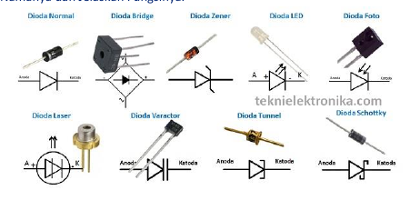

1. Jelaskan Teori Atom dengan panduan gambar dibawah ini:
`Benda memiliki padat, cair, dan gas` -> `Terbagi legi menjadi molekul (memiliki sifat asli)` -> `Terbagi lagi menjadi atom (tidak memiliki sifat asli)`

2. Bagaimana pendapat anda tentang dunia elektronika jaman sekarang ? jelaskan!
3. Sebutkan minimal 3 jenis Resistor seperti tertera digambar ini, sebutkan namanya, dan jelaskan fungsinya!

4. Pecahkan ukuran Resistor di bawah ini menggunakan rumus kode warna pada resistor!
  a. Cokelat, hitam, hijau, emas.
  b. Hijau, Biru, Cokelat, Emas.
  c. Jingga, Jingga, Putih, Hitam, Cokelat.

5. Apa nama komponen ini, sebutkan fungsi dan cara kerjanya!

6. Sebutkan nama komponen ini, fungsinya dan spesifikasi mulai dari tegangan, dan kapasistas komponen ini!

7. Sebutkan minimal 4 jenis dioda seperti tertera digambar ini, sebutkan nama dan jelaskan fungsinya!

