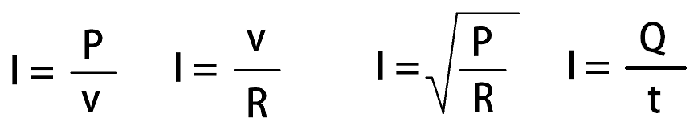

# Instalasi Listrik dan panel

## Mengukur Tegangan (voltage), daya (watt), dan arus (Ampere) Dalam Alat Elektronik

## Apa itu listrik ?

__Listrik__ adalah rangkaian fenomena fisika yang berhubungan dengan kehadiran dan aliran muatan listrik. Listrik menimbulkan berbagai macam efek yang telah umum diketahui, seperti petir, listrik statis , induksi elektromagnetik dan arus listrik. Adanya listrik juga bisa menimbulkan dan mernerima radiasi elektromagnetik seperti gelombang radio.

## Apa itu Instlasi Listrik ?

Istalasi listrik adalah suatu bagian penting yang terdapat dalam sebuah bangunan / gedung, yang bergungsi untuk menyalurkan tegangan listrik dari sumber ke bangunan / gedung.

Peynaluran tenaga listrik harus sesuai dengan peratuan yang telah distandarisasi oleh **Badan Standarisasai Nasional (BSN)** dengan menerbitkan **Persyaratan Umum Instalasi Listrik (PUIL)** sebagai panduan umum (rujukan) instalsi listrik.

Istalasi Listrik Rumah pada umumnya adalah 220 AC 50/60Hz, 

## Humuk OHM

Besar arus listrik (I) yang mengalir melalui sebuah penghantar atau Konduktor akan berbanding lurus dengan beda potensial / tegangan (V) yang diterapkan kepadanya dan berbanding terbalik dengan hambatanya (R)

## Teori Dasar Kelistrikan

- Dalam teori arus listrik, dikenal dua jenis sumber arus listrik, yakini sumber arus listrik searah atau DC dan sumber arus bolak balik atau AC.

- Sumber arus DC adalah listrik yang tidak merubah fasenya. Contohnya adalah baterai, solar sel, accumulator, dinamo dan adaptor.

- Sedangkan arus AC adalah arus listrik yang berubah-ubah fasenya setiap saat. Contohnya adalah generator, listrik PLN dan inveter.

- I : Kuat Arus (Ampere)
- V : Tegangan Listrik
- R : Tahanan / hambatan (ohm)
- P : Power / daya
- Q : Coulomb
- T : Waktu dalam detik

### Contoh 1

Waktu yang diperlukan untuk mengalirkan sebuah kawat penghantar adalah 5 menit dengan muatan listrik sebesar 1000 coulomb. Berapakah kuat arus dalah sebuah kawat penghantar tersebut?

$$
I = Q/t
$$

$$
I = 1000/300
$$

$$
I = 3.3333 A
$$

## Teori Dasar Kelistrikan

- Pengertian tegangan listrik adalah energi atau tenaga yang menyebabkan muatan-muatan negatif atau elektron mengalir dalam penghantar. Nilai satuan dari tegangan listrik adalah V (*volt*)

**Rumus menghitung Tegangan listrik**

$$
V = I * R
$$

$$
I = V / R
$$

$$
R = V / I
$$

- Ketetangan
- Tegangan = Kuat arus * Hambatan
- V = Tegangan Listrik (volt)
- I = Kuat Arus (Ampere)
- R = Hambatan (ohm)

### Contoh 2

Jika dalam suatu rangkaian total hambatanya adalah 4,5Ohm dan arus listrik yang mengalir adalah 10 A, berapakah beda potensial (tegangan listrik) dalam rangkaian tersebut ? 

$$
V = I * R
$$

$$
V = 4.5 * 10
$$

$$
V = 45 volt
$$

## Tori Daya Listrik

Daya listrik didefinisikan sebagai laju hambatan energi listrik dalam rangkaian listrik. Satuan daya listrik adalah watt yang menyatakan banyaknya tenaga listrik yang menhalir per satuan waktu.

**Rumus Menghitung Daya Listrik**

$$
P = V * I
$$

atau

$$
P = i^2 * R
$$

atau 

$$
P = V^2/R
$$

- Ketetangan
- P = Daya Listrik dengan satuan Watt (W)
- V = Tegangan Listrik dengan Satuan Volt (V)
- I = Arus listrik dengan Satuan Ampere (A)
- R = Hambatan dengan Satuan Ohm ()

### Contoh 3

Sebuah Televisi LCD memerlukan Tegangan 220V dan Arus Listrik sebesar 1.2 A untuk mengaktifkannya. Berapakah Daya Listrik yang dikonsumsinya?

$$
P = V * I
$$

$$
P = 220 * 1.2
$$

$$
P = 264 watt
$$

### Contoh 4

Suatu rangkaian memiliki arus listrik yang mengalir sebesar 5 A dan tegangan listrik sebesar 75 volt. Berapakah total hambatanya dalah rangkaian tersebut?

$$
R = V / I
$$

$$
R = 75 / 5
$$

$$
R = 15 ohm
$$

### Contoh 5

Dalam suatu rangkaian total hambatanya adalah 8 ohm dan tegangan listrik adalah 20 volt, berapakah arus listrik yang mengalir dalam rangkaian tersebut?

$$
I = V / R
$$

$$
I = 20 / 8
$$

$$
I = 2.5 A
$$

