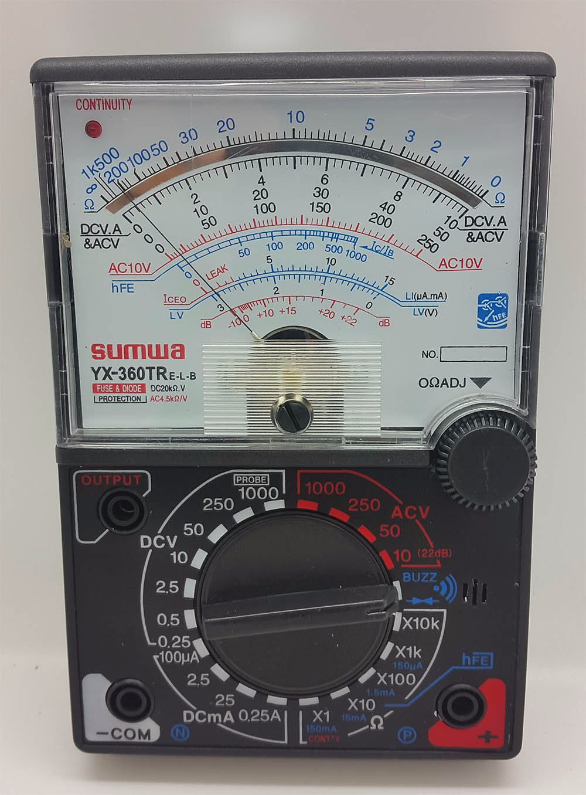
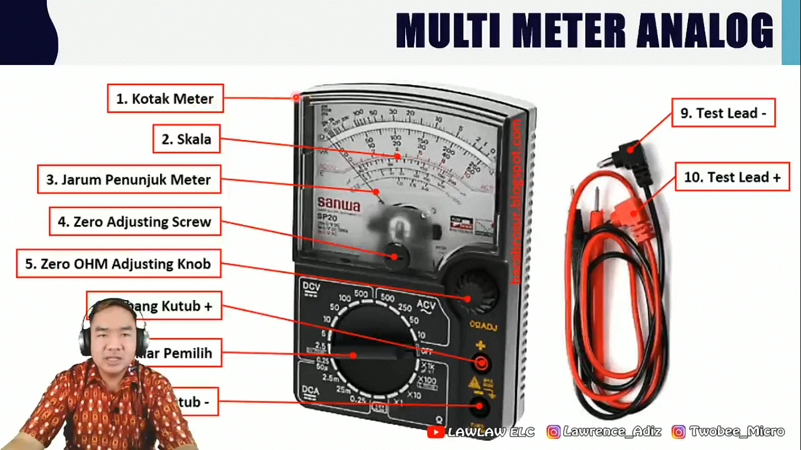
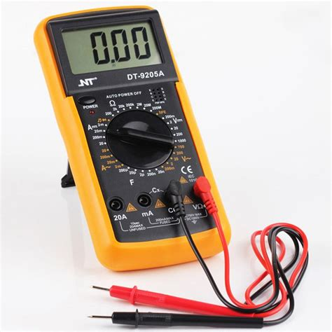
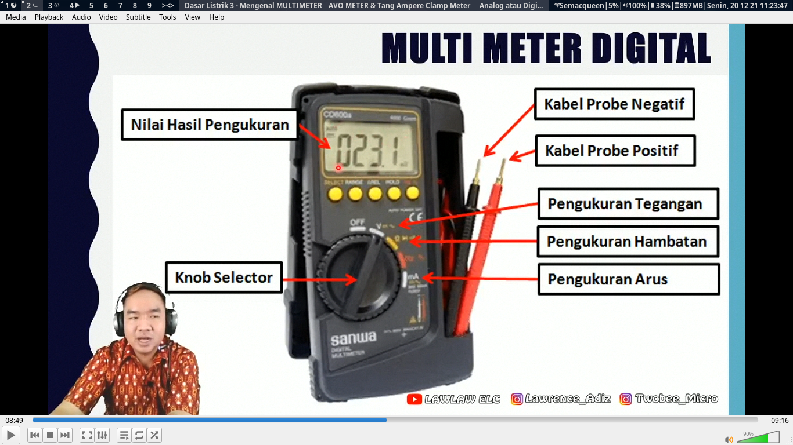
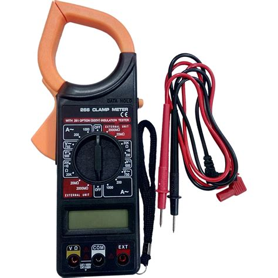
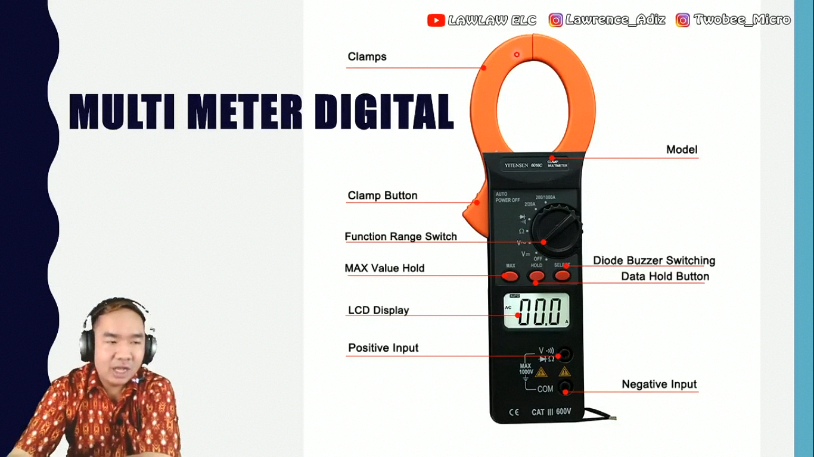
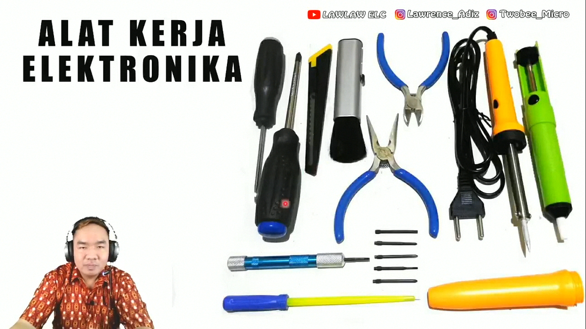

# Mengenal Alat Ukur

## Multi Meter

Pengertian **multimeter** secara umum adalah alat ukur yang dipakai untuk mengukur tegangan listrik, arus listrik, dan tahanan (resistansi). Sedangkan  pada perkembangannya multimeter masih bisa digunakan untuk beberapa fungsi seperti mengukur termeratur, induktansi, frekuensi, dan sebagainya. Dan juga orang yang menyebut multimeter dengan sebutan AVO meter mungkin maksudnya A (Ampere), V (Volt), O (Ohm).

### Fungsi

1. Mengukur tegangan DC.
2. Mengukur tegangan AC.
3. Mengukur kuat arus DC.
4. Mengukur nilai hambatan sebuah resistor.
5. Mengecek hubung-singkat / koneksi.
6. Mengecek transistor.
7. Mengecek kapasitor elektrolit.
8. Mengecek dioda, led, dan dioda zener.
9. Mengecek induktor.
10. Mengukur HFE transistor (type tertentu).
11. Mengukur suhu (type tertentu).

## AVOmeter Analog

## AVOmeter Digital

## Tang Ampere

Tang Ampere atau dalam bahasa inggrisnya disebut dengan Clamp Meter adalah alat ukur yang digunakan untuk mengukur alur listrik dengan menggukan dua rahang penjepitnya (Clamp) tanpa harus memiliki kontak langsung dengan terminal listriknya. Dengan demikian, kita tidak perlu mengganggu rangkaian listrik yang akan diukur. Pada umumnya, Tang Ampere (Clamp Meter) yang terdapat di pasaran memiliki fungsi sebagai Multimeter juga. Jadi selain terdapat dua rahang penjepit. Clamp Meter juga memiliki dua probe yang dapat digunakan untuk mengukur Resistansi, Tegangan AC, Tegangan DC, dan bahkan ada model yang dapat mengukur Frekuensi, Arus Listrik DC, Kapasitansi dan Suhu.

## Alat Kerja Elektronika

