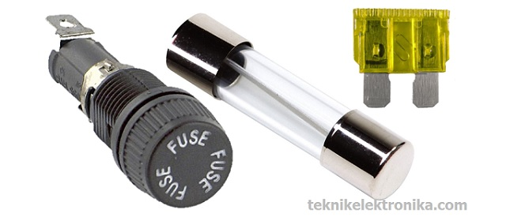
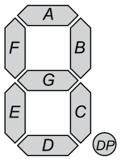
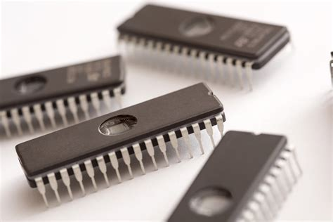

# Mengenal IC, Sekring Fuse dan Seven Segment

## Fuse (Sekring)

Fuse atau dalam bahasa indonesia disebut dengan Sekring adalah komponen yang berfungsi sebagai pengaman dalam Rangkaian Elektronika maupun perangkat listrik. Fuse (Sekring) apa dasarnya terdiri dari sebuah kawat halus pendek yang akan meleleh dan terputus jika dialiri oleh Arus Listrik yang berlebihan ataupun terjadinya hubungan arus pendek (short circuit) dalam sebuah peralatan listrik / Elektronika. Dengan putusnya Fuse (Sekring) tersebut, Arus listrik yang berlebihan tersebut diak dapat masuk ke dalam Rangkaian Elektronika sehingga tidak merusak komponen-komponen yang terdapat dalam rangkaian Elektronika yang bersangkutan. karena *fungsinya* yang dapat melindungi peralatan listrik dan peralatan Elektronika dari kerusakan akibat arus listrik yang berlebihan, Fuse atau Sekring juga sering disebut sebagai Pengaman Listrik.

---

Fuse (Sekring) terdiri dari 2 Terminal dan biasanya dipasang secara Seri dengan Rangkaian Elektronika / listrik yabg akan dilindunginya sehingga apabila Fuse (Sekring) tersebut terputus maka akan terjadi "Open Circuit" yang memutuskan hubungan aliran listrik agar arus listrik tidak dapat mengalir masuk ke dalam Rangkaian yang dilindunginya.

### Bentuk Asli Fuse (Sekring)

### Cara Kerja Fuse

- Bentuk Fuse (Sekring) paling sering ditemukan adalah berbentuk tabung (silinder) dan Pisau (Blade Type). Fuse yang berbentuk tabung atau silinder sering ditemukan di peralatan listrik Rumah Tangga sedangkan Fuse yang berbentuk Pusau (Blade) lebih sering digunakan di bidang Otomotif (kendaraan bermotor).
- Nilai Fuse biasanya tertera pada bahan Fuse itu sendiri ataupun diukir pada Terminal Fuse, nilai Fuse diantaranya terdiri dari Arus Listrik (dalam satuan Ampere **A**) ataupun miliAmpere (**mA**) dan Tegangan (dalam satuan Volt **V**) ataupun miliVolt (**mV**).
- Dalam Rangkaian Elektronika maupun Listrik, Fuse atau Sekring ini sering dilambangkan dengan huruf **"F"**.

### Simbol Fuse / Sekring

### Contoh Pemasangan Fuse / Sekring Pada Rangkaian Adaptor

## Seven Segment

**Seven Segment** adalah suatu segmen-segmen yang digunakan unutk menampilkan angka / bilangan decimal. Seven Segment ini terdiri dari 7 batang LED yang disusun membentuk angka 8 dengan mengguanakn huruf a-f yang disebut `DOT MATRIKX`. Setiap segment ini terdiri dari 1 atau 2 LED (*Light Emiting Dioda*).

### Prinsip Kerja Seven Segment

Prinsip kerja dari Seven Segment ini adalah inputan bilangan biner pada switch dikonversi masuk kedalam decoder, bau kemudian decoder mengkonversi bilangan biner tersebut ke dalam bilangan desimal, yang mana bilangan desimal ini akan ditampilkan pada layar Seven Segment. **Fungsi** dari decoder sendiri adalah sebagai pengkonversi bilangan biner ke dalam bilangan desimal.

### Jenis-Jenis Seven Segment

- Common Anoda
  - *Common Anoda* merupakan pin yang terhubung dengan semua kaki anoda LED dalam seven segmen. Common anoda diberi tegangan CCC dann Seven Segment dengan common anoda akan aktif pada saatu diberi *logika* rendah(0) atau sering disebut *aktif low*. Kaki katoda dengan label a sampai h sebagai pin aktifasi yang menentukan nyala LED.
- Common Katoda
  - *Common Katoda* merupakan pin yang terhubung dengan semua kaki katoda LED dalam seven segmen dengan common katoda akan aktif apabila diberi logika tinggi(1) atau disebut *aktif high*. Kaki anoda dengan label a sampai h sebagai pin aktifasi yang menentukan nyala LED.

## IC (Integreted Circuit)

Integreted Circuit atau IC juga termasuk salah satu dari komponen elektornika aktif. Komponen jenis ini terdiri dari beberapa jenis komponen seperti transistor, resistor, dan beberapa komponen lain yang tersusun menjadi satu kesatuan. Pada umumnya IC berbentuk kecil dan memiliki 3 hingga ratusan kaki. Fungsi IC juga sangat bermacam-macam tergantung kompnenyang ada di dalamnya.

### Fungsi IC

1. Penguat Daya (Amplifier)
2. Penguat Operasional (Op Amp)
3. Penguat Signal (Signam Amplifier)
4. Penguat Signal Micro (Microwace Amplifier)
5. Miltiplier
6. Voltage Comparator
7. Regulator Tegangan (Voltage Regulator)
8. Penerima Frekuensi Radio

