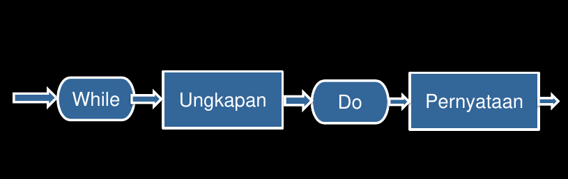
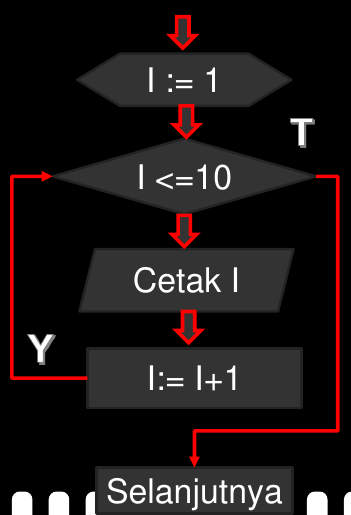
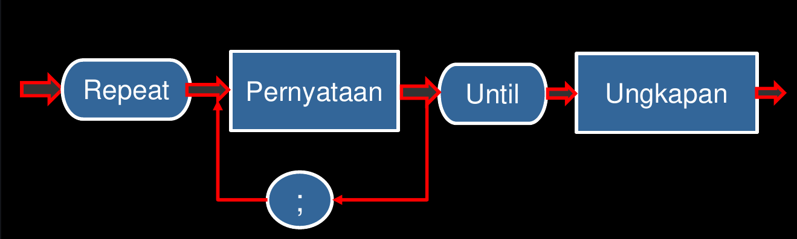
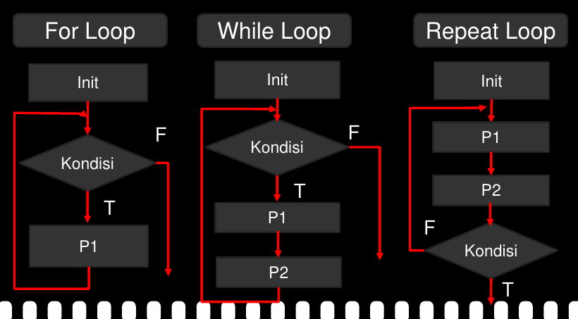
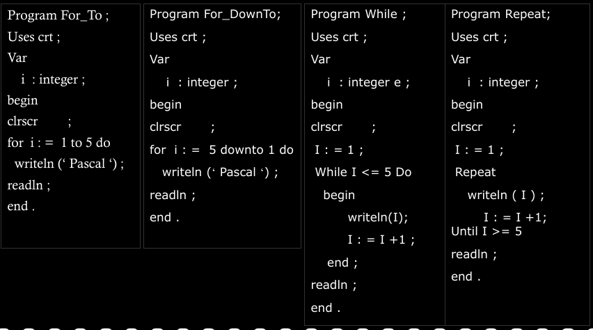

# Kontrol Perulangan Pascal

## Tujuan

- Mahasiswa mampu mengerti konsep perulangan dalam pascal
- Mahasiswa mampu membuat program pengulangan dalam pengulangan
- Mahasiswa mampu mengimplementasikan program pengulangan dan memadukan dengan percabangan

## Materi Kuliah

- Pengulangan dengan `while - do`
- Pengulangan dengan `repeat - until`
- Nested loop

## Jenis Perngulangan 
- `for do`
- `while - do`
- `Repeat - until`

## While - do

Pengulangan `while - do` digunkanan untuk melakukan proses pengulangan suatu statemen atau blok statemen terus menerus selama kondisi ungkapan logika pada `while` masih bernilai logika benar.

## Skema while - do



## Pengulangan while - do

```pascal
while <kodisi yang dipenuhi do
  begin
    <perintah ke-1>;
    <perintah ke-n>;
  end;
```

## Perulangan while - do

- Pernyataan ini untuk mengulangan semua perintah dalam blok `begin` dan `end` selama kondisi yang diuji masih memenuhi.
- Ciri khususnya adalah koddisi akan diperiksa lebih dahulu, sebelum melaksanakan blok perintah (interasi di depan).
- Perbedaan dengan `for - do`, maka `while - do` dapat menggunakan step berapa saja untuk index perulangan

## Contoh Program

```pascal
program perulangan_dengan_while_do;
uses crt;

var 
  i : integer;

begin
  clrscr;
  I := 1;
  while I <= 10 do
    begin
      write(I, ' ');
      I := I + 1;
    end;
  readln;
end.
```

## Penjelasan

- Pengulangan dari while akan terus menerus dikerjakan bila kondisinya masih benar.
- Dalam hal ini kondisinya adalah I dan bila nilai I kudanga dari sama dengan 10, maka berati kondisi di dalam while masih terpenuhi dan perulagnan akan selesai setelah nilai I lebih besar dari 10 maka akan berhenti

## FLowchart while - do



## Contoh Program

```pascal
program perulngan_dengan_while_do;
uses crt;

var
  i : integer;

begin
  clrscr;
  i := 25;
  while i >= 1 do
    begin
      write(i, ' ');
      i := i - 3;
    end;
  readln;
end.
```

## Penjelasan

- Program ini akan mengulang / mencetak akan yang dimulai dari nilai awal dalam hail ini adalah `i := 25;`, apabila nilai dari `i >= 1;`.
- Selanjutnya nilai awal (i) dikurang3 sehingga menjadi (25-3=22), bilai nilai i masil >= 1, maka akan mengulang sampai `i < 1`.
- Pengulang ini akan melakukan pencetakan negatif (turun), engan step / counter - 3.
- Untuk counter sebenarnya bebas mau berapa pun bisa tidak harus 1, 2, atau 3.

## Repeat - until 

- `repeat - until` digunakan untuk mengulang (_repeat_) Statement atau blok statemen sampai (_until_) kondisi yang diseleksi tidak terpenuhi
- Perbedaan `repeat - until` dengan `while - do` terletak pada proses pemeriksaan kondisi.
- Permeriksaan kondisi pada `repeat - until` dilakukan paa akhir pengulangan, sedangkan `while - do` dilakukan di awal pengulangan.
- Dengan pengujian dibelakan ini paling tidak program akan mencetak 1x walaipun nantinya akan di hapus.

## Skema Repeat - until



## Struktur Repeat-Until

```pascal
repeat
  <perintah ke-1>;
  <perintah ke-n>;
until <kondisi yang dikehendaki>;
```

## Contoh program

```pascal
program perulngan_dengan_repeat_until;
uses crt;

var 
  i : integer;

begin
  clrscr;
  i := 1;
  repeat
    write(i, ' ');
    i := i + 2;
  until i >= 20;
  readln;
end.
```

## Penjelasan

- Program ini akan mengulang  / mencetak yang di mulai dari nilai awal dalam hal ini adalah i := 1, apabila nilai dari i >= 20.
- Selanjutnya nilai awal (i) ditambah 1 sehingaa menjadi (1+2 = 3), bila nilai i masih `<= 20`, maka akan mengulang sampai i >= 20.
- Pengulang ini akan melakukan pencetakan positif (naik), dengan step / counter + 2.
- Hasilnya adalah mencetak angka = 1, 3, 5, 7, ..., 17 dan 19

## Contoh program

```pascal
program perulngan_dengan_repeat_until;
uses crt;

var i : integer; begin
  clrscr;
  i := 100;
  repeat
    write(i, ', ');
    i := i - 10;
  until i <= 0;
  readln;
end.
```

## Penjelasan

- Program ini akan mengulang / mencetak yang dimulai dari nilai awal alam hal ini adalah i := 100, apabila nilai dari i `<=` 0.
- Selanjutnya nilai awal (i) dikurangi 10 sehingga menjadi (100-10=90), bila nilai i masih `<= 0` maka  akan mengulang sampai `i <= 0`
- Pengulang ini akan melakukan pencetakan negatif (turun), dengan step / counter -10.
- Hasilnya akan mencetaka angka 100, 90, 80, 0.

## Nested Loop

- Dalam `while - do` dan `repeat - until` juga dapat melakukan pengulangan dalam pengulangan atau nested loop.
- Berikut adalah conth pengulangan dalam pengulang dengan menggunakan `while - do` dan `repeat - until`

## Nested Loop While - do

```pascal
program Menampilkan_index_matrix;
uses crt;
var
  x, y : integer;

begin
  clrscr;
  x := 1;
  while x <= 5 do
    begin
      y := 1;
      while y <= 3 do
        begin
          write(x, y, ' ');
          y := y + 1;
        end;
      writeln;
      x := x + 1;
    end;
  readln;
end.
```

## Penjelasan

- Program ini akan mengulang variabel x sebanyak 5x, akan tetapi belum selesai pengulangan, selanjutnya menjumpai kembali pengulangan yang berbeda didalam yatiu variabel y, dimana pada variabel y akan diulang sebanyak 3x, maka harus diselesaikan pengulangan yang dalam sebanyak 3x, jika sudah selesai akan melakukan pengulangan pada variabel x sebanyak 5x.
- Dengan tetap menyesuaikan pengulangan yang didalam terlebih dahulu atau variabel y.

## Nested Loop Repeat - Until

```pascal
program Menampilkan_index_matrix;
uses crt;

var 
  x, y : integer;

begin
  clrscr;
  x := 1;
  repeat
    y := 1;
    repeat
      write(x, y, ' ');
      y := y + 1;
    until y > 5;
    writeln;
    x := x + 1;
  until x > 3;
  readln;
end.
```

## Penjelasan

- Program ini akan mengulang variabel x sebanyak 3x, akan tetapi belum selseai pengulangan, selanjutnya menjumpai kembali pengulangan yang berbeda didalam yatiu variabel y, dimana pada var y akan diulang sebanyak 5x, maka harus diselesaikan pengulangan yang dalam sebanyak 5x, jika sudah selesai akan melakukan pengulangan pada variabel x sebanyak 3x.
- Dengan tetap menyesuaikan pengulangan yang didalam terlebih dahulu atau var y.

## FLowchart Pengulangan 



## Perbandingan



## Infinate Loop

```pascal
program perulngan_dengan_while_do;
uses crt;

var
  i : integer;

begin
  clrscr;
  i := 25;
  while i >= 1 do
    begin
      write(i, ' ');
    end;
  readln;
end.
```

## Kesimpulan

- Perulangan dengan `while - do` adalah jenis perulangan yang lebih fleksibel, step positif dan negatif dapat diatur sesuai dengan kebutuhan.
- Jenis perulangan ini akan terus mengulang selama kondisi masih benar dan akan berhenti jika sudah salah.
- Jika mengunakan `while - do` atau `repeat - until` kita harus memastikan variabel _counter_ dinaikan pada saat yang tepat, kalau tidak bisa terjadi __infinite loop__.
- __infinite loop__ adalah proses ekspresi pada sebuah pengulangan selalu bernilai true, maka pengulangan akan dijalankan terus menerus tanpa berhenti.
- Perul adalah proses ekspresi pada sebuah pengulangan selalu bernilai true, maka pengulangan akan dijalankan terus menerus tanpa berhenti.
- Perulangan dengan `repeat - until` adalah jenis perulangan yang mirip dengan perulangan `while - do` dimana step positif dan negatif.
- Jenis perulangan `repeat - until` ini akan terus mengulang selama kondisi belum tercapai (atau masih salah), jika sudah tercapai (benar) akan berhenti.

