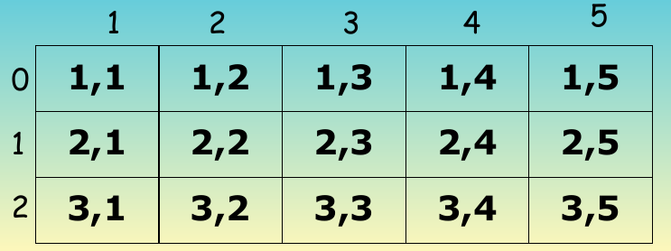
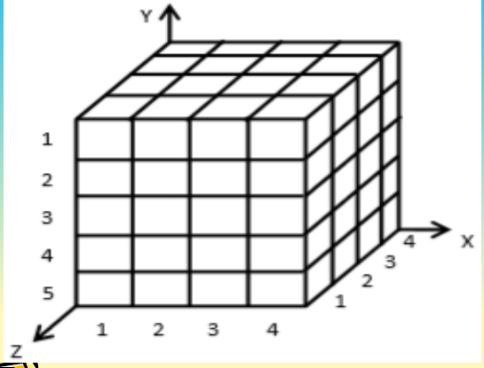

# Array (Dua / Multi Dimensi)

## Tujuan Pembelajaran

- Setelah mempelajari pada bab ini diharapkan mahasiswa:
  * Mengerti dan mampu memahami tentang fungsi array dua dimensi.
  * Mampu merencanakan dam menempatkan fungsi array pada program sederhana terutama dalam program pascal.
  * Mampu mengaplikasikan funsi array dalam pembuatan program baik dalam skala kecil maupun besar.

## Materi

- Array Dua Dimensi
- Array Multi Dimensi
- Kesimpulan
 
## Pengertian

- Suatu array adalah sebuah struktur data yang terdiri atas banyak variabel dengan tipe data sama, dimana masing-masing elemen variabel mempunyai nilai indeks.
- Setiap elemen array mampu untuk menyimpan satu jenis data (yaitu:variabel).
- Array selalu membuat tiga (3) komponen penting, yaitu:
  - nama array,
  - indeks (yang bertipe ordinal), dan
  - Tipe data (sederhana) yang digunakan oleh array.

## Array Dua Dimensi

- Array dua dimensi merupakan array yang terdiri dari x buah baris (row) dan y buah kolom (column).
- Array ini menggunakan 2(dua) buah kelompok indeks yang masing-masing direpresensikan sebagai indeks baris dan kolom.
- Bentuk umumnya adalah: `var array : array[0..X, 1..Y] of type_data;`.
- Nilai indeks `0..X` merupakan indeks Baris.
- Nilai indeks `1..Y` merupakan indeks kolom.

## Contoh Array Dua Dimensi

```pascal
var
  bil : array[0..2, 1..5] of integer;
  harga : array[0..4, 1..10] of real;
```

## Repesentasi Array


```pascal
var
  Bilangan : Array[1..3, 0..4] of integer;
```

## Bentuk Array Dua Dimensi

```pascal
var
  bil : array[0..2, 1..5] of integer;
```



Terdiri dari 3 baris dan 5 kolom\
Jadi : Indeks-1 menyatakan baris dan indeks-2 menyatakan kolom.

## Contoh Array 2

```pascal
program Contoh_Array_Dua_Dimensi;
uses crt;

const
  x = 25;
  y = 10;

type
 a_string1 = array[0..x] of string[15];
 a_string2 = array[0..y] of string[10];
 a_real = array[0..x, 1..y] of real;

var
  nm : a_string1;
  mk : a_string2;
  nx, ny, a, b : byte;
  tot, rt : real;

begin
  clrscr;
  writeln('Pengolahan Data Niliai Mahasiswa');
  writeln;

  write('Beberapa jumlah mahasiswa (max: ', x, ') ? ');readln(nx);
  write('Beberapa jumlah mata kuliah (max: ', y, ') ? ');readln(ny);

  if (nx > x) or (ny > y) then halt;

  writeln;
  writeln(' === Input nama Mahasiswa dulu ===');

  for a:= 1 to nx do
    begin
      writeln('Nama Mahasiswa ke : ', a, ' ? ');
      readln(nm[a]);
    end;

  writeln;
  writeln(' === Input nama mata kuliah terlebih dahulu ===');

  for b := 1 to ny do
    begin
      write('Nama matakuliah ke :', b, ' ? ');
      readln(mk[b]);
    end;

  writeln;
  writeln(' === Input data-data nilai semua mata kuliah ===');

  for a := 1 to nx do
    begin
      writeln('Data-data nilai untuk mahasiswa bernama : ', nm[a]);
      
      for b := 1 to ny do
        begin
          write( mk[b]:15, ' => Nilai ? ');
          readln( sc[a, b]);
        end;

      writeln;
    end;

  write('Tekan Enter untuk lihat dafar'); readln;

  clrscr;
  writeln('Daftar Nilai Mahasiswa');
  writeln;

  write(':No : Nama Mahasiswa :');
  for b := 1 to ny do
    begin
      write(mk[b], ' :');
      writeln(' Total : Rata :');
    end;

  for a := 1 to nx do
    begin
      write(':', a:2);
      write(':', nm[a]:15):

      tot := 0;

      for b := 1 to ny do
        begin
          write(':', sc[a, b]:10:2);
          tot := tot + sc[a, b];
        end;

      rt := tot / b;
      write(':', tot:6:2);
      write(':', rt:6:2);
    end;
  readln;
end.
```

## Array Multi Dimensi

- Penggambaran array multidimensi hanya terbatas hingga dimensi ke-3 yakini dengan mengguanakn bangun ruang, nilai dalam kenyataanya, tipe data array ini dapat dibentuk menjadi lebih dari tiga dimensi atan menjadin dimensi.
- Notasi algoritma untuk mendeklarasikan tipe data array multi dimensi cukup dengan memodifikasi deklarasi array dua dimensi dengan menambahkan elemen array.

## Refesentasi array 3 dimensi



```pascal
var
  array: array[0..x, 1..y, 2..y] of real;
```

## Hasil refresentasi

```pascal
var
  array : array[0..x, 1..y, 2..z] of integer;
```

- x : [0..2] -> baris
- y : [1..5] -> kolom
- z : [0..3] -> tinggi
- xyz[111, 112, 113, dst]

## Quiz

1. Berikut adalah sebuah deklarasi variabel dengan array:
  a. `type a_gaji : array[0..5] of real;`\
      `var Gaji: a_gaji;`
  b. `Nama : array[0..10] of string;`
  c. `Bilangan : array[0..10] of real; `
  d. semua benar.

2. Berikut adalah refresentasi dari bentuk array 2 dimensi , **Kecuali**:
  a. `Upah : array[0..5, 1..3] of real;`
  b. `MataKuliah : array[1..7, 0..5] of string; `
  c. `Nilai : array[2..7, 10..5] of integer;`
  d. Semua Benar.

3. `if (nx > x) or (ny > y) then halt;`. Apa maksud perintah di atas:
  a. Jika nx lebih besar x dan ny lebih besar y maka program akan keluar.
  b. Jika nx lebih besar x atau ny lebih besar y maka program akan keluar.
  c. Jika nx lebih besar x dan atau ny lebih besar y maka program akan keluar.
  d. Semua Benar.

4. Jelakan Maksud deklarasi di samping ini: `Nama : array[0..3, 0..5] of string;`
  a. Nama di deklarasikan array 2 dimensi di mana pada indeks pertama di siapkan ruang sebanyak 3 dan indeks ke dua di siapkan ruang sebanyak 5x.
  b. Nama di deklarasikan array 2 dimensi di mana pada indeks pertama di siapkan ruang sebanyak 4x dan indeks ke dua di siapkan ruang sebanyak 6x.
  c. Nama pada soal di atas di dekarasikan indeks 2 dimensi dengan type string. 
  d. Semua Jawaban Benar.

5. `grand = 0;` `grand := total;` . Maksud perintah di atas adalah :
  a. Untuk menjumlahan nilai grand dari semua total yang ada.
  b. Untuk menjumlahkan semua grand total dan total yang ada.
  c. Untuk menjumlahkan total.
  d. Untuk menjumlahkan semua total dan hasil penjumlahan akan di berikan ke grand.


