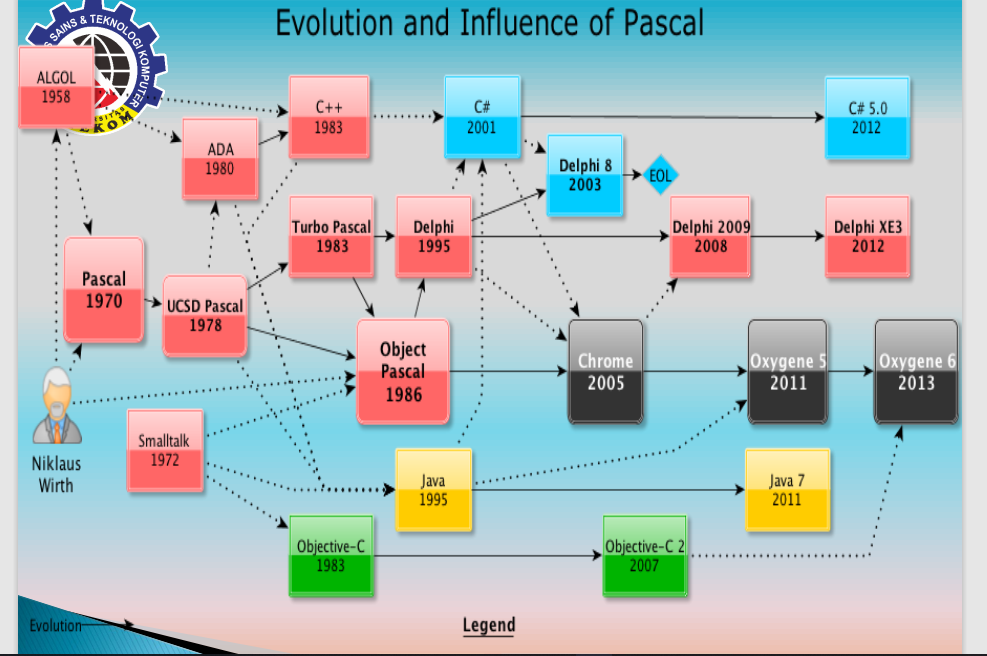
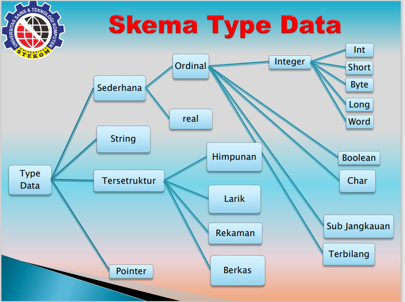
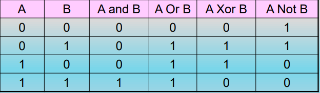
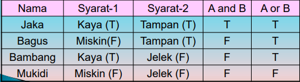
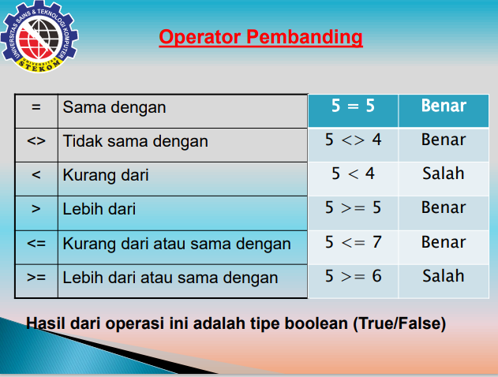
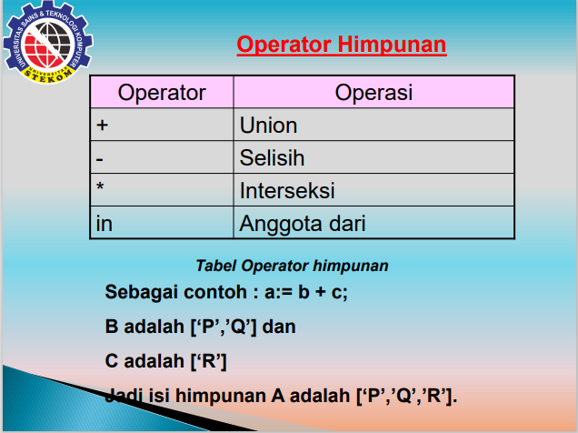

# Type Data dan Operator 

## Tujuan

Setelah mempelajari pada bab ini diharapkan Mahasiswa:
- Mampu memahami dan membedakan tipe data dalam pemrograman pascal.
- Mampu memahami dan menempatkan tipe data tersebut dalam pembuatan dasar program.
- Mampu mengendalikan dan menetapkan operator yang digunakan dalam program beserta urutan yang harus didahulukan dalam operator terseebu.

## Sejarah Pascal

- **Pascal** adalah bahasa pemrograman yang pertama kali dibuat oleh Profesor Niklaus Wirth, pada tahun 1971.
- Nama pascal diambil dari matematikawan Perancis, Blaise Pascal, yang pertama kali menciptakan mesin penghitung.
- Profesor Niklaus Wirth membuat bahasa Pascal ini sebagai alat bantu untuk megajarkan konsep pemrograman komputer kepada mahasiswanya.
- Merupakan pengembangan dari bahasa ALGOL 60.
- Tahun 1971, Dr. Niklaus Wirth menerbitkan suatu spesifikasi untuk highly-structured laguage (bahasa tingkat tinggi yang tersrutktur) yang mempunyai ALGOL yang dinamai dengan **PASCAL**.
- Diperkenalkan pada Komputer CDC 6000.
- Versi bahasa Pascal: UCSD (University of California at San Diego) Pascal, Ms (Microsoft) Pascal, Apple Pascal, Turbo Pascal, dsb.
- Turbo Pascal yang dibuat oleh Borland Inc. adlaah versi yang paling banyak digunakan karena menggunakan Compiler unutk menterjemahannya dan juga menikuti standart bahasa pascal yang dibuat oleh Nicklaus Wirth dan K.Jensen.

## Evolution and Influence of Pascal

## Ciri-Ciri Pascal

- Berurutan.
- Blok dengan batas-batas yang jelas.
- Satu pintu masuk dan satu pintu keluar pada blok pemilihan dan perngulangan.

## Jenis Perluasan

Ada beberapa file yang digunakan dalam **TURBO PASCAL** standar yang perlu diketahui, yaitu:
- \*.PAS  : File Source Kode (naskah program) Pascal.
- \*.BAK  : File cadangan dari source code Pascal.
- \*.EXE  : File file hasil compile source kode pascal.
- \*.TPU  : FIle unit Pascal, yang berisi procedure dan function baik dari TP atau yang dibuat sendiri.
- \*.TPL  : File Library, kompulan file-file unit pascal.
- \*.TP   : File Konfigurasi Pascal.

## Unit

Unit merupakan kumpulan dari konstanta, label, type, variable, procedure dan function yang siap untuk dipakai untuk kegunaan tertentu dalam program Pascal.

Beberapa unit standar yang disediakan adalah SYSTEM, DOS, CRT, PRINTER, OVERLAY, GRAPH. Kesemuanya ini sudah menyatu dalam sebuah file library bernama **TURBO.TPL**, kecuali unutk unit file TURBO3.TPU, GRAPH.TPU, dan GRAPH3.TPU adalah berdiri sendiri.

## Konstanta

- Constant yang disingkat dengan const adalah nilai konstanta (nilai tetap) yang dipasang dalam program.
- Bentuk umum:
  - > Const\
  - > Pengenal = exprisi;
  - atau 
  - > Const\
  - > Phi = 3.14;

## Variable 

- Jika constant adalah nilai tetap. maka Variable adalah nilai yang isinya dapat berubah-ubah. Dalam program, Variable disingat menadi Var.
- bentuk umum :

- > Var\
    Pengenal, pengenal : Tipe data;

- contoh:

- > Var\
    Panjang, Lebar : Inetger;

- atau juga

- > Var\
    Panjang : Integer;
    Lebar   : Integer;

## Type Data

- Setiap data memiliki tipe data, apakah merupakan angka bulat, angka pecahan, atau berupa karakter, dan sebainya.
- Jadi, tipe data adalah pengelompokan data berdasarkan isi dan sifatnya.
- Bentuk umum:

- > Type\
    Pengenal, pengenal  : Tipe data;

## Penerapan

## Tipe Data

Tipe Data atau Jenis data dalam pascal terbagi dalam kelompok, yaitu:
1. Tipe sederhana/simple, dibagi jadi 2 tipe:
  1. Tipe Ordinal, dibagi lagi;
    - Tipe bilangan bulat (int).
    - Tipe boolean (bool).
    - Tipe karakter (char).
    - Tipe terbilang.
    - Tipe subjangkauan.
  2. Tipe real
2. Tipe String.
3. Tipe Terstruktur, dibagi menjadi:
  - Tipe larik.
  - Tipe rekaman / record.
  - Tipe himpunan.
  - Tipe berkas.
4. Tipe Pointer.

## Skema Type data

## Tipe Bilangan Bulat

Sesuai dengan namanya, tipe bilangan Bulat digunakan untuk menyimpan bilangan bulat.
- Sortint
  - Jangkauan **-128 ... 127**
  - Ukuran **8 bit**
- Integer
  - Jangkauan **-32768 ... 32767**
  - Ukuran **16 bit**
- Longint
  - Jangkauan **-3147483648 ... 14748647**
  - Ukuran **32 bit**
- Byte
  - Jangkauan **0 ... 255**
  - Ukuran **16 bit**

## Tipe Boolean

Tipe boolean adalah tipe yang hanya dapat bernilai **true** (benar) atau **false** (salah).
- Boolean
  - Ukuran **1 byte**
- Bytebool
  - Ukuran **1 byte**
- Wordbool
  - Ukuran **2 byte ( 1 word )**
- Longbool
  - Ukuran **4 byte ( 2 word )**

## Tipe Charaker

- Char adalah semua tompol yang terdapat pada keyboard, atau lebih lengkapnya semua karaktet yang terdapat pada kode ASCII.
- Char hanya 1 diigit huruf / angaka

## Tipe Real

Tipe Real digunakan untuk menyimpan bilangan real / pecahan.
- Real
  - Jangkauan **2.9 * 10-³⁹ ... 10³⁸**
- Single
  - Jangkauan **1.5 * 10-⁴⁵ ... 3.4 * 10³⁸**
- Double 
  - Jangkauan **5.0 * 10-³²⁴ ... 1.7 * 10³⁰⁸**
- Extended
  - Jangkauan **3.4 * 10-⁴⁹³² ... 1.1 * 10⁴⁹³²**
- Comp
  - Jangkauan **-2⁶³ + 1 ... 2⁶³ - 1**

## Tipe String 

String adalah kumpulan dari beberapa karakter dan panjangnya tidak boleh melebihi 255 karakter.
Pemberian nilai pada sring dilakukan dengan meletakan karakter diantara tanda perik tunggal.
- Contoh
  - > Var\
      Kalimat = Sring;
  - > Kalimat := 'Pemrograman menggunakan basha pascal';

## Tipe Pointer

Tipe pointer adalah tipe yang berisi alamat memori, dan berlambar ^.
- Conoth
  - > Var\
      p1 : ^integer;
      p2 : ^double;

## Rumus Operator

1. Bilangan : Bulat + Bulat = Bulat
2. Bilangan : Bulat + Bulat = Bulat
3. Bilangan : Bulat * Bulat = Bulat
4. Bilangan : Bulat / Bulat = Real
5. Bilangan : Real +, -, /, * Real = Real
6. Bilangan : Bulat +, -, /, * Real = Real

## Macam - Macam Operator

Ada tujuh operator pada pascal, yaitu;
1. Operator Pemberian Nilai (assignment)
2. Operator Aritmatik (+, -, /, \*)
3. Operator Pemanipulasi bit
4. Operator Boolean (OR, AND)
5. Operator Pembandingan (<, >, <=, >=, ==, !=)
6. Operator Himpunan
7. Operator String.

## Operator Aritmatik

1. **Operator Aritmatik Tunggal**
  - + (contoh : **x := +y;**)
  - - (contoh : **x := -y;**)
2. **Operator Aritmetik Biner**
  - + (Penjumlahan)
    - **X := y + z;**
  - - (Pengurangan)
    - **X := a - b - c - d;**
  - * (Perkalian)
    - **X := 5 * 9 * 3.14;**
  - / (Pembagian)
    - **X := a / b;**
  - Div (Pembagian bilangan bulat)
    - **Z := 10 div 2;**
  - Mod (Sisa pembagian  / modulus)
    - **Z := y mod k;**

## Operator Pemanipulasikan Bit

**And, OR, Xor, Not**
1. And -> Jika semua syarat bernilai benar/terpenuhi, maka hasilnya adalah benar.
2. Or -> Jika salah satu syarat terpenuhi / benar maka hasilnya benar.
3. Xor -> Jika salah satu syarat bernilai benar / salah maka hasilnya adalah benar.
4. Not -> Kebalikanya salah hasilnya benar, benar hasilnya salah.

**Contoh Penerapan**

## Contoh Kasus

Ada Seorang anak Gadis mau nikah minta persyaratan:
1. Orangnya harus kaya dan
2. Orangnya harus tampan

## Operator Pembanding

## Operator Himpunan

## Operator String 

Pascal hanya mengenal satu macam operator string, yaitu penggabungan, Operatir ini digunakan unutuk menggabungkan dua atau lebih string. Operator ini menggunakan tanda '+'.
contoh:
- > S := 'Univ STEKOM' + 'Semarang';\
    Writeln(S);

## Derajat Operator 

