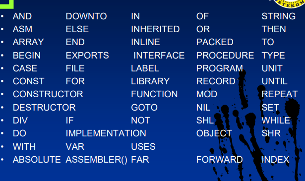
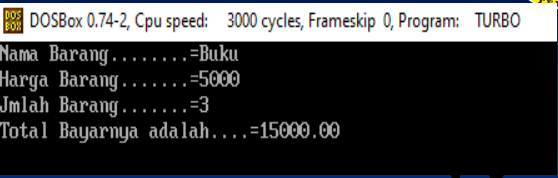

# Instalasi Software dan Perintah Dasar dalam Pascal

## Tujuan Pembelajaran

- Diharapkan mahasiswa mampu unutk menginstalasi software yang digunakan dengan cara yang baik dan bernar.
- Mahasiswa mampu dan mengerti perintah-perintah dasar dalam pemrograman khususnya pascal.
- Mahasiswa mampu mengaplikasikan perintah dasar unutk membuat program dasar dalam permrograman secara umum dan khususnya pemrograman pascal.

## Materi Pokok

- Software Turbo Pascal.
- Struktur Pemrograman Pascal.
- Perintah Dasar Pascal.
- Program Dasar Input.

## Menu File

- New : Buka Lembar Kerja baru.
- Open (F3) : Membuka file yang pernah dibuat sebelumnya.
- Save (F2)/Save As : Menyimpan lembar kerja baru atau simpan lembar kerja dan beri nama baru.
- Save All : Menyimpan semua file yang terbuka atau aktif.
- Change Dir : Perintah ke direktori / folder aktif penyimpanan.
- Print : Cetak.
- Printer Setup : Atur Printer.
- Dos Shell : Ke Mode Command Prompt.
- Exit (Alt + X) : Keluar dari aplikasi program.
- Run (Ctrl + F9) : Jalankan Program yang kita buat.

## Struktur Program Pascal

- Secara ringkas, struktur suatu program Pascal dapat terdiri dari 3 bagian:
  1. Bagian Judul Program.
  2. Bagian Deklarasi.
     - Deklarasi tipe data (TYPE)
     - Deklarasi variable (VAR)
     - Deklarasi konstanta (CONST)
     - Deklarasi label (LABEL)
     - Deklarasi sub-program (PROCEDURE dan FUNCTION)
  3. Bagian Program Utama Statement.

Secara sederhana bisa saja program Pascal hanya terdiri pada bagian ke-3, yaitu Begin dan End saja.

```pascal
Begin
  #Statement
End.
```

## Implementasi


### 1.Judul Program

- Judul Program ini digunakan unutk memberi nama program sifatnya optional. Jika ditulis harus terletak pada awal dari program dan diakhiri dengan titik koma;
- Contoh penulisan judul program yang benar:
  - `PROGRAM latihan;`
  - `PROGRAM latihan(input,output);`
  - `PROGRAM lat_1;`
  - `PROGRAM lat_satu(output);`
- Dalam penulisan judul tidak boleh ada spasi kosong, kalau mau nyambung pakai underscore(_).
- Jangan lupa berakhiri dengan titik koma (;).

### Deklarasi

- Bagian ini menjelaskan / memperkenalkan secara rinci semua data yang akan digunakan pada suatu program. Dalam penulisannya tidak boleh sama dengan kata-kata cadangan (*reverse words*) dan selalu diakiri dengan tiitk koma (;).
- **Deklarasi label**
  - Deklarasi label digunakan jika pada penulisan program akan menggunakan statment `GOTO` (untuk meloncat ke suatu statement tertentu).
- **Deklarasi Kostanta**
  - Deklarasi ini digunakan untuk mengidentifikasikan data yang nilainya suda ditentukan dan pasti, tidak dapat dirubah dalam program.
- **Deklarasi Tipe**
  - Deklarasi ini digunakan unutk menyebutkan tipe setiap data yang akan digunakan pada program Pascal.
- **Deklarasi Variable/peubah**
  - Deklarasi ini berisi data-data yang bisa beruah-ubah nilainya di dalam program.
- **Deklarasi Prosedur/Fungsi**
  - Deklarasi prosedure / fungsi terletak pada sub program yang menggunakannya.
  - Program dapat dibagi menjadi beberapa bagian/sub program, yang terdiri dari satu program utama dan satu / lebih program bagian (bisa berupa prosedur / fungsi).

## Pernyataan

- Bagian ini adalaah bagian yang akan terproses dan terdapat dalam satu blol yang diawali dengan `BEGIN` dan diakhiri dengan `END` (penulisan `END` dikuti dengan tanda titik).
- Bagian ini berisi pernyataan / statement yang merupakan instruksi program.
- Setiap statement diakhiri dengan tanda titik koma (;).
- Bentuk umumnya adalah sebagai berikut:

```pascal
BEGIN
  {Statenent}
END.
```

## Aturan Program

- Setiap akhir pernyataan diakhiri titik koma(;), kecuali unutk nama label.
- Akhir progarm diberi titik (.).

## Komentar

- Adalah keterangan yang diberikan untuk keperluan dokumentasi.
- Tidak menghasilkan tindakan (tidak mempengaruhi jalanyana program).
- Boleh menggunakan tanda : `{ini komentar}` atau `{*ini komentar*}`.

## Identifier

- Merupakan identifier yang didefinisikan sendiri oleh pemrograman. Pemrograman mempunyai kebebasain unuk menentukan nama identifiernya, dengan syarat nama tersebut tidak sama dengan identifier standar dan reverse word yang akan  dibahas lebih lanjut. Hal ini untuk mencegah kesalahan yang bisa timbul akibat tumpang tindih identifier dalam program.

## Syarat identifier / Variable

- Variable merupakan penyimpan data yang bersifat sementara di memori komputer (RAM).
- Aturan pemberian nama variable:
  - Diawali huruf.
  - Tidak boleh ada spasi/blank.
  - Tidak boleh menggunakan revered word.
  - Tidak boleh menggunakan simbol khusus, kecuali underscore.
  - Panjang maxsimal 63 karakter.

## Statement-statement pada pascal

- ***RESERVED WORD***
  - Reserved word adalah kata kata baku yang digunakan dalam program dan mempunyai bentuk serta kegunaan tertentu yang telah didefinisikan oleh pascal.
  - Reserved word tidak oleh didefinisikan kembali oleh pemakai, sehingga tidak dapat digunakan sebagai pengenal (identifier).
  - Dalam bahasa pemrograman pascal beberapa Reserved word tersebut adalah:
  - 

## Perintah Dasar

- Write ('Text/tulisan', Variable);
  - Perintah untuk menampilkan atau cetak dilayar monitor tanpa pindah baris.
- WriteLn('Text/Tulisan', Variable);
  - Perintah untuk menampilkan/cetak dilayar monitor lalu pindah baris kebawah
- Read/Readln(variable);
- Digunakan unutk memasukan input data lewat keyboard ke dalam suatu variabel.
- Sintax :READ/READLN(Variabel);
  - READ = Pada statement ini posisi kursor tidak pindah ke baris slajutnya (pembacaan secara horizontal).
  - Readln = Pada statement ini posisi kursor akan pinda ke baris selanjutnya setelah di input(pemBacaan secara vertical).
- Readkey
  - Unutk pembacaan sebuah karakter dari keyboard. Tipe data yang dihasilkan adalah char
  - Sintaks : READKEY;

## Runtunan / Sequence

- **Runtunan** adalah struktur algoritma paling dasar yang berisi rangkaian intruksi yang diproses secara **Sekuensial**, satu per satu, mulai **dari** intruksi pertama sampai instruksi terakhir. Yang berati: Tiap barisnya hanya dikerjakan satu-persatu tanpa ada loncatan atau perulangan, dilakukan sekali tiap instruksi.
- Runtunan/Squence ini akan mengerjakan proses satu per satu, mulai dari intruksi pertama, instruksi ke-2, ke-3, ke-4 sampai instruksi terakhir.
- Ini artinya bahwa tiap barisnya hanya dikerjakan satu-persatu tanpa ada loncatan atau perulangan dikalukan sekali setiap instruksi.

## Contoh Program Sederhana

```pascal
Begin
  Writeln('Namaku Yusril');
  Writeln('Rumahku Semarang');
  Readln;
End.
```

## Variabel

- **Variabel** adalah suatu tempat yang digunakan unutk menampung data atau kostanta di memori yang mempunyai nilai yang dapat berubah selama proses program.
- variabel terkait dengan deklarasi.
- Bentuk umum variabel.

```pascal
var
  a : integer;
  b : real;
  c : String;
```

## Contoh Program

- Pencataan transaksi penjualan sebiah toko kelontong dengan inputan nama barang, harga barang, jumlah barang(penjualan).
- Total adalah sebuah proses dari : harga * jumlah barang.
- Buatlah program transaksi diatas.
- Langkah-langkahnya:
  - Kita tilis judulnya(Transaksi_penjualan).
  - deklarasikan variabelnya :
    - NamaBar -> string,
    - HargaBar -> real,
    - jumlahBar -> integer dan
    - total -> real.
  - Tuliskan program pada antara begin dan end.

## Program transaksi penjualan

```pascal
Program Transaksi_penjualan;
uses crt;
var
  namaBar : String;
  hargaBar, total : Real;
  jumlahBar : integer;
begin
  clrscr;
  write('Nama Barang .....=');readln(namaBar);
  write('Harga Barang ....=');readln(hargaBar);
  write('Jumlah Barang ....=');readln(jumlahBar);
  total := hargaBar * jumlahBar;
  writeln('Total Bayarnya adalah ....= ', total:6:2);
  readln;
end.
```


## Type Real

`('Total Biaya adalah ...= ', total:6:2);`
jumlah 6:2 itu optional bisa lebih atau kutang sesuaikan dengan kebutuhan.

## Hasil Program



- Untuk program di atas tambahkan -> bahwa setiap pembelian mendapatKAN potongan sebesar 15% dari total pembelian.
- Tambahkan juga bayat yang didapatkan dari `: total - potongan`

## Latihan

### 1.Buat program unutk menkonversikan derajat celcius ke reamur dan fahrenheit

- input : Celcius R=4/5\*C, F=9/5\*C+32
- output : Reamur dan Fahrenheit (C/R/F, 5/4/9+32)

### 2. Buatlah program unutk menghitung Luas segi tiga

- input : Alas, Tinggi
- Output: Luas segi tiga (Alas*Tinggi)/2

### 3. Buatlah program unutk mengitung Luas dan keliling lingkaran

- input : Jari-jari(r) / atau Diameter(D)
- output: Luas(Phi\*r\*r) dan keliling(Phi\*r\*2)

### 4. Buat Program Pascal dengan atuaran input dua buah bilangan, Tampilan hasil : penjumlahan, pengurangan, perkalian dan pembagian dari kedua bilangan tersebut

## Penutup

- Perintah dasar write berfungsi untuk menampilkan teks pada layar monitor.
- Write akan menampilkan tampilan kekanan sedanakn writeln akan menampilan ke baris berikutnya.
- Perintah Read berfungsi untuk membaca sebuah variabel yang sudah dideklarasiakan.
- Peringtah dalam pascal haris diakhiri dengan tanda titik koma(;).
