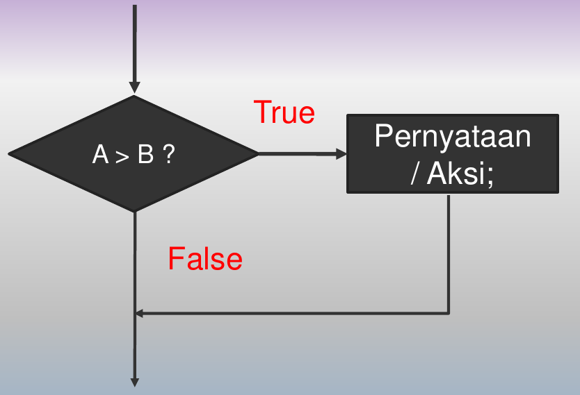
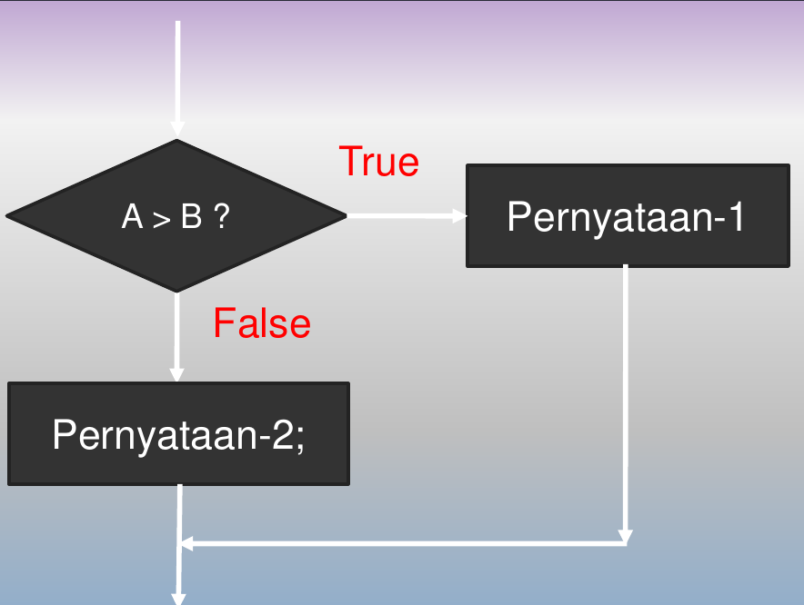
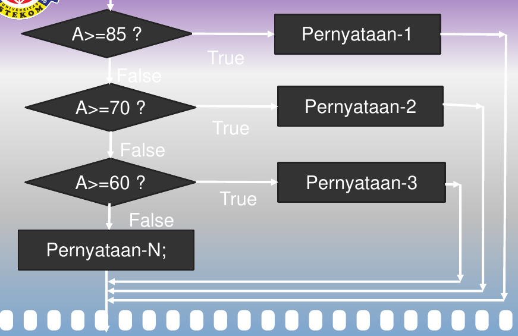
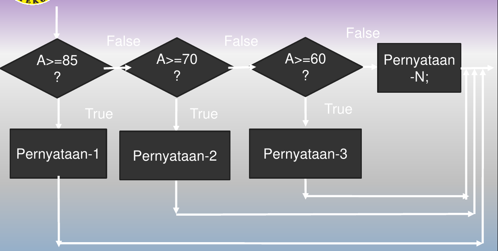
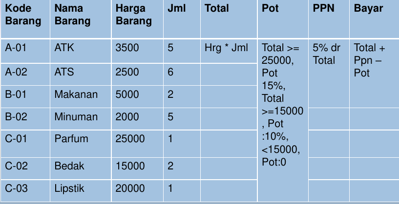

# Percabangan 1

## Tujuan Pembelajaran

- Mahasiswa dapat mengerti dan memahami struktur pemilihan dan seleksi dalam program.
- Mahasiswa mengerti dan mampu menyelesaikan penyelesaian kondisi dalam bentuk tunggal maupun majemuk.
- Mahasiswa mampu dan dapat menerapkan pemilihan dalam menyelesaikan berbagai kasus dalam program aplikasi.

## Materi Pokok

- Seleksi Tunggal / Satu kondisi 
- Seleksi Dua / Dua kondisi
- Seleksi Majemuk / Lebih dari Dua kondisi

## Pengertian Percabangan

- Percabangan adalah suatu perintah (pernyataan) yang memungkinkan suatu perintah (pernyataan) dieksekusi jika suatu kondisi terpenuhi atau tidak terpenuhi.
  - Jika suatu kondisi terpenuhi, maka perintah akan dilaksanakan.
  - Jika kondisi tidak terpenuhi, maka perintah yang lainnya dilaksanakan.
- Kondisi umumnya dalam bentuk Boolean (`Ture`/`False`)
- Percabangan didalam pemrograman digunakan oleh komputer untuk menentukan langkah kerja instruksi.
- Percabangan menggunakan operator kondisional yang akan menghasilkan nilai boolean (benar / `true` atau salah / `false`).
- Jika nilai yang dihasilkan benar, maka perintah (instruksi) akan dilaksanakan atau melaksanakan instruksi lainnya.

## Konsep Percabangan

- Tidak semua baris dalam program akan di eksekusi.
- Suatu aksi akan dilakukan bila memenuhi persyaratan atau kondisi tertentu.
- Penentuan kondisi **Boolean** dan aksi yang dilakukan bergantung pada jumlah pilihan atau kasus yang terdapat pada masalah tersebut apakah terdapat satu pilihan, dua pilihan, ataukah terdiri atau banyak pilihan.

## Jenis Percabangan

- Jenis percabangan yang umum digunakan antara lain:
  - Percabangan tunggal.
  - Percabangan dua kondisi.
  - Percabangan Majemuk.

## Percabangan Tunggal

- bentuk Umum
- `if <kondisi terpenuhi> Then <laksanakan perintah>`
- Dimana kondisi adalah suatu yang bernilai *True* atau *False*, dan pernyataan adalah perintah yang akan dilankan.
- Atau `if x Then Y`
- Jika kondisi X terpenuhi (benar) maka lakukan aksi Y / jika tidak : Tidak melakukan perintah.

## Bentuk Flowchart



## Studi Kasus

- Menentukan Kelulusan seorang siswa berdasarkan nilai yang didapat:
  - Jika nilai >= 60 maka dinyatakan "Lulus".
  - Jika nilai \ 60 maka ... ?

- Menentukan nilai masukan apakah Genap atau ganjil jika nilai tersebut dibagi 2.
  - Jika Sisa = 0 maka Bilangan Genap
  - Jika Sisa = 1 maka ...?

## Contoh Program

```pascal
program Nilai_Huruf;
uses crt;
var
    nilai : real;
    ket : string;


begin
    clrscr;
    write('Masukan Nilai : '); readln(nilai);
    
    if Nilai >= 60 then
        ket := 'Lulus';
        writeln('Keterangan = ', ket);
        readln;
end.

```

---

```pascal
program Cari_Bilangan_Genap_dan_Ganjil;
uses crt;

var
  bil : integer;
  ket : string;

begin
  clrscr;
  write('Masukan Sebuah bilangan : ');readln(bil);

  if (bul mod 2 ) == 0 then
    ket := 'Genap';

    writeln('Keterangan   : ', ket);
    readln;
end.
```

## Percabangan Dua kondisi 

Bentuk Umum
```pascal
if <kondosi- Terpenuhi> Then
  {pernyataan-1}
else
  {pernyataan-2}
```

- Dimana kondisi adalah sesuatu yang bernilai *True*(terpenuhi) atau *Falae* (tidak terpenuhi), dan pernyataan adalah perintah yang akan dijalankan
- **Atau** `if kodisi == true Then X else Y`

Jika kondisi terpenuhi (*true*) maka lakukan aksi X jika tidak maka lakukan aksi Y.

## Flowchart If Ganda



## Studi Kasus-2

- Menentukan Kelulusan seorang siswa berdasarkan nilai yang didapat:
  - Jika nilai >= 60 maka dinyatakan "Lulus".
  - Jika nilai \ 60 maka dinyatakan "Tidak Lulus"

- Menentukan nilai masukan apakah Genap atau ganjil jika nilai tersebut dibagi 2.
  - Jika Sisa = 0 maka Bilangan Genap
  - Jika Sisa = 1 maka Bilangan Ganjil.

## Contoh Program

```pascal
program Nilai_Huruf;
uses crt;

var
  nilai : integer;
  ket : string;

begin
  clrscr;
  write('Masukan nilai : '); readln(nilai);

  if nilai >= 60 then
    ket := 'Lulus';
  else
    ket := 'Tidak Lulus';

  writeln('Keterangan  = ', ket);
  readln;
end,
```

---

```pascal
program Cari_Bilangan_Genap_dan_Ganjil;
uses crt;
var
  bil : integer;
  ket : string;

begin
  clrscr;
  write('Masukan sebuah bilangan : '); readln(bil);

  if (bil mod 2) == 0 then
    ket := 'Genap';
  else
    ket := 'Ganjil';
  
  writeln('Keterangan = ', ket);
  readln;
end,
```

## Pilihan Majemuk / bertingkat

- Bentuk Umum
```pascal
if kondisi then
  {Pernyataan-1}
else
  if kondisi-2 then
    {Pernyataan-2}
  else
    if kondisi-3 then
      {pernyataan-3}
    else
      {Pernyataan-n}
```

- Dimana kondisi-1 di uji jika hasil _true_ jalankan pernyataan-1, jika _false_.
- Uji kondisi-2, jika hasil _true_ jalankan pernyataan-2, jika hasilnya _false_.
- Uji kondisi-3, jika hasil _true_ jalankan pernyataan-3, jika _false_ jalankan pernyataan-n dst.

## Contoh lain if majemuk

- Bentuk Umum:
- `if X1=T, aksi Y, if X2=T, aksi X, if X3=T, aksi Z, ...else AA`
- jika uji kondisi `X1` terpenuhi maka lakukan aksi `Y`, jika tidak lakukan uji kondisi `X2`, jika terpenuhi maka lakukan aksi `X`, jika tidak lakukan uni kondisi `X3`, jika terpenuhi lakukan aksi `Z`, jika tidak lakukan aksi `A`
- Banyak if yang digunakan = banyak pernyatan-1 `if = Y,X,Z,A` adalah pernyataan, yang berati jumlah 4, maka 4-1 = 3, jadi `if` yang digunakan = 3.

## Flowchart if bertingkat



---



## Studi Kasus

- Menetukan Grade Seorang siswa berdasarkan nilai yang didapat:
  - Jika nilai >= 86 maka grade-nya "Baik Sekali"
  - Jika nilai >= 70 maka grade-nya "Sekali"
  - Jika nilai >= 55 maka grade-nya "Cukup"
  - Jika nilai \ 55 maka grade-nya "Remidi"

## Contoh Program

```pascal
program Nilai_Huruf;
uses crt;
var
  nilai : real;
  ket string;

begin
  clrscr;
  write('Masukan Nilai Anda : ');readln(nilai);

  if nilai >= 86 then
    ket := 'Sangat baik';
  else
    if nilai >= 70 then
      ket := 'Baik';
    else
      if nilai >= 55 then
        ket := 'Cukup';
      else
        ket := 'Remidi';

  writeln('Keterangan Anda = ', ket);
  readln;
end.
```

### Kesalahan

- Bagaimana jika nilai yang dimasukan diatas 100? Apakah Hsilnya Benar / Error?
- Hasilnya ujianya adalah benar masa hasilnya Istimewa, Apakah 125 >= 85, jawabanya adalah benar.
- Untuk antisipasi hal ini anda bisa tambahkan `and` / `or` sesuai kebutuhan.

```pascal
program Nilai_Huruf;
uses crt;
var
  nilai : real;
  ket string;

begin
  clrscr;
  write('Masukan Nilai Anda : ');readln(nilai);

  if (nilai >= 86) and (nilai <= 100) then
    ket := 'Istimewa';
  else
    if (nilai >= 70) and (nilai <= 84) then
      ket := 'Baik';
    else
      if (nilai >= 55) and (nilai <= 69) then
        ket := 'Cukup';
      else
        if (nilai >= 0) and (nilai <= 54) then
          ket := 'Remidi';
        else
          ket := 'Input data salah !';

  writeln('Keterangan Anda = ', ket);
  readln;
end.
```

## Blok Pernyataan

- Bila dalam pernyataan lebih dari satu maka penulisan harus diantara : `begin` dan `end`.
- Bentuk umumnya

```pascal
if kondisi then
  begin
    {pernyataan-1a}
    {pernyataan-1b}
  end
else
  begin
    {pernyataan-2a}
    {pernyataan-2b}
  end
```

## Studi Kasus

Menetukan gaji dan tunjangan dengan berdasarkan golongan tertentu

- Jika gol = A maka ; Gaji Pokok : 1.000.000, trans : 25.000
- Jika gol = B maka ; Gaji Pokok : 1.500.000, trans : 50.000
- Jika gol = C maka ; Gaji Pokok : 2.000.000, trans : 75.000
- Jika gol = D maka ; Gaji Pokok : 3.000.000, trans : 100.000

## Contoh Program

```pascal
program Penggajian_Karyawan;
uses crt;

var
  gol : char;
  gaPok, Trans, gaBer : real;

begin
  clrscr;
  write('Masukan Golongan Anda : '); readln(gol);

  if gol='A' then
    begin
      gaPok := 1000000;
      trans := 25000;
    end
  else
    if gol='B' then
      begin
        gaPok := 1500000;
        trans := 50000;
      end
    else
      if gol='C' then
        begin
         gaPok := 2000000;
         trans := 75000;
        end
      else
        if gol='D' then
          begin 
            gaPok := 2000000;
            trans := 75000;
          end
        else
          writeln('Anda memasukan golongan yang salah !!');
  
  gaBer := gaPok + trans;

  writeln('Gaji Bersih  = ', gaBer:7:2);
  readln;
end.
```

## Alternatif Pilihan

- `case ... of`
- Struktuf `case of` mempunyai suatu ungkapan logika yang disebut dengan selector dan sejumlah statement yang diawali dengan suatu label permasalahan (case label) yang mempunyai tipe yang sama dengan selector.
- Statement yang mempunyai case label yang bernilai sama dengan case label selector akan diproses sedang statement yang lainya tida.

## Bentuk Umum case ... of

```pascal
case <variabel> of
  alternatif1:
    begin
      {Pernyataan-1a}
      {Pernyataan-1b}
    end
  alternatif2: {pernyataan2}
  alternatif3: {pernyataan3}
  alternatif4: {pernyataan4}
else
  {alternatif jika bukan pilihan diatas}
end;
```

## Contoh Program

```pascal
program Pemilihan_Dengan_Case_Of;
uses crt;

var
  nilai : integer;
  ket : string;

begin
  clrscr;
  write('Masukan Nilai ujian Anda : '); readln(nilai);

  case niai of
    86..100 : ket := 'Sangat Baik';
    70..85  : ket := 'Baik';
    55..69  : ket := 'Cukup';
    0..54   : ket := 'Remidi';
  else
    writeln('Input Salah !!! Isi dengan 0-100');
  end;

  write('Keterangan Nilai Anda  = ', ket);
  readln;
end.
```

## Contoh Lain

```pascal
Program Alternatif_Percabangan;
uses crt;

var
  nama : string;
  gol : integer;
  gaPok, Tunj, gaBer : real;

begin
  write('Nama Karyawan  : '); readln(nama);
  write('Golongan Karyawan(1, 2, 3, 4) : '); readln(gol);

  case gol of
    1:
    begin
      gaPok := 1000000;
      Tunj := 25000;
    end;

    2:
    begin
      gaPok := 1500000;
      Tunj := 50000;
    end;

    3:
    begin
      gaPok := 2000000;
      Tunj := 75000;
    end;

    4:
    begin 
      gaPok := 2000000;
      Tunj := 75000;
    end;
    
  else
    writeln('Anda memasukan golongan yang salah !!');
  end;
  
  gaBer := gaPok + Tunj;

  writeln('Gaji Pokok Karyawan = ', gaPok:7:2);
  writeln('Tunjanga Karyawan   = ', Tunj:6:2);
  writeln('Gaji Bersih         = ', gaBer:8:2);
  readln;
end.
```

## Analisis Data



## Buatlah Program

- Buatlah program berdasarkan analisis data diatas dengan menggunakan fungsi `if then`, `else`, atau `case of`.
- Untuk nama barang dan Harga barang gunakan dengan blok pernyataan, sehingga lebih efektif dari pada di buat dengan satu persatu.
- Ujilah program tersebut dengan memasukan kode barang yang berbeda.

```pascal
program Hitung_Pembayaran_Kontan;
uses crt;

var
  koBar, namaBar : string;
  hargaBar, total, pot, ppn, bayar: real;
  jml : integer;

begin
  clrscr;
  write('Masukan Kode barang : '); readln(koBar);
  
  if koBar='A-01' then
    begin
      namaBar := 'ATK';
      hargaBar := 3500;
    end
  else
    if koBar='A-02' then
      begin
        namaBar := 'ATS';
        hargaBar := 2500;
      end
    else
      if koBar='B-01' then
        begin
          namaBar := 'Makanan';
          hargaBar := 5000;
        end
      else
        if koBar='B-02' then
          begin
            namaBar := 'Minuman';
            hargaBar := 3500;
          end
        else
          if koBar='C-01' then
            begin
              namaBar := 'Parfum';
              hargaBar := 25000;
            end
          else
            if koBar='C-02' then
              begin
                namaBar := 'Bedak';
                hargaBar := 15000;
              end
            else
              if koBar='C-03' then
                begin
                  namaBar := 'Minuman';
                  hargaBar := 3500;
                end
              else
                writeln('Anda memasukan kode barang yang salah!!!');
              end;
  
  writeln('Nama Barang          = ', namaBar);
  writeln('Harga Barang         = ', hargaBar:6:2);
  write('Jumla Barang           = ');readln(jml);

  total := hargaBar * jml;

  writeln('Total Harga Adalah   = ', total:6:2);

  if total >= 25000 then
    pot := 0.15 * total;
  else
    if total >= 15000 then
      pot := 0.10 * total;
    else
      pot := 0;

  ppn := (total * 5)/100;
  bayar := total + ppn - pot;

  writeln('Dapat Potongan Sebesar     = ', pot:5:2);
  writeln('Pajak Pertambahan          = ', ppn:5:2);
  writeln('Total Bayarnya adalah      = ', bayar:6:2);
  readln;
end.
```

## Latihan

Karyawan honorer di PT ABC digaji berdasarkan jumlah jam kerja selama satu minggu. Upah per jam Rp2000,-. Bila jumlah jam kerja lebih besar dari 48 jam, maka siswanya dianggap sebagai jam lembur. Upah lembur Rp 3000,-/jam.\
Tulislah algorita yang membaca nama pegawai, jumlah jam kerja seorang karyawan selama satu minggu, lalu menentukan umah mingguannya.

## Penutup

- Percabangan atau penyelesaian kondisi adalah suatu bentuk penyelesaian sebuah kasus.
- bentuk percabangan umumnya terdiri dari 3 hal: tunggal, dua dan majemuk.
- Selain dengan `if then` dan `else`
- Penyelesaian kondisi dapat diselesaikan dengan alternatif lain yaitu : `case of`

