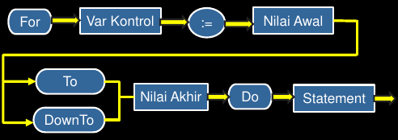
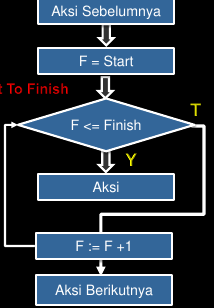
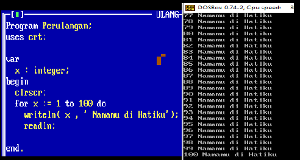
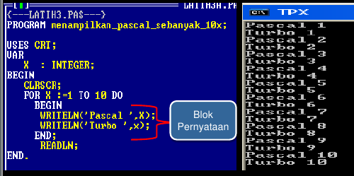
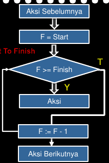
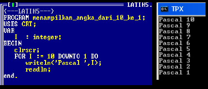
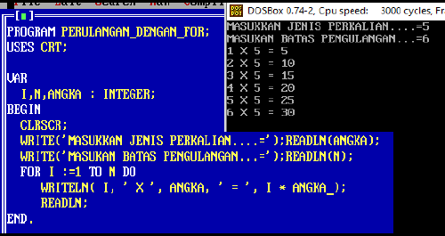
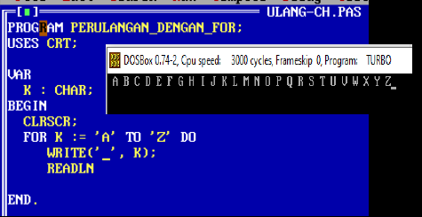

# Kontrol Program Perulangan Pascal

## Tuhuan 

- Mahasiswa Mampu Mengerti Konsep Perulangan dalam pascal
- Mahasiswa mampu membuat program perulangan sederhana
- Mahasiswa mampu mengimplementasikan program perulangan

## Materi Kuliah 

- Perulangan dengan `for do`
- Perulangan Positif / naik
- Perulangan Negaif / turun
- Perulangan dalam perulangan (nasted loop)

## Definisi Perulangan

- Perulangan dalam program didefinisikan sebagai bentuk algoritma yang berfungsi untuk mengulang perintah-perintah baris program dalam aturan tertentu atau menjalankan suatu program tertentu berulang-ulang sampai suatu kondisi teopenuhi
- Perulangan akan melakukan proses berulang-ulang selama kondisi masih bernilai __TRUE__ (atau nilai batas yang ditentukan belum tercapai), dan kondisi akan berhenti jika keadaan kondisi berubah menjadi __FALSE__ (Atau nilai batas telah tercapai)

## Struktur Perulangan

Struktur perulangan terdiri dari 2 bagian:

- yaitu syarat yang harus dipenuhi untuk melaksanakan perulangan. Syarat ini bianyanya dinyatakan dengan benar(*true*) atau salah(*false*)
- Badan perulangan (*loop body*), yaitu satu atau lebih instruksi yang akan diulang.

## Komponen Perulangan

Tiga (3) Komponen utama dalam perulangan

- Kondisi awal dari Pengulangan
- Perintah program yang akan di ulang
- Kondisi akhir dimana pengulangan akan berhenti

## Jenis Perulangan

- Di dalam bahasa Pascal. dikenal tiga macam / jenis pengulangan, yaitu dengan menggunakan penyataan `for-do`, `while-do`, `repeat...until`.

## Perulangan for-do

- Pengulangan dengan pernyataan `for-do` digunakan untuk mengulang penyataan atau satu blk pernyataan berulang kali sejumlah yang ditentukan. Perulangan dengan pernyataan `for-do` dapat berbentuk perulangan positif maupun perulangan negatif.

## Sekema for-do



## Pengulangan Positif

Pengulangan dengan `for - to - do`, dengan bentuk umum:

`For <variabel-control> := <nilai-awal> To <nilai-akir> DO <pernyataan/perintah>`

```pascal
For X := 1 TO 100 DO
  Writeln(X, 'Turbo Pascal');
```

## Flowchart for - do positif



## Pengulangan Positif

- Pernyataan ini mengerjakan instruksi lebih dari satu kali (Mengulang perintah) sebyanak jimlah ulangan yaitu nilai akhir dikurangi nilai awal.
- Nilai awal dan nilai akhir harus pertipe integer positif atau negatif. Dan nilai akhir harus lebih besar dari nilai awal.
- Pertambahan perulangan (conuter/skip) dalam `for-to-do` selalu bertambah +1.
- Loop ini akan berhenti sampai nilai akhir terpenuhi.

## Algoritma for-do

- Algoritma untuk mencetak penyataan sebanyak 100 kali.
- Misalkan pernyataan "Namamu di hatiku".
- Bagaimana caranya algorima untuk kasus ini?

## Penyelesaian

- Perlu adanya variabel counter, kita beri nama X.
- Nilai awalnya adalah 1 dan nilai akhirnya adalah 100.
- Sedangkan kenaikan tiap kali pengulangan dari X adalah 1.
- Perintah untuk mencetak pernyataan akan diulang satu persatu sampai nilai akhir dari counter terpenuhi(100).
 
## Program hasil



## Penjelasan

- Penyataan `Writeln(x, 'Namamu di hatiku');` akan diulang sebanyak 100 kali, yaitu dengan penghitung dari nilai awal 1 sampai dengan nilai akhir 100.
- X dan Namamu di Hatiku tercetak sebanyak 100 kali sesuai dengan akhir pengulangan.
- Apabila penyataan diulang lebih dari satu pernyataan maka setelah `Do` harus memakai Begin kemudian beberapa pernyattaan yang akan diulangan dan diakhiri dengan `end;`.

## Contoh program



## Pengulangan Negaif

- Perulangan negatif penyataan `for-downTo-Do`, dengan bentuk umum:
- `For <variabel-control> := <nilai awal> DownTO <nilai akhir> DO <pernyataan/perintah>`.

```pascal
For X := 25 DownTO 10 Do
  Writeln(X, 'Turbo Pascal');
```

---

- Penyataan ini mengerjakan instruksi lebih dari satu kali (mengulang perintah) sebanyak jumlah ulangan yaitu Nilai akhir dikurangi nilai awal.
- Nilai awal dan nilai akhir harus pertipe integer positif atau negatif. Dan nilai akhir harus lebih kecil dari nilai awal.
- Pertambahan perulangan (conuter/skip) dalam `For ... DownTO ... Do` selalu berkurang -1.
- Loop ini akan berhenti sampai nilai akhir terpenuhi.
 
## Flowchart for-do Negaif



## Program + Hasil



## Penjelasan

- Pernyataan `Writeln('Pascal', 1)` akan diulang sebanyak 10 kali, yaitu dengan penghitung dari nilai awal 10 sampai dengan nlai akhir 1.
- X dan Pascal tercetak sebanyak 10 kali sesuai dengan akhir pengulangan

## Pengulangan Perkalian



## Pengulangan Char 



## Pengulangan Bersarang (Nested loop)

- Pengulangan bersarang atau _nested loop_ adalah pengulangan di dalam pengulangan.
- Pengulangan dalam pengulangan adalah suatu pengulangan dimana ada pengulangan lagi yang ke dua, dan seterusnya.

## Struktur Nested Loop

```pascal
For (variabel1) := (nilai-awal) to (nlai-akhir)do
  begin
    {Kode program pertama yang akan diulang}

    for (variabel2) := (nilai-awal2) to (nlai-akhir2) do
      begin
        {kode prgram kedua yang akan diulang}
      end;
  end;
```

## Contoh Program

```pascal
program perulangan_dengan_for;
uses crt;

var
  I, J : integer;

begin
  clrscr;
  for I := 1 to 5 do
    begin
      for j := 1 to 3 do
        begin
          write(I, J);
          write('  ');
        end;
      writeln;
    end;
  readln;
end.
```

---

```pascal
program perulangan_dengan_for;
uses crt;

var
  I, J : integer;

begin
  clrscr;
  for I := 1 to 5 do
    begin
      for J := 1 to 3 do 
        begin
          write(I, ' * ', J, ' = ', I * J);
          writeln;
        end;
    end;
  readln;
end.
```

## Kesimpulan

- Perulangan dengan `for to do` adalah perulangan positif dengan step 1 dan jumlah perulangan sudah diketahui dengan step 1 dan jumlah perulangan sudah diketahui dengan pasti.
- Perulangan dengan `for downto do` adalah perulangan negatif dengan step -1 dan jumlah perulangan sudah diketahui dengan pasti.
- `for to do` juga mengenal istilah pengulangan dalam pengulangan.

