# Matematika Diskrit Teori Himpunan dan Operasi Himpunan

## Himpunan

Salah satu kemampuan yang kita kuasai setelah kita mempelajari logika proposisi adalah kemampuan membedakan. Membedakan apakah tautologi, konstadiksi atau bentuk proposisi yang lain, membedakan apakah proposisi bernilai benar atau salah, membedakan apakah kautor universal atau existential.\
Untuk dapat menguaisai teori himpunan, kemampuan untuk membedakan sangat diperlukan, karena himpunan merupakan kumpulan benda atau objek yang didefinisikan secara jelas. Himpunan dapat dipandang sebagai kumpulan benda-benda yang berbeda tapi dalam satu segi dapat ditanggapi sebagai suatu kesatuan. Objek-objek ini disebut anggota atau elemen himpunan.\

**Notasi**:
- Himpunan : A, B, C, ...
- Anggota himpunan : a, b, c, ...

## Contoh

Kita didefinisikan himpunan software under windows, maka kita menulis ;
`A = [MsWord, MsExcel, MsPowerPoint,...]`
atau
`B = [x|x software under windows]`

Cara menuliskan himpunan A disebut menulis secara tabulasi\
Cara menuliskan himpunan B disebut menulis secara deskirpsi.

Masing-masing objek dalam himpunan A disebut anggota atau elemen himpunan, dithuliskan:\
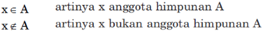

## 2.1.1 Kardinalitas

Jumlah elemen di dalam A disebut kardinal dari himpunan A.
Notasi : *n(A)* atau |A|

**Contoh**
B = {*x*| *x* merupakan bilangan prima yang lebih kecil dari 20},atau B = {2, 3, 5, 7, 11, 13, 17, 19} maka |B| = 8
T = {penrkutut, kutilang, kenari, dara, beo}, maka |T| = 5
A = {a, {a}, {{a}} }, maka |A| = 3

## Himpunan Berhingga dan Tak Berhingga

Himpunan berhingga adalah himpunan dimana jumlah anggotanya berhingga artinya bila kita menghitung elemen-elemen yang berbeda dari himpunan ini, maka proses berhitungnya dapat selesai.

Bila tidak demikian maka himpunan tak berhingga.

A = himpunan software anti virus.
A = {x|x software anti virus}
A = {Norton, McAfee, Panca, KaperSky, Norman}

**CONTOH**

B = himpunan bilangan asli
B = {x|x bilangan asli}
b = {1, 2, 3, ...}

maka A berhingga

## 2.1.3 Kesamaan Dua Himpunan dan Subhimpunan

Dua himpunan A dan B dikatakan sama dengan jika dan hanya jika keduanya bersama-sama memiliki anggota yang sama.

**CONTOH**

A = {WordPad, MsWord, WordPerfect, Libreoffice}
B = {WordPad, WordPerfect, Libreoffice, MsWord}

**MAKA**

A = B

Dua himpunan A dan B dengan elemen-elemen yang berbeda dikatakan setara jika dan hanya jika jumlah anggota himpunan A sama dengan jumlah anggota himpunan B.

**CONTOH**

A = {MsExcel, Lotus 123}
B = {Mouse, Keboard}

**MAKA**

A ~ B

Himpunan A dikatakan sub himpunan B jika dan hanja jika semua elemen-elemen A adalah anggota himpunan B.

**CONTOH**

A = {Win3.1, Win3.11, Win95, Win97}
B = {Win3.1, Win3.11, Win95, Win97, Win98, Win98SE, WinMe, Win2000, WinXp}

**MAKA**\

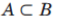

Bila tidak demikian dikatakan bukan sub himpunan.

**CONTOH**

A = {WinXp, Linux, Unix}
B = {Win3.1, Win3.11, Win95, Win97, Win98, Win98SE, WinMe, Win2000, WinXp}
C = {*monitor, printer, scanner*}

**MAKA**\

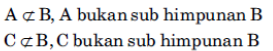

## 2.1.4 Macam-macam Himpunan

### 2.1.4.1 Himpunan Kosong / Enrty set

Himpunan dengan kardinal = 0 disebut dengan himpunan kosong/

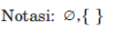

**CONTOH**

A = himpunan software aplikasi yang bisa dipakai dengan semua sistem operasi.\
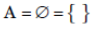

### 2.1.4.2 Singleton Set

Singleton set adalah himpunan yang hanya memiliki satu angota.

**CONTOH**

A = Himpunan devices yang berfungsi sebagai input devices sekaligus output devices.
A = {touch screen}

### 2.1.4.3 Himpunan Semesta / Universal Set

Dalam setiap membicarakan himpunan, maka semua himpunan yang ditinjau adalah subhimpunan dari sebuah himpunan tertentu yang disebut himpunan semesta.
Dengan kata lain himpunan semesta adalah himpunan dari semua objek yang berbeda.

Notasi : U

**CONTOH**

U = Semesta pembicaraan, yaitu sistem operasi produksi Microsoft
U = {Win3.1, Win3.11, Win95, Win97, Win98, Win98SE, WinMe, Win2000, WinXp}

### 2.1.4.4 Himpunan Kuasa

Dari sebuah himpunan, kita dapat membuat subhimpunan-subhimpunannya.\
Himpunan dari sema subhimpunan yang dapat dibuat dari sebuah himpunan disebut himpunan kuasa.\
Banyaknya himpunan bagian dari sebuah himpunan A adalah:\
2*, x adalah banyak elemen A\
Notasi : 2^

**CONTOH**

A = {mouse, keyboard}
B = {monitor, printer, scanner}

**MAKA**
2A = {A, {mouse}, {keyboard}, 0}
2B = {B. {monitor}, {printer}, {scanner}, {monitor, printer}, {monitor, scanner}, {printer, scanner}, 0}

## 2.2 Operasi Himpunan

### 2.2.1 Union / gabungan dari 2 himpunan

Gabungan 2 himpunan A dan B adalah himpunan yang angotanya semua angota A atau B atau Keduanya.

Notasi:

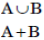

**CONTOH**

A = {mouse, keyboard}
B = {monitor ,printer, scanner}
C = {mouse, keyboard, CPU, monitor}

**MAKA**

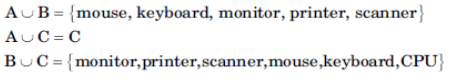

### 2.2.2 Intersection / Irisan dari 2 Himpunan

Irisan dari 2 himpunan A dan B adalah himpunan yang angotanya dimiliki bersama oleh himpunan A dan B.

Notasi :

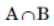

**CONTOH**

A = {mouse, keyboard, touch screen}
B = {monitor, touch screen, printer, scanner}

**MAKA**

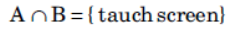

### 2.2.3 Relatice Complement / Selish Antara 2 Himpunan

Selish antara himpunan A dan B adalah himpunan yang angotanya hanya menjadi anggota himpunan A tetapi tidak termasuk anggota himpunan B.

Notasi : 

A - B

**CONTOH**

A = {SQL server, MySQL, MsAcecs}
B = {MySQL, MsAcecs, Oracle}

**MAKA**

A - B  = {SQL server}

### 2.2.4 Komplemen dari Himpunan

Komplemen dari sebuah himpunan A adalah himpunan yang anggotanya bukan anggota A .
Dengan kata lain komponen A adalah himpunan yang anggotanya merupakan hasil dari U - A.

Notasi :

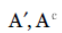

**CONTOH**

U = {Win3.1, Win3.11, Win95, Win97, Win98, Win98SE, WinMe, Win2000, WinXp, ...}
A = {Win3.1, Win3.11, Win95, Win97}
A'= {Win98, Win98SE, WinMe, Win2000, WinXp, ...}

### Symmetic Difference / Beda Setangkup

Beda Setangkup 2 himpunan A dan B adalah himpunan yang angotanya merupakan anggota himpunan A atau anggota himpunan B tetapi bukan merupakan anggota kedua himpunan secara bersamaan.

Notasi :

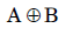

**CONTOH**

A = {Win3.1, Win3.11, Win95, Win97}
B = {Win95, Win97, Win98SE, WinMe, Win2000}

**MAKA**

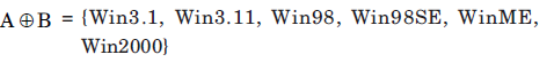

## Diagram Venn

Diagram Venn adalah suatu cara untuk menggambarkan hubungan antara himpunan-himpunan. Dalah diagram venn himpunan bisanya dinyatakan dengan suatu daerah bidang yang dibatasi oleh sebuah lingkaran.

**CONTOH**

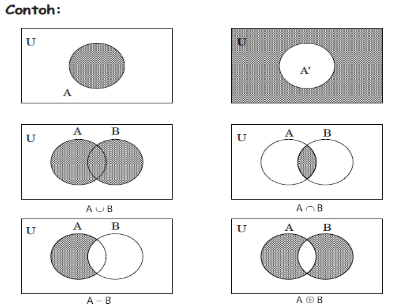

## Soal

1. Tuliskan dalam bentuk deskirpsi:
  - A = {Adobe Photoshop, Macromedia, Fireworks, PrintShopPro, GIMP, ...}
  - B = {SQL server, MySQL, MsAcecs, Oracle, SAP DB. PostGre SQL, Mongo DB, ...}
  - C = {PHP, ASP, Cold Fusion}
  - D = {Windows, Linux, Unix, MacOS, OS/2, ...}
  - E = {disket, CD-R, Hardisk, ...}
  - F = {mouse, keyboard, touch screen, ...} 
2. Misalkan semesta pembicaraan adalah sistem operasi produksi Microsoft dan himpunan-himpunan lainnya dinyatakan oleh :
  - A = {Win3.1, Win3.11, Win95, Win97}
  - B = {Win97, Win98, Win98SEm WinMe}
  - C = {WinMe, Win2000, WinXp, ...}
  - **Carilah**
  - 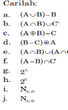

