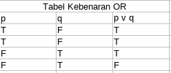
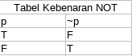
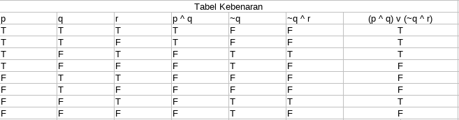

# Logika Proposisi

- **Logika**
  - merupakan dasar dari semua penalaran (*reasoning*)
  - penalaran didasarkan pada hubungan antara pernyataan *(statement)*.
- **Proposisi**
  - Pernyataan / Kalimat delkaratif yang bernilai benar *(True)* atau salah (*False*), tetapi tidak keduanya.

## Mengkombinasikan Proposisi

misal *p* dan *q* adalah proposisi

1. konjungsi : *p* dan *q* *p* & *q*
  - Notasi   : *p* ^ *q*
2. Diskonjungsi : *p* atau *q* *p* | *q*
  - Notasi   : *p* v *q*
3. Ingkaran  : Tidak *p* ~*p*
  - Notasi   : ~p

- *p* dan *q* disebut proposisi atonomik.
- Kombinasi *p* dengan *q* menghasilkan proposisi majemuk *(compund propisition)*.

## Tabel Kebenaran AND

## Tabel Kebenaran OR

## Tabel Kebenaran NOT

## Contoh Soal

(p ^ q) v (~q ^ r)

