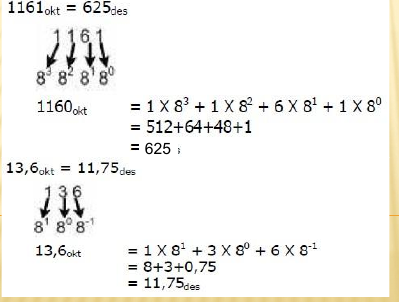
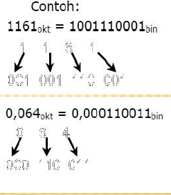

# Bilangan Oktal

- Sistem bilangan oktal merupakan sistem bilangan basis delapan. Pada sistem bilangan ini terdapat delapan lambang, yaitu: **O = {9, 1, 2, 3, 4, 5, 6, 7}**
- Ciri suatu bilangan menggunakan sistem bilangan oktal adalah tambahan subskip *okt* atau 8 atau tambahan huruf *O* di akhir suatau bilangan contoh : 1161okt, 11618, 1161O,0o1161

## Konversi Bilangan Oktal ke Desimal

Konversi bilangan oktal ke desimal dilakukan dengan menjumlahkan hasil perkalian semua digit oktal dengan beratnya.

## Konversi Bilangan Desimal ke Oktal

Konversi bilangan bulat desimal ke oktal dilakukan dengan membagi secara berulang-ulang suatu bilangan desimal denga 8, Sisa setiap pembagian merupakan digit oktal yang didapat, Contoh :

625 = 0o ?

+-----+----+---+
|625/8| 78 | 1 |
|78/8 | 9  | 6 |
|9/8  | 1  | 1 |
|1/8  | 0  | 1 |
+-----+----+---+

## Konversi Bilangan Oktal ke Biner

Konversi bilangan oktal ke biner lebih mudah dibandingkan konversi bilangan oktal ke desimal. Satu digit oktal dikonversi ke 3 bit biner.

+-+---+
|0|000|
|1|001|
|2|010|
|3|011|
|4|100|
|5|101|
|6|110|
|7|111|
+-+---+

0o1161 = 0b1001110001

+-+---+
|1|001|
|1|001|
|6|110|
|1|001|
+-+---+

## Penjumlahan Bilangan Oktal

- Langkah-langkah penjumlahan oktal:

  * Tambhakan masing-masing kolom secara desimal
  * rubah dari hasil ke oktal
  * tuliskan hasil dari digit paling kanan dari hasil oktal
  * kalau hasil penjumlahan tiap-tiap kolom terdiri dari dua digit, maka digit paling kiri merupakan carry of untuk penjumlahan kolom selanjutnya.

Contoh :

0o25
0o127
------ +
0o154

