# Gerbang Logika Dasar

**Gerbang Logika** merupakan dasar pembentukan sistem digital. **Gerbang Logika** beroperasi dengan bilangan biner, sehingga disebut juga gerbang logika biner. Tegangan yang digunakan dalam gerbang logika adalah **Tinggi** dan **Rendah**. Tegangan tinggi berati 1, sedangkan tegangan rendah berati 0.

## Gerbang AND

**Gerbang AND** digunakan untuk menghasilkan logika 1 jika semua masukan mempunyai logika 1, jiga tidak maka akan dihasilkan logika 0.

F = A.B

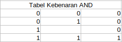

## Gerbang NAND (Not AND)

**Gerbang NAND** akan mempunyai keluaran 0 bila semua masukan pada logika 1. Sebaliknya jika ada semua logika ada sebuah logika 0 pada sembarang masukan pada gerbang NAND, maka keluaran akan bernilai 1.

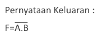

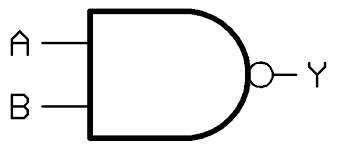

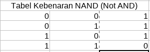

## Gerbang OR

**Gerbang OR** akan memberikan keluaran 1 jika salah satunya dari masukan pada keadaan 1. Jika diinginkan keluaran bernilai 0, maka semua masukan harus dalam keadaan 0.

F = A+B

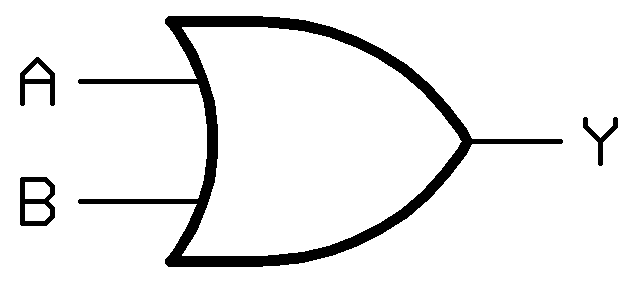

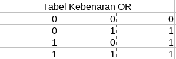

## Gerbang NOR

**Gerbang NOR** akan memberikan keluaran 0 jika salah satu dari masukan pada keadaan 1. Jika diinginkan keluaran 1, maka semua masukannya harus dalam keadaan 0.

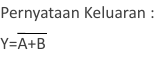

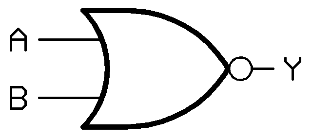

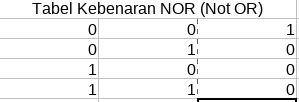

## Gerbang XOR (Exclusive OR)

**Gerbang XOR** (dari kata *Exclusive OR*) akan memberikan keluaran 1 jika masukan-masukannya mempunyai keadaan yang berbeda.

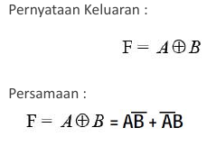

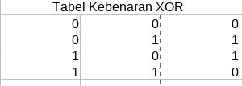

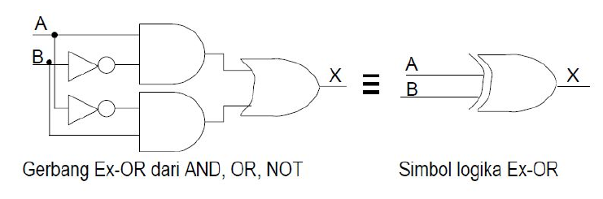

## Gerbang XNOR

**Gerbang XNOR** disebut juga gerbang *Not Exclusive OR* mempunyai sifat bila signal keluaran ingin bernilai tinggi (1) maka signal masukannya harus bernilai genap (kedua nilai masukan harus rendah atau tinggi keduanya). Pernyataan keluaran:

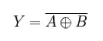

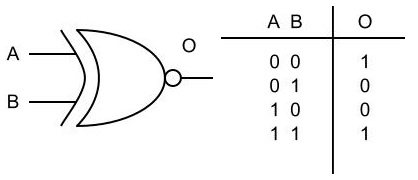

## Gerbang NOT

**Gerbang NOT** adalah gerbang yang mempunyai sebuah input dan sebuah output, **Gerbang NOT** berfungsi sebagai pembalik *inverter*, sehingga output dari gerbang ini merupakan kebalikan dari inputnya.

F = A'

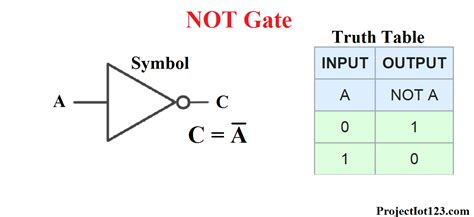

## Tabel Kebenaran

**Tabel Kebenaran** adalah tabel yang menunjukan kombinasi input beserta outputnya pada suatu kasus logika. **Tabel Kebenaran** berguna sekali untuk menganalisa suatu fungsi logika. Ada kalanya suatu kasus logika ditunjukkan oleh suatu fungsi logika atau suatu tabel kebenaran. Untuk mempermudah pemahaman perhatikan Contoh berikut:

Contoh:
	Tunjukan nilai kebenaran dari suatu fungsi F = AB'C + ABC'

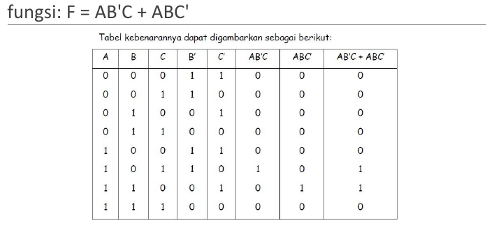

## Latihan

Gambarkan Pernyataan Boolean dibawah ini, dan buktikan dengan tabel kebenaran:

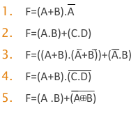

1. 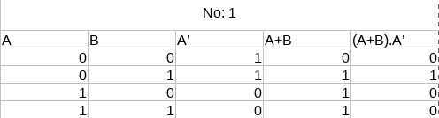
2. 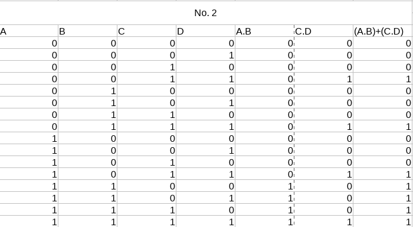
3. 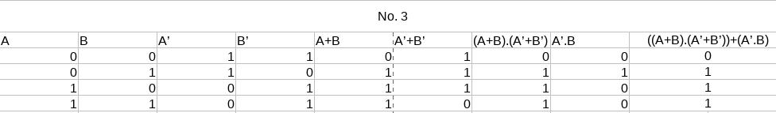
4. 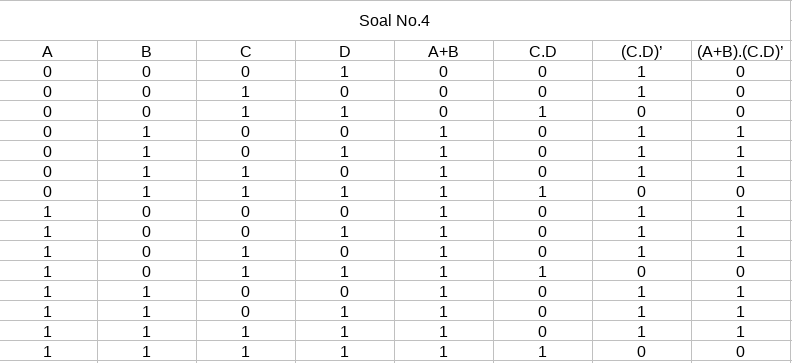
5. 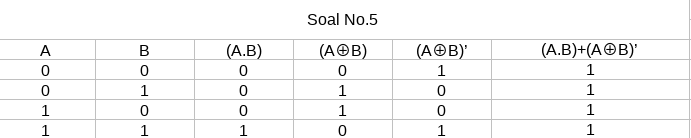

