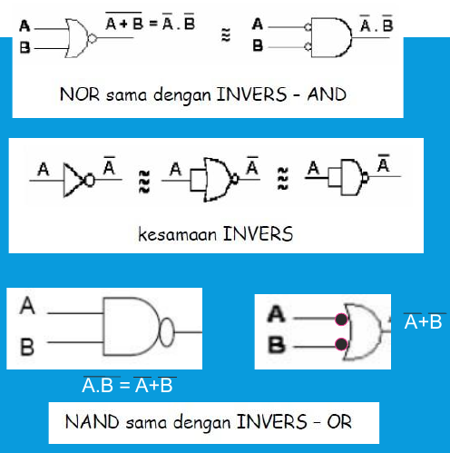
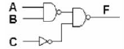
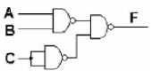
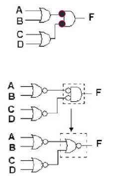

# ALJABAR BOOLEAN DAN RANGKAIAN EKIVALEN

## Aljabar Boolean

- Teori-teori aljabar boolean merupakan aturan-aturan dasar hubungan antara variable-variable boolean.
- Aturan ini digunakan untuk memanipulasi dan menyederhanakan suatu rangkaian logika ke dalam bentuk yang bervariasi.
- Teori-teori boolean dapat dirangkum menjadi bentuk bentuk seperti berikut:
  * Dalil-dalil boolean (Boolean Postulates)
  * P1 : X=0 atau X=1 (tidak pasti=don't care)
  * P2 : 0.0=0
  * P3 : 1+1=1
  * P4 : 0+0=0
  * P5 : 1.1=1
  * P6 : 1.0=0.1=0
  * P7 : 1+0=0+1=1

  * T1 : Commutative Law
    1. A+B=B+A
    2. A.B=B.A
  * T2 : Associative Law
    3. (A+B)+C=A+(B+C)
    4. (A.B).C=A.(B.C)
  * Distributive Law
    5. A.(B+C)=A.B+A.C
    6. A+(B.C)=(A+B).(A+C)
  * T4 : Identity Law
    7. A+A=A
    8. A.A=A
  * T5 : Negation Law
    9. (A')=A'
    10. (A')'=A
  * T6 : Redundant Law
    1. A+A.B=A
    2, A.(A+B)=A
  * T7 : 0+A=A
    1. A=A
    2. A=1
    0. A=0
  * T8 : A'+A=1
    A'.A=0
  * T9 : A+A'.B=A+B
    A.(A'+B)=A.B
  * T10 : De Morgan's Theorem
    1. (A+B)=A.B
    2. (A.B)=A+B

## Rangkaian Ekivalen

Dalam mendesain rangkaian logika seringkali kita diminta untuk menggunakan gerbang-gerbang NAND atau NOR saja.

Untuk memudahkan pelaksanaan desain tersebut, maka diberikan rangkaian ekivalen dari gerbang NAND dan NOR yaitu sebagai berikut:

## Contoh

- Contoh 1.1:
  * Ubahlah rangkaian dibawah ini menjadi rangkaian yang hanyak terdiri dari gerbang NAND saja
  * 
  * Jawab: Karna kesetaraan gerbang INVERS maka rangkaian menjadi:
  * 
- Contoh 1.2:
  * Ubahlah rangkaian dibawah ini menjadi rangkaian yang hanya terdiri dari gerbang NOR saja.
  * 

