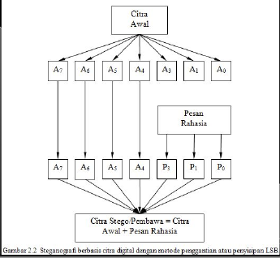
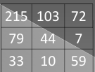
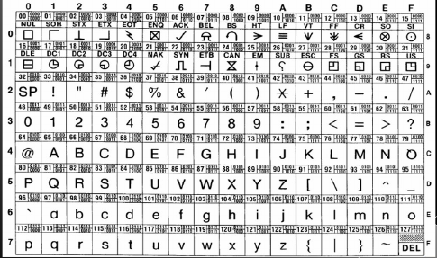
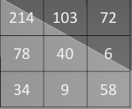

# STEGANOGRAFI

## Steganografi

- Steganografi berasal dari bahasa Yunani yaitu kata *Stegos*, yang artinya tertutup atau tersembunyi, dan *graphos*, yang artinya tulisan.
- Steganografi merupakan bagian luar dari bidang ilmu yang membahas tentang metode-metode atau teknik-teknik tentang penyembunyian informasi ( *information hiding* ) dibidang informasi lainnya.

## Steganografi Vs Kriptografi

- Pada kirptografi pesan yang disandikan masih dapat dilihat karena metode yang digunakan adalah dilihat karena metode yang digunakan adalah menghilangkan indormasi dengan menlakukan enkripsi data (data dikacaukan) sehingga tidak dimengerti orang lain. Sedangkan, pada stegonagrafi pesan di sembunyikan pada pesan (informasi) lain sehingga menjadi suatu pesan yang tidak terlihat.
- Kriptografi menarik perhatian karena pesan di ubah. Sedangkan, stegonagrafi tidak menarik perhatian karena pesan disembunyikan.

## Penggunaan Steganografi

- Metode stegonagrafi menghilangkan keberadaan suatu pesan informasi sehingga pesan informasi tersebut menjadi suatu pesan yang tidak terlihat ( *invisible* ) sehingga pesan rahasia tidak akan menarik perhatian, baik terhadap pesan itu sendiri, terhadap pembawa pesan, atau penerima pesan.
- Contoh penggunaan Steganografi adalah pemberian tanda-air digital ( *digital watermark* ) pada suatu berkas. Biasanya digunakan untuk melindungi hak kepemilikan intelektual pada berkas tersebut dan digunakan dalam bidang komunikasi rahasia *convert Communications*.

## Media Pembawa *Carrier*

- Dalam stegonagrafi berbasis komputer, media pembawa *carrier* dapat berupa citra digital, audio, video, grafik, dan sebagainya.
- Pada stegonagrafi berkas pembawa berupa teks kurang cocok untuk diterapkan karena berukuran kecil sehingga dapat mengubah total pesan pembawa.

## Kriteria Berkas Pembawa

- Berkas-berkas tersebut telah dikompresi dengan algoritma tertentu, sehingga pesan yang disisipkan juga ikut terkompresi.
- Berkas-berkas tersebut biasanya berukuran besar, sehingga pesan informasi rahasia dapat disisipkan tanpa mempengaruhi atau mengubah berkas pembawa secara signifikan.
- Berkas-berkas tersebut merupakan pengalih perhatian yang baik bagi pesan rahasia yang akan disembunyikan.

## Cara Kerja Steganografi

- Steganografi bekerja dengan mengganti bit-bit data yang tidak berguna atau tidak terpakai dalam berkas-berkas komputer umumnya (seperti grafik, suara, teks, HTML, atau bahkan disket) dengan bit-bit yang berbeda,
 * yaitu informasi yang tak terlihat. Pesan rahasia disembunyikan telebih dahulu dikonversikan ke dalam suatu aliran bit informasi.
 * Kemudian bit-bit informasi ini disisipkan ke dalam berkas yang berperan sebagai pembawa.
 * Metode ini memanfaatkan bit-bit LSB berkas *file* pembawa dan menggantinya dengan bit-bit dari pesan informasi.
 * Informasi yang tersembunyi ini dapat berupa teks bisa *plain teks*, teks tersandi *chiper text*, atau suatu citra.

## Steganografi Berbasis Citra

- Steganografi berbasis citra digital dapat dikategorikan dalam dua kategori, yaitu:
  * *stegonagrafi dalam kawasan citra* dan
  * dalam *kawasan alih ragam*.
- Dalam kawasan citra, stegonagrafi dilakukan dengan metode pemanggilan atau penyisipan bit pada LSB atau sering disebut manipulasi derau *noise manipulation*.
- Disebut demikian karena pesan rahasia pada citra yang disisipkan, akan mengubah piksel tertentu pada citra.
- Jika perubahan tersebut terlihat, akan nampak seperti derau pada citra tersebut.
- Pendekatan ini melibatkan citra berfomat tak berugi, dan pesan disisipkan dan diambil secara langsung, tanpa melibatkan proses alih ragam.
- Sedangkan dalam kawasan alih ragam, proses dilakukan dengan melibatkan manipulasi dari algoritma alih ragam citra.
- Dalam metode penyisipan LSB, stegonagrafi dilakukan dengan cara mengganti satu atau beberapa bit-bit RGB piksel citra awal (A0 - A3) dengan bit-bit pesan rahasisa (P0 - P3) yang akan diembunyikan.
- Berkas citra pembawa yang telah disisipi dengan rahasisa, atau disebut juga berkas atau citra stego, dapat dikirimkan ke penerima.
- Penerima dapat mengektrasi pesan terrsebut atau melakukan aksi destegonografi dari citra pembawa sehingga mendapatkan bit-bit pesan tersembunyi dari citra pembawa.
- 

## Contoh soal

- Suatu citra pembawa memiliki 9 pixel (ukuran citra 3x3), resolusi 8 bit, dengan nilai-nilai intensitasnya ditujukan dengan gambar berikut:
- 
- Informasi yang akan disisipkan adalah teks "Aku". Bagaimanakah pesan dalam desimal setelah dilakukan stegonagrafi, jika diketahui 3-bit LSB pada citra pembawanya dapat disisipi oleh informasi teks tersebut?

## Table ASCII

## Jawab

Konversi teks "Aku":
ASCII("A") = 0b01000001
ASCII("k") = 0b01101011
ASCII("u") = 0b01110101

Sedangkan konversi pixel-per piksel adalah sbb:
215 = 11010111
103 = 01100111
72  = 01001000
79  = 01001111
44  = 00101100
7   = 00000111
33  = 00100001
10  = 00001010
59  = 00111011

---

Jawab:
Konversi teks 'Aku':
ASCII("A") = 0b01000001
ASCII("k") = 0b01101011
ASCII("u") = 0b01110101

Penyisipan Teks 'Aku':
215 🡪 11010110 = 214 
103 🡪 01100111 = 103 
72 🡪 01001000 = 72
10 🡪 00001001= 9 
79 🡪 01001110 = 78
59 🡪 00111010= 58
44 🡪 00101000 = 40
7 🡪 00000110= 6
33 🡪 00100010= 34

Sehingga Hasilnya setelah di steganografi menjadi

