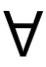
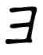
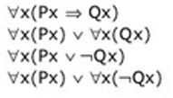

# Kuantor Pernyataan

Misalkan P(*x*) adalah pernyataan yang menyangkut variable x dan q adalah sebuah himpunan, maka P adalah fungsi proposisi juka untuk setiap *x**E*D berlaku P(*x*) adalah sebuah proposisi.

---

**Contoh**
Misalkan P(*x*) adalah pernyataan dengan x adalah sebuah bilangan genap bulat.
Misalkan D = himpunan bilangan bulat positif

**Maka** fungsi proposisi P(*x*) dapat ditulis :
- Jika x = 1 maka proposisinya.\
           1 adalah bilangan bulat genap (*f*).
- Jika x = 2 maka proposisinya.\
           2 adalah bilangan bulat genap (*f*).
           dan seterusnya

jadi dapat kita liat ada sejumlah (kuantitas) proposiis yang benar. Untuk menyatakan kuantitas suatu objek dalam proposisi tersebut digunakan notasi-notasi yang disebut kuantor.

## Macam-macam Kuantor

Macam-macam kuantor yang sering digunakan dalam proposisi:

1. Untuk setiap x, P(*x*) disebut kuantor universal simbol yang digunakan *A*
  - 
2. Unutk beberapa (paling sedikit satu) **x, P(x)** disebut kuantor existensial simbol yang digunakan *E*
  - 

**Contoh**
Misalkan x himpunan warga negara Indonesia, P prefikat membayar pajak, R predikat membeli printer.

**Maka**

1. *A*xP(*x*), : Semua warga negara membayar pajak.
2. *E*xR(*x*)P(*x*), : Ada beberapa warga negara pemberli printer menbayar pajak.
3. *A*xR(*x*) -> P(*x*), : Setiap warga negara jika beli printer maka membayar pajak. 
4. *E*xR(*x*) ^ ~P(*x*), : Ada warga negara membeli printer dan tidak membayar pajak.

## Negasi Kuantor

~*A***x** = *E***x**
~*E***x** = *A***x**

**maka** :

- ~(*A***xP**(*x*)) = *E***x~P(*x*)**
- ~(*E***xP(*x*)**) = *A***x~P(*x*)**
- ~(*A***xP(*x*)**  -> **Q(*x*))** = *E***x~P(*x*)** -> **~Q(*x*))**\
                                   =  *E***xP(*x*)   ^  **~Q(*x*))**
- ~(*E***xP(*x*)**  -> **Q(*x*))** = *A***x~P(*x*)** -> **~Q(*x*)**\
                                   = *A***xP(*x*)**  ^  **~Q(*x*)**

## Latihan 

1. Misal Px : x adalah planet seperti bumi\
         Qx : x mendukung kehidupan
Terjemahkan pernyataan kuantor universal berikut ke dalam bashas sehari hari.
  - 
  - Jika seluruh planet adalah seperti bumi maka mendukung kehidupan.
  - Seluruh planet adalah seperti bumi atau semua orang mendukung kehidupan
  - Seluruh planet adalah seperti bumi atau tidak semua orang medukung kehidupan.
  - 

