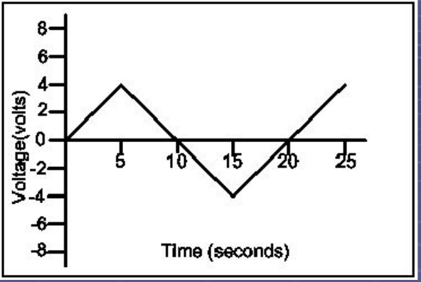
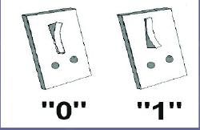
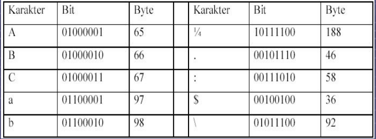
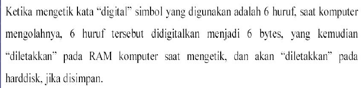
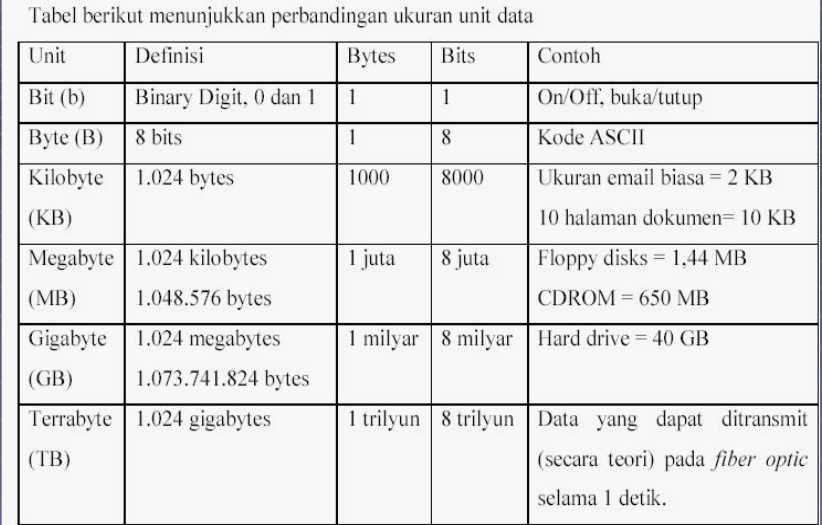
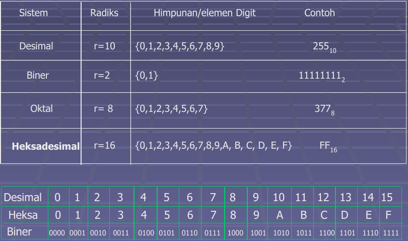
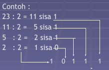
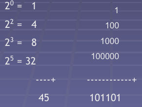

# Struktur Data dan Sistem Bilangan

## Data

Komputer yang dipakai saat ini adalah sebuah pemroses data. Fungsinya sangat sederhana : Untuk memproses data, kemudian hasil prosesnya diselesaikan secara elektronis didalam CPU (Central Processing Unit) dan komponen lainnya yang menyusun sebuah komputer personal.

## Analog

Suatu sinyal yang dikirimkan dari suatu pemancar (transmitter) ke penerima (receiver) untuk berkomunikasi, adalah data. Data-data yang bisa dijumpai sehari-hari memiliki banyak bentuk, antara lain: suara, huruf, angka, dan karakter lain (tulisan tangan atau dicetak), foto, gambar, film dan lain sebagainya. Suatu sistem yang dapat memproses nilai yang kontinyu berbanding terhadap waktu dinamakan sistem analog. Pada sistem analog, nilainya biaa diwakili oleh tegangan, arus dan kecepatan.

Berikut ini adalah gambar grafik nilai tegangan analog terhadap waktu.

## Digital

Sistem yang memproses nilai diskrit (langkah demi langkah) dinamakan digital. Pada sistem digital untuk memproses suatu nilai digunakan simbol yang dinamakan digit. Komputer adalah sebuah perangkat elektronik. Data yang dapat diolah adalah data yang direpresentasikan oleh sinyal listrik. Signal yang digurepresentasikan oleh sinyal listrik. Sinyal yang digunakan bisa dianalogikan dengan saklar listrik, yaitu tombol off (mati) atau on (hidup). Jika saklar pada kondisi off, maka komputer membaca sebagai data 0, jika saklar dalam kondisi hidup, maka komputer membaca sebagai angka 1.

## Bits

Setiap angka 0 dan 1 disebut **Bit**. **Bit** adalah singkatan dari **B**inary Digit. Kata Binary diambil dari nama *Binary Number System* (Sistem Bilangan Biner). Tabel 2.1 berikut menunjukan tentang bit:

0        1 bit
1        1 bit
0110     4 bit
10011101 8 bit

## Bytes

Pengolahan data yang paling sering digunakan adalah perangkat kata *(word processing)*, yang akan digunakan sebagai contoh. Ketika melakukan seatu pengolahan kata, komputer bekerja dengan *Keyboard*. Ada 101 tombol yang mewakili karakter alphabet A, B, C, dst. Selain itu juga akan ditemui karakter angka 0 sampai dengan 9, dan karakter-karakter lain yang diperlukan, antara lain:,.;():_?!"#*%&. Seluruh karakter yang ada pada keyboard harus digitalkan, Karakter-karakter tersebut diwaliki oleh angka-angka 0 dan. Bit yang digunakan adalah 8 bit biner. 8 bit biner dinamakan **Byte**. 8 bit = 1 bytes, sistem inilah yang digunakan.

## Ascii

ASCII singkatan dari *American Standard Code for Information* Interchange. Standard yang digunakan pada industri untuk mengkodekan huruf, angka, dan karakter-karakter lain pada 256 kode (8 bit biner) yang bisa ditampung.

Tabel ASCII dibagi menjadi 3 seksi:

1. Kode sistem tak tercetak *(Non Printable System Codes)* antara 0 - 31.
2. ASCII lebih rendah *(Lower ASCII)*, antara 32 - 137. Diambil dari kode sebelum ASCII digunakan, yaitu sistem American ADP, sistem yang bekerja pada 7 bit biner.
3. ASCII lebih tinggi *(Higher ASCII)*, antara 128 - 255. Bagian ini dapat diprogram, sehingga dapat mengubah - ubah karakter.

## Program Code

Tipe data dasar dapat dikelompokan menjadi 2:

1. Program Code, dimana data digunakan untuk menjalankan fungsi komputer.
2. Data User, seperti teks, gambar dan suara.

Suatu komputer harus memiliki instruksi-instruksi agar dapat berfungsi sebagaimana fungsinya. Hal ini akan dijelaskan lebih detail pada modul 3 CPU didesain untuk mengenali instruksi-instruksi ini, yang kemudian diproses bersama-sama data user.

*Program Code* adalah kumpulan instruksi-instruksi, dieksekusi satu persatu, ketika program dijalankan. Saat mengklik mouse, atau mengetikan sesuatu pada *keyboard*, instruksi-instruksi dikirimkan dari *Software* (perangkat lunak) ke CPU.

### Files

*Program Code* dan Data User disimpan sebagai *file* pada media penyimpanan. Tipe *file* dapat dikenali dari ekstensi *file* tersebut.

Contoh nama *file*

- Program Code : Start.exe, win.com, help.dll, vmm32.vxd, Main.out
- Data User : Letter.doc, house.bmp, tmux.conf

## Struktur Data

Suatu koleksi / Kelompok data yang dapat dikarakterisasikan oleh organisasi serta operasi yang didefinisikan terhdapnya.

Data di kategorikan menjadi:

1. Tipe data tunggal : integer, boolean, dan karakter.
2. Tipe data majemuk : String (untai).

Struktur data di kategorikan menjadi:

1. Struktur data Sederhana : Array dan Record.
2. Struktur data majemuk   : Linear dan Non Linear

## Tipe Data Tunggal

- **Integer**:

  - Himpunan { ...,-{-(n+1), -n, ..., -1, 0, 1, 2, ..., n+1, ..}, ...}
  - Operasi aritmatika yang dapat dilakukan : Penjumlahan, Pengurangan, Perpangkatan, Perkalian, dan Pembagian.

- **Boolean**

  - Tipe data logika.
  - Elemen tipe data : True & False.
  - Operator logika  : OR, NOT, AND.
 
- **Karakter**

  - Merupakan suatu kumpulan dari symbol aksara yang meliputi digit angka, alfabet dan spesial karakter lainnya.

- **String**

  - adalah barisan hingga symbol yang diambil dari himpunan karakter. Himpunan karakter yang digunakan untuk membentuk string dinamakan Alfabet.
  - C/:CD1, C1D, DCC, 111D1, dst, termasuk `null`(empty).
  - Secara umum dapat kita nyatakan Steing S sebagai:
  - S : a1, a2, ..., an  setiap a anggota alfabet.
  - Panjang dari srtring didefinisikan sebagai banyaknya karakter, atau dapat ditulis:
  - S = N atau length (S) = N

## Sistem Bilangan 

### Definisi

Sistem bilangan (number system) adalah suatu cara untuk mewakili besaran dari suatu item fisik.

Sistem bilangan banyak dipergunakan oleh manusia adalah system bilangan desimal, yaitu sistem bilangan yang menggunakan 10 macam symbol untuk mewakili suatu besaran. Sistem ini banyak digunakan karena manusia mempunyai sepuluh jari untuk dapat membantu perhitungan. Lain hanya dengan komputer, logika di komputer diwakili oleh bentuk elemen dua keadaan yaitu *off* (tidak ada arus) dan *on* (ada arus). Konsep inilah yang dipakai dalam sistem bilangan binary yang mempunyai dua macam nilai untuk mewakili suatu besaran nilai.

Terbagi atas 4 macam yaitu:

1. Bilangan Desimal berbasis 10 (0-9).
2. Bilangan Binary berbasis 2 (0 & 1).
3. Bilangan Oktal berbasis 8 (0-7).
4. Bilangan Hexadesimal berbasis 16 (0-9, A, B, C, D, E)

### Macam-macam sistem bilangan

### Desimal

- Digit angka antara 0 sampai dengan 9
- Bentuk nilai dari suatu bilangan desimal terbagi menjadi 2:

  * **integer desimal (bilangan bulat)**
  * Absolute value : nilai dari masing masing bilangan digit bilangan.
  * Position value : penimbang dari masing masing digit tergantung dari letak posisinya.

  * **Decimal Fraction (pecahan desimal)**
  * Nilai desimal yang mengandnug nilai pecahan.

### Biner

Untuk bilangan biner (bilangan basis 2)

Untuk bilangan biner, kalikan bilangan paling kanan terus ke kiri dengan 2 , 2 , 2 . dst,

Contoh : 10110 (1 x 2 ) + (0 x 2 ) + (1 x 2 ) + (1 x 2) + (0 x 2) = 22

Dari contoh diatas, menunjukan bahwa bilangan biner 10110 sama dengan bilangan desimal 22.

Dari dua siste bilangan diatas, dapat dibuat rumus umum untuk mendapatkan nilai desimal dari radiks bilangan tertentu:

(N)r = [(d0 x r0) + (d1 x r1) + (d2 x r2) + ... + (dn x rn)]10

dimana, N = nilai, r = Radiks

d0, d1, d2 = digit yang terkecil (paling kanan) untuk d0

## Konversi Sistem Bilangan

### Konversi dari Sistem Bilangan Decimal

#### Konversi Ke Sistem Bilangan Biner

- Metode 1

  - dengan membagi dengan 2 dan sisa pembagian merupakan digit binary dari bilangan binary hasil konversi.
  - 

- Metode 2

  - Menjumlahkan bllangan-bilangan pangkat 2 yang jumlahnya sama dengan bilangan desimal yang akan dikonversikan.
  - 

- Contoh Soal

Desimal     Biner
124         1111100
143         10001111
65          1000001
76          1001100
255         11111111

Biner       Decimal
101011      43
111110      62
111000      56
100100      36
101010      42

