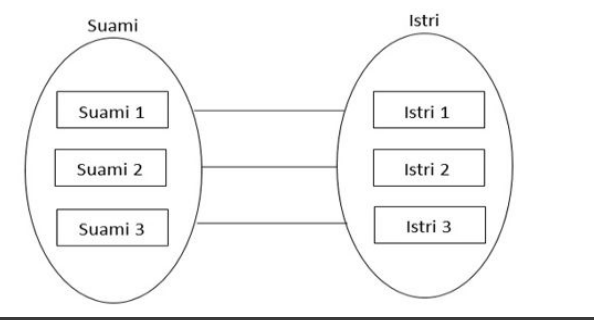
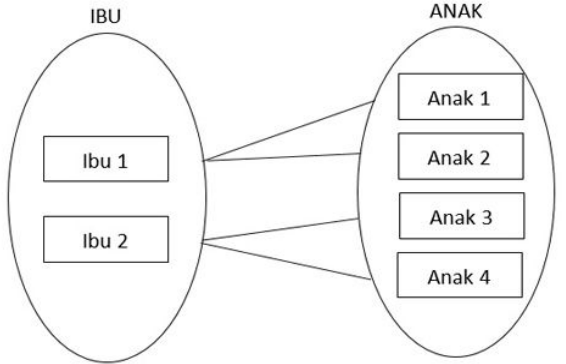
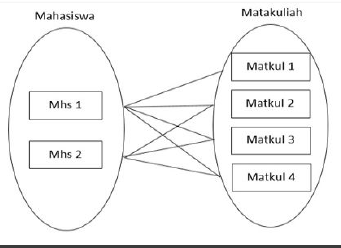
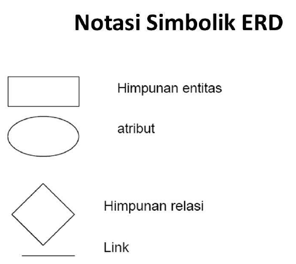
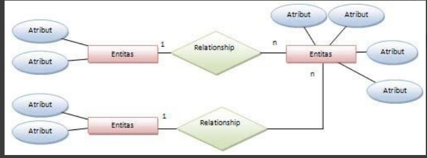

# Pengorganisasian Data dan Informasi

## Hirarki Data

- Distem Komputer mengorganisasikan data ke dalam suatu hirarki yang dimulai dengan bits dan kemudian bytes, field, record, files, dan database.
- **Bits** merupakan unit tekecil dari data yang dapat diproses oleh komputer dan satu kumpulan bit yang terdiri dari 8bits adalah bytes yang merepresentasikan kararter tunggal bisa berupa huruf, angka, atau simbol.
- **Field** merupakan penggabungan beebrapa karakter secara logic menjadi sebuah kata, gabungan kata, atau rangkaian kata. Conthna nama_siswa, tgl_daftar, alamat.
- **Record** adalah gabungan dari beberapa field secara logic, contohnya adalah : nama_siswa, mata_kuliah yang diabil, dll.
- **File** merupakan gabungan dari beberapa record sejenis yang saling berhubugan
- **Database** ialah gabungan beberapa file yang salaing berhubungan.
- Sebuah record menggambarkan sebuah entity/entitas (orang, tempat, barang, atau pelanggan, pegawai, produk, dll). Setiap karakteristik atau kualitas menggambarkan keterangan dari entitas disebut attribut. Conthnya nama_pelangan, kode_karyawan, warna_produk.
- Setiap record dalam sebuah file harus mempunyai paling tidak satu field yang unik yang dapat mengidentifikasi record tersebut, sehingga record tersebut mudah diambil (*access*), diperbarui (*update*), dan diurutkan.
- Field ini yang bisa disebut Primary Key, contohnya nomor induk mahasisawa (***NIM***) sebagai Primary Key, karena tidak mungkin sama antar siswa satu dengan siswa lain (*unik*).

## File

- Dari jaman aplikasi komputer pertama dalam bisnis (pertengahan tahun 50) sampai tahun 1970, organisasi mengatur datanya dengan pendekatan tradisional yaitu dealamm bentuk file.
- Cara ini telah berjalan sebab organisasi secara khusus telah memulai sebuah aplikasi otomatis pada suatu waktu. Sistem ini berkembang sendiri tanpa perencanaan secara menyeluruh. Setiap aplikasi mempunyai data sendiri, yang mana dikelola dalam sebuah file data. Sebuah file data adalah koleksi dari record yang berhubungan secara logic.

## Permasalahan Dengan Pendekatan FIle

Permasalahan yang timbul antara lain:
1. **Data Redundacyi** (*Duplicate*) 
  - Karena aplikasi dan file datanya telah dibuat oleh programer yang berbeda dalam jangka waktu lama, maka sejumlah informasi yang sama terduplikasi di berberapa tempat.
2. **Data Inconsestency** (*Data tidak konsisten*)
  - Data inconsistency berati suatu jenis data memiliki berbagai macam salinan yang berbeda-beda (untuk data yang sama, salinannya tidak sama, sehingga data tidak konsisten).
3. **Data Integrity** (*Integrasi Data*)
  - Nilai data harus dipertahankan kesusaianya. Misalnya nilai siswa tidak bolah negative.

## Pendekatan Modern : Basis Data (DATABASE)

Database merupakan gabungan dari beberapa file yang saling berhubungan dan dapat mengeliminasi permasalahan yang timbul dari pendekatan tradisional yaitu file. Dengan pendekatan moern semua data diletakan di tempat penyimpanan yang sama. Tidak seperti pendekatan tradisional dimana program yang berbeda-beda mengakses file data yang berbeda-beda. Basis data diatur sedemikian rupa sehingga satu atau sekelompok program menyediakan akses terhadam semua data. Sehingga permasalahan duplikasi data (*redundancy*), data yang tidak konsisten (*inconsistency*) dapat dikurangi, dan data dapat dibagi-bagikan di antara semua pengguna (*users*). Di samping itu keamanan dan itergritas data meningkat, dan aplikasi serta data tidak bergantung satu dengan yang lain.

## Pembuatan Basis Data (Creating Database)

- Untuk membuat sebuah database, perancangan data base harus membuat rancangan konsep (*conceptual design*) dan rancangan fisik (*pytsical design*).
- Rancangan konsep adalah model abstrak database dari user atau dari segi pandang bisnis.
- Rancangan fisik menunjukan bagaimana sebuah database sebenarnya diatur/disusun pada tempan penyimpanan.
- Rancangan konsep menggambarkan bagaimana elemen data dalam database dikelompokan. Proses perancangan mengidentifikasi hubungan antara elemen data dan cara paling efisien unutk mengelompokan elemen data dalam memenuhi kebutuhan informasi. Proses perancangan juga mengidentifikasi duplikasi dan pengelompokan pada elemen data membutuhkan aplikasi tertentu. Untuk mendapatkan rancangan databsae yang optimal peranccangan database harus menggunakan ER-Dagram dan Normalisasi.
- **Enitiy Relationship** (ER) Modeling.
- ER Diagram sebagai dokumen dari konsep model data yang berisi entity/entitas, attribut, dan relasi, yang semuanya digambarkan dalam diagram.
- **Entitas** adalah suatu yang dapat diidentifikasi pada lingkungan kerja pengguna (user). Contoh : pendaftaran mata kuliah oleh mahasiswa. Pada cotoh ini entitasnya adalah mahasiswa, mata kuliah. Entity Classes merupakan gabungan/kelompok dari beberapa entity/entitas.
- **Instance** mengambarkan keterangan dari entity. Sebagai contoh mahasiswa (Jhons Mill, 088802413898) adalah instance dari mahasiswa.
- **Identifier** merupakan atribut yang mengidentifikasi instance dari entity. Contohnya untuk instance mahasiswa dapat diidentifikasi dengan nomor id mahasiswa.
- Relationship adalah menggambarkan hubungan satu entity dengan entity lain. Hubungan tersebut bisa hubungan one to one, one to many, dan many to many.
  - 1 : 1 (one to one)
    - Satu intance dari suatu entity berhubungan dengan satu intance dari satu
    - 
  - 1 : M (one to many)
    - Satu instance dari satu entity berhubungan dengan banyak instance dari suatu entity lain. Conthnya adalah hubungan antara entitas dosen dan mata kuliah. Hubungan ini menggambarkan bahwa satu dosen dapat mengajar lebih dari saru mata kuliah.
    - 
  - M : M (many to many)
    - Banyak instance dari suatu entity berhubungan dengan banyak instance dari suatu entity lain. Contohnya adalah hubungan antara entitas mahasiswa dan mata kuliah. Hubungan ini mengambarkan bahwa satu mahasiswa dapat mengambil lebih dari satu mata kuliah dan satu mata kuliah dan satu mata kuliah dapat diambil oleh lebih dari bkmata kuliah dan satu mata kuliah dapat diambil oleh lebih dari satu mahasiswa. 
    - 
  - Satu mahasiswa bisa memiliki banyak mata kuliah dan satu matakuliah bisa dimiliki oleh banyak Mahasiswa.
- **Normalization**
  - Pada relational database perlu dilakukan analisa agar tidak terjadi pengulangan atau *redundancy*. Normalisasi adalah cara untuk menganalisa dan menggurani suatu relasi database menjadi lebih singkat dengan tujuan meminimalkan duplikasi data, memaksimaklan integritas data, dan kinerja proses yang baik.

## Notasi ERD

## Contoh Penggunaan ERD

