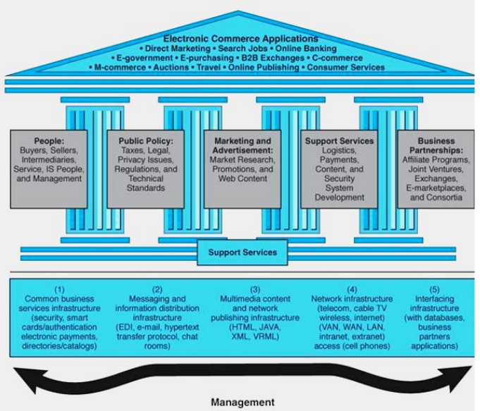
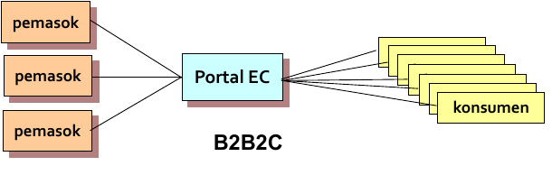
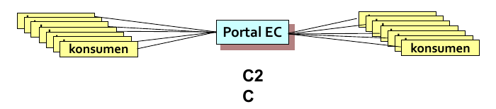

# E-Commerce

## Tujuan

- Mahasiswa memahami definisi e-commerce.
- Mahasiswa mengetahui kalsifikasi e-commerce.
- Mahasiswa mengetahui batasan e-commerce.
- Mahasiswa mengetahui teknologi e-commerce.
- Mahasiswa memiliki pemahaman dasar akan tantangan dan peluang e-commerce.

## Topik

1. Definisi *electronic commerce* (e-Commerce) dan pengkategoriannya.
2. Konsep dan struktur e-Commerce.
3. Tipe transaksi melalui e-Commerce.
4. Model bisnis e-Commerce.
5. Manfaat e-commerce bagi perusahaan, konsumen dan masyarakat.
6. Hambatan dan tantangan e-commerce.

## Konsep Dasar *Electornic Commerce*

- Internet berkembang menjadi **Saluran distribusi global utama** untuk produk, jasa, lapangan pekerjaan bidang manajerial dan profesional.
- Dampaknya mengubah perekonomian, struktur pasar dan industri, produk dan jasa serta aliran distribusinya, segmentasi pasar, nilai bagi konsumen, prilaku konsumen, lapangan pekerjaan dan pasar tenaga kerja.
- Dampaknya juga terjadi pada masyarakat dan politik, dan perspektif kita terhadap dunia dan diri kita didalamnya.

## *Electornic Commerce* : Definisi dan Konsep

E-commerce dapat didefinisikan dari beberapa perspektif:

- **Komunikasi**: pengirim barang, jasa, informasi, atau pembayaran melalui jaringan komputer atau sarana electronic lainnya.
- **Pedagangan**: penyediaan sarana untuk membeli dan menjual produk, jasa dan informasi melalui internet atau fasilitas online lainnya.
- **Proses Bisnis**: menjalankan proses bisnis secara elektronik mealui jaringan elektronik, menggantikan proses bisnis fisk dengan informasi.
- **Layanan**: cara bagi pemerintah, perusahaan, konsumen, dan manajemen untuk memangkas biaya palayanan/operasi sekaligus meningkatkan mutu dan kecepatan layanan bagi konsumen.
- **Pembelajaran**: sarana pendidikan dan pelatihan online untuk sekolah, universitas, dan organisasi lain termasuk perusahaan.
- **Kolaborasi**: metoda kolaborasi antar dan intra organisasi.
- **Komunikasi**: tempat berkumpul (*mangkal*) bagi anggota suatu masyarakat untuk belajar. mencari informasi, melakukan transaksi,dan kolaborasi.

## Kategori e-Commerce

- **Pure vs. Partial e-Commerce** tergantung dari *derajat digitasi* (transformasi dari fisik ke digital):

  1. *produk*(jasa) yang dijual.
  2. *proses bisnis*.
  3. *agen penyalur*(dengan digital *inermediary*).

- **Perusahaan Brick & Mortar** yaitu perusahaan model "ekonomi lama" yang melakukan sebagian besar aktivitas bisnis secara manual (*off-line*), menjual produk fisik melalui agen penyalur fisik.
- **Perusahaan Virtyal (*pure-play*)** semua aktivitas bisnis dilakukan *online*.
- **Perusahaan Click & Mortar** Melakukan aktivitas EC, tetapi aktivitas bisnis utama dilakukan di didunia fisik.
- **Pasar elektronik **(***e-marketplace***) pasar online dimana pembeli dan penjual bertemu untuk bertukar produk, jasa, uang, atau informasi.

## Struktur dan Klasifikasi e-Commerce

**Dua tipe umum e-commerce**

- ***business-to-consumer (B2C):*** transaksi online terjadi antara perusahaan dengan konsumen individual.
  - **e-tailing:** ritel online, biasanya B2C.
- ***business-to-business (B2B):*** perusahaan melakukan transaksi online dengan perusahaan lain.

**Insfrastrukturnya**

- ***Internet:*** jaringan global.
- ***Intranet:*** Jaringan milik perusahaan atau organisasi yang menggunakan teknologi internet, seperti protokol internet, Web browser, dsb.
- ***Extranet:*** jaringan melalui internet yang menghubungkan berberapa internet.

**Selain Insfrastruktur. E-Commerce juga ditunjang oleh lima pilar:**

- SDM (Peaple).
- Peraturan/perundangan publik (Public Policy).
- Pemasaran dan periklanan (Marketring dan Advertisment).
- Layanan-layanan pendukung (Support dan Services).
- Kemitraan usaha (Business Partnerships).

## Framework e-Commerce

## Klasifikasi EC menurut Pola Interaksi/Transaksi

- *B2B* dan **B2C**
- **business-to-business-to-consumer** (B2B2C); model EC dimana suatu perusahaan menjual produk atau jasa kepada perusahaan lain yang memiliki konsumennya sendiri.

- **consumer-to-business** (C2B):
- model EC dimana individu menggunakan internet untuk menjual produk atau jasa  yang diperlukannya

- **consumer-to-consumer** (C2C):
- Model EC dimana konsumen menjual (bertransaksi) langsung kepada konsumen lain.

- **Mobile Commerce** (m-commerce): transaksi dan aktivitas EC dilakukan dengan teknilogi *wireless* (misal telepn seluler).
- **Location-based Commerce** (l-Commerce): transaksi m-commerce yang ditargetkan pada individu di lokasu dan waktu tertentu.
- **intrabusiness EC** : kategori EC untuk aktivitas internal suatu organisasi yang melibatkan pertukaran barang, jasa, atau informasi antara berbagai bagian dan individu dalam perusahaan.
- **business-to-employees** (B2E): model EC dimana organisasi menyediakan jasa, informasi, atau produk kepada individu karyawannya.
- **Collaborative commerce** (c-commerce): Model EC dimana beberapa individu atau kelompok berkomunikasi dan berkolaborasi secara online.
- **e-learning** : penyampaian informasi secara online tujuan pelatihan dan pendidikan.
- **exchange** (e-exchange) : pasar elektronik untuk umum yang beranggotakan banyak pembeli dan penjual.
- **exchange-to-exchange** (E2E) : model EC dimana beberapa e-exchange berhubungan satu sama lain untuk pertukaran informasi.
- **e-goverment** : model EC dimana organisasi pemerintah membeli atau menyediakan produk, jasa, atau informasi bagi perusahaan atau individu warganegara.

## Sejarah singka E-Commerce

- 1969 : **Internet** dilahirkan dari riset pemerintah AS, pada awalnya hanya untuk kalangan teknis di lembaga pemerintah, ilmuwan, militer, dan penelitian akademis.
- 1999-an : terjadi komersialisasi internet dan pertumbuhan perusahaan *dot-coms*, atau *internet strart-ups* menjamur.
- Berbagai inovasi dibidang aplikasi dari penjualan online sampai e-learning bermunculan.
- Umumnya perusahaan besar dan sedang di AS telah memiliki situs Web.
- Umumnya perusahaan besar di AS telah memiliki portal lengkap.
- 1999 : fokus e-Commerce bergerak dari B2C ke B2B.
- 2001 : terjadi pergerakan fokus dari B2B ke e-goverment, e-learning, dan m-commerce.
- E-Commerce dakan terus berkembang setiap saat.

## Model Bisnis E-Commerce

- ***Business Model*** : metode melakukan usaha yang dapat menghasilkan revenue bagi perusahaan untuk menjamin kelangsungan hidupnya.
- Tiga komponen utama :

  1. Target **konsumen** dan potensinya.
  2. Modal **persaingan**: formula produk dan layanan.
  3. **Profit** yang dapat diperoleh

## Struktur Model Bisnis

- ***Revenue model***: deskripsi bagaimana perusahaan atau proyek e-Commerce dapat menghasilkan revenue, misal:
  - Penjualan.
  - Komisi transaksi.
  - Iuran anggota atau biaya pendaftaran.
  - Iklan.
  - Royalti.
  - Sumber revenue lain.
- ***Value Proposition***: Keuntungan yang diperoleh dari usaha e-Commerce, misal:
  - Efisiensi pencarian produk dan transaksi bagi pembeli.
  - Keterangan Pelangaan (*lock-in*).
  - Citra perusahaan.
  - Agresi informasi.
  - Kolaborasi dengan perusahaan lain.

## Model Bis Umum E-Commerce

1. **Penjualan online** (langsung tanpa melalui perantara).
2. **Sistem tender** (*reverse action*) **elektronik**: suatu model dimana seorang pembeli meminta kandidat penjual untuk mengajukan penawaran harga; pemenangnya yang menajukan harga terendah.
3. **Lelang dengan harga bali** **name your own price**: suatu model dimana pembeli menentukan harga yang ia mampu bayar dan mengundang para penjual yang dapat menjual dengan harga tersebut.
4. **Affilate marketing**: suatu perjanjian dimana rekanan pemasaran (perusahaan, organisasi, atau bahkan perorangan) mengacu konsumen ke situs Web penjual.
5. **Viral marketing**: pemasaran dari **mulut ke mulut** dimana konsumen menganjurkan suatu produk atau jasa perusahaan kepada teman-temannya atau orang lain.
6. **Group purchasing**: pembelian dalam skala besar yang memungkinkan sekelompok pembeli mendapatkan potongan harga.
7. **Lelang online**: 
8. **Personalisasi** (kustomisasi) produk atau jasa: menciptakan produk atau jasa sesuai dengan spesifikasi yang diminta pembeli.
9. **Pasar elektronik** (e-market) dan *exchange*
10. Integrator rantai pertambahan nilai *(value chain integrator)*
11. Penyedia layanan Value Chain Integrator.
12. Broker informasi *(brokerange)*.
13. Pertukaran barang *(barter)*.
14. Keanggotaan *(membership)*.
15. Fasilator rantai pasokan *(suplly chain)*.

Model bisnis dapat berdiri sendiri atau kombinasi dari beberapa model atau kombinasi dengan model bisnis tradisional.

## Manfaat E-Commerce

- Jangkauan global.
- Pengurangan biaya operasi.
- Perbaikan rantai pasokan.
- Penambahan jam buka: 24jam/1minggu/365hari.
- Kustomisasi.
- Model bisnis baru.
- Spesialisasi vendor.
- Kecepatan *time-to-market*.
- Biaya komunikasi/koordinasi lebih rendah.
- Efisiensi pengadaan.
- Meningakatkan hubungan dengan konsumen.
- Informasi yang *up-to-date*.
- Tidak harus membayar pajak/biaya usaha fisik.
- Dimana saja dan kapan saja.
- Lebih banyak pilihan produk dan jasa.
- Harga lebih murah.
- Pengiriman / penyampaian segera.
- Ketersediaan informasi.
- Wahana komunitas elektronik.
- Personalisasi, sesuai selera.
- Tidak dikenai pajak penjualan.
- Memungkinkan *telecommuting*.
- Peningkatan kualitas hidup.
- Dapat menolong masyarakat yang kuang mampu.
- Kemudahan mendapatkan layanan umum.

## Tandangan E-Commerce

- Keamanan : Kepercayaan dan resiko.
- SDM : Masalah organisasi.
- Model bisnis.
- Budaya.
- Otontikasi *user* dan belum tersedianya *public key infrastructure*.
- Penipuan.
- Akses internet yang lambat.
- Permasalahan hukum / legalitas.

## Masa Depan E-Commerce

2004: total volume belanja online dan transaksi B2B di AS sekitar $3 sampai $7 triliun, estimasi 2008:

- Jumlah pengguna internet diseluruh dunia akan mencapai 750 juta.
- 50 % pengguna internet akan berbelanja online.
- Sumber pertumbuhan E-Commerce:
  - B2C dan B2B.
  - e-goverment dan e-learning.

