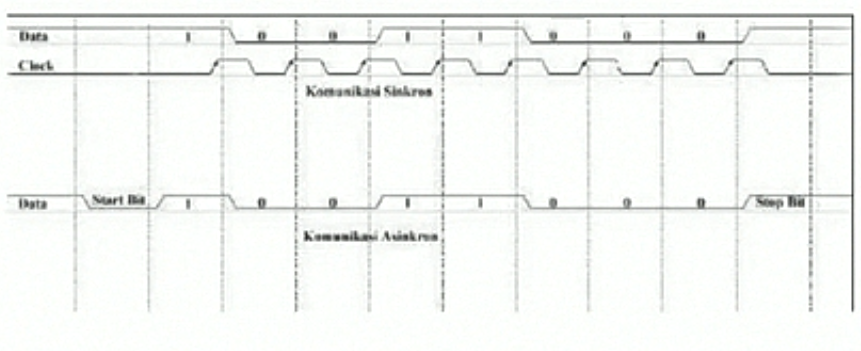
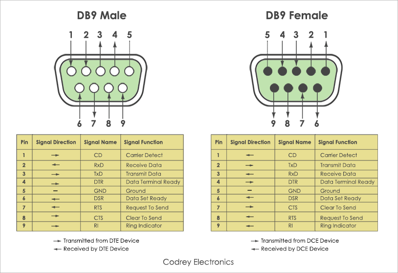
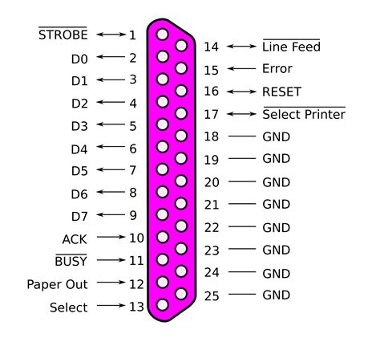
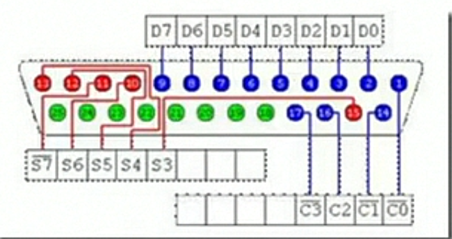
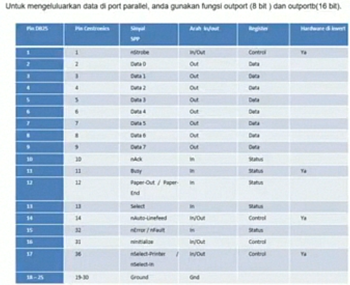

# Serial PORT

## Definisi

Serial Port atau Terminal seri adalah port yang menggunakan tehnik interfacing secara seri. Dalam tehnik ini masing-masing bit data dikirim secara berurutan (serial), sehingga dalam satu detak (satuan waktu) hanya 1 bit data yang dikirim, lalu data berikutnya sampai data yang akan dikirim sudah terkirim.

## Jenis Komunikasi Data

- Jenis Komunikasi Data
- Ada dua jenis komunikasi data melali port serial yaitu:
	* Sinkron
	* Komunikasi Sinkron adalah komunikasi data dimana clock dikirim bersamaan dengan data
	* Asinkron
	* Pada Asinkron, clock tidak dikirimkan bersamaan dengan data, tetapi dibangkitkan pada masing-masing sisi pengirim dan penerima.
	* Berikut ini adalah gambar untuk komunikasi Sinkron dan Asinkron.

## Keuntungan dan Kelemahan Serial Interfacing

- Keuntungan
	* Tidak membutuhkan banyak jalur.
	* Jarak pengiriman jauh.
	* Banyak microcontroller menggunakan SCI (Serial Communication Interface) untuk berkomunikasi dengan *dunia luar*.
- Kelemahan
	* Kecepatan pengiriman lebih lambat.
	* Serial port lebih sulit ditangani, karena data dikomputer diolah secara paralel sehingga data dari & ke serial port perlu dikonversi ke serial.
	* Dari segi perangkat lunak: Lebih banyak register yang digunakan atau ... 

## Fungsi

- Menghubungkan antara peripheral (alat) computer lain dengan motherboard.
- Penghubung antara mouse dengan motherboard, penghubung antara modem dengan motherboard.
- Mentransmisikan informasi-informasi berupa bit-bit dari mainboard ke perangkat lainnya.

## Peralatan

- Device pada serial port dibagi menjadi 2 kelompok yaitu **Data Communication Equipment (DCE)** dan **Data Terminal Equipment (DTE)**.
- Contoh dari **DCE** ialah modem, plotter, scanner dan lain-lain sedangkan contoh dari **DTE** ialah terminal di komputer.
- Spesifikasi elektronik dari serial port merujuk pada *Electronic Industry Association (EIA)*:
	* *Space* (logika 0) ialah tegangan antara +3 hingga +25V.
	* *Mark* (logika 1) ialah tegangan -3 hingga -25V.
	* Daerah antara +3V hingga -3V tidak didefinisikan atau tidak terpakai.
	* Teganan open circuit tidak boleh melebihi 25V.
	* Arus hubungan singkat tidak boleh melebihi 500mA.
- Komunikasi serial membutuhkan port sebagai saluran data. Berikut tampilan port serial BD9 yang umum digunakan sebagai port serial.

## Paralel Port

### Definisi Paralel

Interfacing dengan menggunakan paralel port berbeda dengan interfacing dengan menggunaakn serial port. Pada interfacing ini, bit data dikirim secara bersamaan. Pada interfacing ini 8 bit data dikirim secara bersamaan pada satu waktu.

### Fungsi Paralel Port

- Sebagai penghubung motherboard dengan printer jenis lama, Zip drive, beberapa Scanner, Sound Cards, Web Cams, Gamepads, Joystick, Pemrograman EPROM, peralatan SCSI melalui adapter paralel ke SCSI, percobaan dengan TTL 12 driver, dan External CD-R atau CD-RW.
- Uji coba sederhana dalam perancangan peralatan elektronika:
	* Mengirim dan menerima beberapa bit pada satu saat melalui satu set kabel.

## Keuntungan Dan Kelemahan

- Keuntungan
	* Pengiriman data lebih cepat.
- Kelemahan
	* Menggunakan banyak jalur.
	* Hanya efektif untuk jarak yang pendek.

