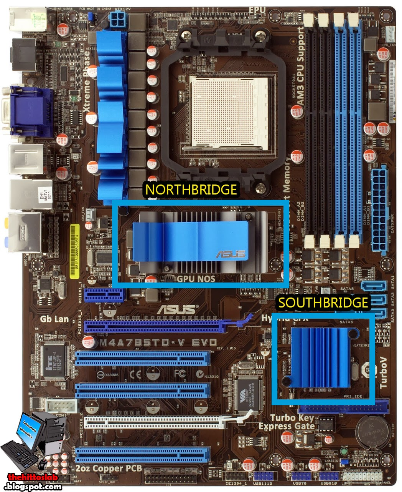

# Chipset

## Pengertian

Chipset merupakan penghubung antara microposessor/processor dengan komponen lainnya (RAM, Prosessor Video kartu grafis, dll).\
Bila microposessor diibaratkan otak manusia, meka __cipset__ adalah system saraf tulang belakang yang menghidupkan otak dengan saraf-saraf disetiap organ tubuh.

---

__Chipset__ merupakan IC ukuran kecil yang pada komputer merupakan layaknya "Polisi lalu lintas"  pada papan induk (motherboard), mengarahkan aliran data dan menentukan peranti apa yang didukung ole Personal Komputer (PC).\
__Chipset__ mengontrol interface atau koneksi antara mikroprocessor (CPU), maka chipset menentukan:

- Tipe processor dan seberapa cepat operasinya
- Seberapa cepat bus menghantarkan data
- Kecepatan, tipe, dan jumlah memori yang digunakan.
- Dll.

## Ada berapa jenis chipset yang ada pada motherboard

- __Chipset__ Northbridge
- __Chipset__ Southbridge

## Chipset Northbridge

__Chipset__ Northbridge atau __MCH__ (*Memory Controller Hub*) merupakan jenis chipset pada motherboard yang menghubungkan processor atau CPU ke dalam system memory dan juga system graphic controller melalui serial bus yang berkecepatan tinggi.

Berikut ini adalah fungsi dan juga peran dari chipset northbridge: Mengendalikan komunikasi yang terjalin antara processor, RAM, AGP, PCI, Express, dan juga southbridge

- Dapat melakukan pengendalian terhadap video.
- Memiliki peran yang sangat penting dalam menentukan jumlah tipe dan juga kecepatan dari sebuah CPU atau procssor yang dihubungkan ke dalam motherboard
- Menentukan jumlah kecepatan dan juga tipe ram yang digunakan pada motherboard

## Chipset Southbridge

- __Chipset__ Southbridge ini merupakan jenis chipset yang berhubngan dengan perihal melalui jalur penghubung. Tugas dan juga  fungsi dari chipset southbridge ini adalah melakukan pengontrolan pada bus IDE, USB, dan juga Pnp atau Plug and Play.
- Fungsi lain yaitu sebagai pengontrol keyboard, mouse, dan juga power management pada motherboard.

## Foto

## Kenapa bisa dinamakan dengan istilah Northbridge dan Southbridge ?

__CPU__ biasanya diletakan pada bagian atas (puncah) bagian. Pada suatu peta, bagian atas selalu indentik dengan arah utara. __CPU__ kemudian dihubungkan dengan chipset melalui fast bridge atau jalur penghubung cepat yang menyambung langsung dibagian atas unit chipset. Itulah sebabnya bagian yang langsung berhubungan dengan __CPU__ tersebut disebut Northbridge. __Northbridge__ ini kemudian dihubungkan dengan bagian bawah unit chipset melalui clow bridge atau jalur penghubung yang lebih lambat. Unit chipset bagian bawah ini kemudian disebut dengan __Southbridge__. Jika bagian bawah menyimbolkan arah selatan, itulah sebabnya disebut dengan istilah __Southbridge__

## Apa fungsi sebuah chipset pada motherboard?

- Funsi utama untuk mengonrol proses input dan juga outpu pada motherboard
- Funsi lain adalah untuk mengatur aliran data dari satu komponen menuju komponen lainnya, yang terhubung dalam satu kesatuan sistem komputer.

## Kenapa Pilihan sebuah chipset yang mumpuni

Setiap chipset yang ditanamkan pada motherboard biasanya merupakan jenis chipset yang indentik dengan komponen komputer tertentu.\
Setiap chipset bisa saja tidak kompatibel dengan komponen komputer lain, seperti processor dengan juga RAM.

## Macam-Macam Chipset

- Intel : X58, X48, X38, 910. 915, 925X, 945, 946, 975 Express, Centrino, Mobile Intel 910, 915, 945, 965 dan lainnya 
- AMD/ATI : AMD 480X, 570, 680, 770, 790FX, 780g, 780V, 790GX, Radeon Express 1150, 1200, 1250 dan sebagainya 
- Nvidia : nForse, nForse2, nForse3, nForse4, nForse 500, nForse 600, nForse 700, nForse 900, gForce

## Bagaimana memilih chipset yang tepat ?

ini yang harus di perhatikan dalam pemilihan sebuah chipset yang bisa mendukung computer kita:

1. Hal pertama yang anda harus perhatikan adalah jenis chipset yang digunakan
2. Perhatikan kecepatan interkoneksi antara chipset northbridge dengan southbridge. Kecepatan minimal menggunakan 133 MB/s.
3. Perhatikan chipset southbridge, produsen motherboard dapat dengan mudah menukar chipset tersebut dengan yang lain.
4. Untuk memilih chipset yang tepat anda juga membutuhkan second opinion untuk memberikan refrensi yang tepat

## PERBEDAAN AKSESORIS KOMPUTER, PERIPERAL KOMPUTER, DAN PERANGKAT KOMPUTER

