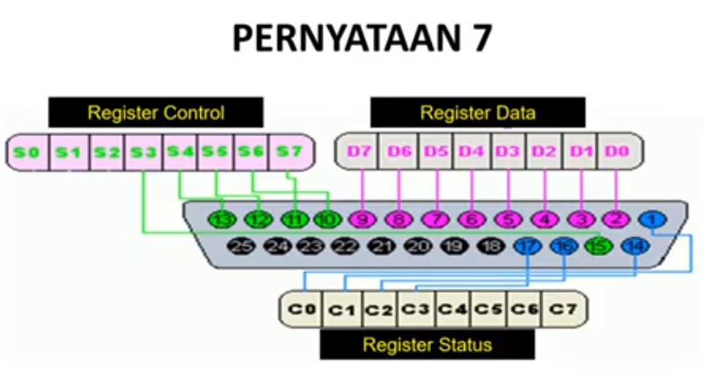

1. Interfacing (antarmuka) adalah bagian dari disiplin ilmu komputer yang mempelajari teknik-teknik menghubungkan komputer dengan peralatan elektronika lainnya.
  - **BENAR** Contoh dari interfaceing adalah USB, DB 25/PORT Parallel, Ps 2 dan Bluetooth.
2. User interface ada dua jenis, yaitu 

  - Graphical User Interface (GUI), Menggunakan unsur-unsur multimedia (seperti gambar, suara, video) untuk berinteraksi dengan pengguna.
  - Text-Based, Menggunakan syntax/rumus yang sudah ditentukan untuk memberikan perintah.

  - __BENAR__ interface memiliki 2 jenis yaitu berbasis teks & gui (grafis).
  - Contoh untuk berbasis teks biasanya bisa ditemukan di bagian server.
  - Contoh untuk berbasis gui bisa ditemuakan di PC desktop.

3. Layer logic merupakan suatu bentuk argumentasi tanpa memandang arti khusus dari istilah argumentasi lain. Hal ini dikarenakan layer signal sebagai penyampai datanya adalah arus listrik. Layer logic adalah pengalamatan dari rangkaian aplikasi, bus interface, dan data transfer.
  - **SALAH** Layer logic adalah pengalamatan dari rangkaian aplikasi, bus interfaciing dan data transfer.
4. Layer signal merupakan layer yang digunakan untuk menyampaikan data dari satu titik ke titik yang lainnya. Pada layer ini tergantung dari layer logic yang dalam penggunaan umum berupa arus listrik yang digunakan untuk menyampaikan data memalui sirkuit. Layer signal adalah teknik pengembangan pada elektrical interfaceing, bus interfaceing, dan data transfer.
  - **BENAR** Layer Signal befungsi untuk menyampaikan titik ke titik yang lain.
5. beberapa sumber noise khas adalah

  * motor.
  * Generator.
  * Resistor.
  * Transistor.
  * Pengulangan. __SALAH__ pengulangan tidak punya noise yang khas.
  * Alat yang besar.

6. Port pararell terbaru yang distandarisasi dengan IEEE.1284 yang dikeluarkan pada tahun 1984, mendifinisikan macam mode sebagai berikut.

  * Mode Kompatibilitas. salah tidak ada mode Kompatibilitas.
  * Mode Nibble.
  * Mode Byte.
  * Mode EPP.
  * Mode ECP.
  * Mode CPP. salah tidak ada mode CPP.

7. 
  - __BENAR__
8. USB atau kita panjangkan menjadi Universal Serial Bus, merupakan interface port device yang sudah pasti ada di setiap komputer dan laptop. Fungsinya adalah sebagai media koneksi data antara komputer dan perangkat dan aksesoris yang mengguakan colokan USB seperti printer, modem, ponsel, cooling fan, flash disk, dan lain-lain.
  - __BENAR__ USB merupakan media penghubung antara komputer dengan perangkat-perangkat elektronik dan sangat penting pada komputer dan laptop.
9. PLC atau Progammable Logic Controller, sistem elektronik yang beroperasi secara analogi dan didisain untuk pemakaian di lingkungan industri, dimana sistem ini mengguanakan memori yang dapat diprogam untuk penyimpanan secara internal.
  - __BENAR__ PLC dalah suatu mikroprosesor yang digunakan untuk otomasi proses industri seperti pengawasan dan pengontrolan mesin di jalur perakitan suatu pabrik.
10. Fungsi Control dalam PLC menunjukan kemampuan dalam memprosesan input secara aritmatik dan logic (ALU), yakini melakukan operasi membandingkan, menjumlahkan, mengalikan, membagi, mengurangi, negasi, AND, OR, dan lain sebagainya.
  - __BENAR__ Fungsi Control pada PLC adalah
