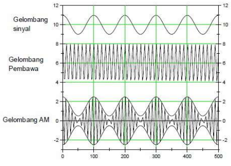
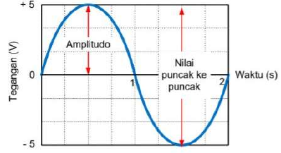
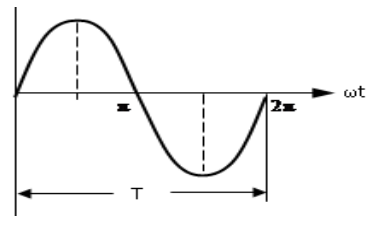
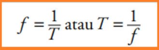
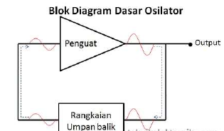
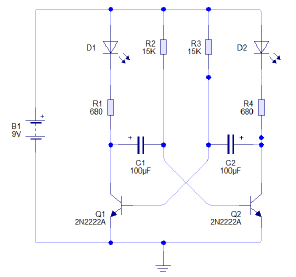
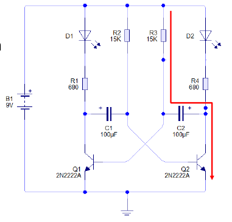
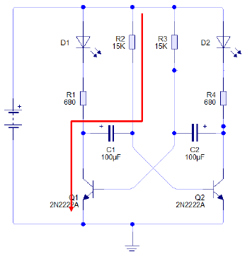
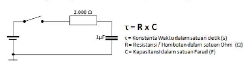
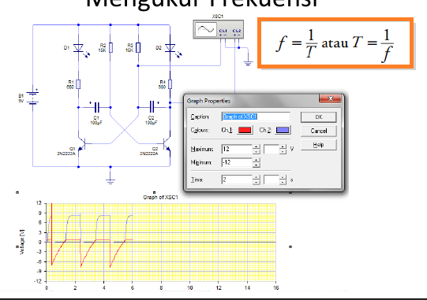

# Pertemuan 10

## Gelombang Frekuensi

Adaptor atau power suplay menggunakan trafo Center Tape

## Frekuensi

Frekuensi ialah jumlah gelmban atau getaran yang dihasilkan tiap detik

## Amplitudo

Amplitudo atau  nilai puncak suatu signal adalah ukran seberapa besar tegangan. Amplitudo sinyal merupakan setengah dari niai puncak ke puncak. Gelombang dengan nilai amplitudo sebesar 5V dan nilai puncak ke puncak sebesar 10 V

Frekuensi ialah jumlah gelombang atau getaran yang dihasilkan tiap detik.

## Periode

Periode adalah lamanya waktu yang dibutuhkan oleh sinyal untuk membentuk satu gelombang penuh. Periode disimbolakan dengan huruf T, dan satuan dari periode dinyatakan dalam detik atau second (s). Gelombang dengan nilai periode sebesar 1/2 detik.

- Frekuensi adalah banyaknya gelombang penuh yang terjadi dalam waktu satu detik.
- Dari dua difinisi tersebut terdapat pengertian, bahwa jika suatu gelombang penuh mempunyai perioda sebesar **T** detik maka banyaknya gelombang penuh yang terjadi setiap detiknya ( **F** ) adalah:

- Dimana : f = Frekuensi dalam cycle/second atau Herzt(Hz)
- T = Perioda dalam detik

## Sumber Gelombang

- Osilator

Osilator memanfaatkan sinyal derau / noice yang berasal dari penguat itu sendiri. Saat penguat diberikan teggangan, sinyal derau / noice akan terjadi, kemudian diumpan balik ke Penguat, maka Osilasi akan terjadi.

Yang membuat rangkaian flip-flop 2 transistor ini memiliki 2 kondisi saling bergantian antara cut-off dan saturasi adalah rangkaian RC pada kedua transistor.

## Osilator flip-flop 2 transistor

Dengan asumsi bahwa transistor TR1 berada pada posisi cut-off (OFF) dan TR2 dalam kondisi saturasi (ON) maka c2 akan melakukan pengisian muatan melalui R2 ke ground melalui kolektor emitor TR2,Kemudianpada saat muatan telah penuh maka transistor TR1 mendapat bias maju sehingga berubah menjadi saturasi (ON) kondisi ini akan memaksa berubah kondisi transistor TR2 menjadi cut-off (OFF) dengan cepat sehingga muatan C2 akan dilepas melalui basis TR1 dan pada saat yang  sama C1 mengisi muatan sampai penuh melalui R3 ke ground melalui kolektor emitor TR1.

Dengan asumsi bahwa transistor Q1 berada pada posisi cut-off (OFF) dan Q2 dalam kondisi saturasi (ON) maka C2 akan melakukan pengisian muatan melalui R3 ke ground melalui kolektor emitor Q2.

Saat muatan C2 penuh, maka cukup untuk menmberikan bias manju pada transistor Q1 sehingga menjadi saturasi (ON) kondisi ini memaksa transistor Q2 menjadi cut-off (OFF) sehingga muatan C2 dibuang menjadi basis Q1 dan selanjutnaya C1 mulai mengisi muatan melalui R2 ke ground melalui kolektor emitor Q1.

Kondisi 2 keadaan pada kedua transistor yang selalu cut-off dan saturasi secara bergantian ini memberikan output berupa pulsa ynag menerus dengan frekuensi ditenukan oleh kecepatan waktu pengisian dan pengosonan kapasiotr umpan balik kedua bagian. Frekuensi pulsa ynag dihasilkan rangkaian flip-flop 2 transistor (stabil multivibrator) sbb:

## Mengukur frekuensi

