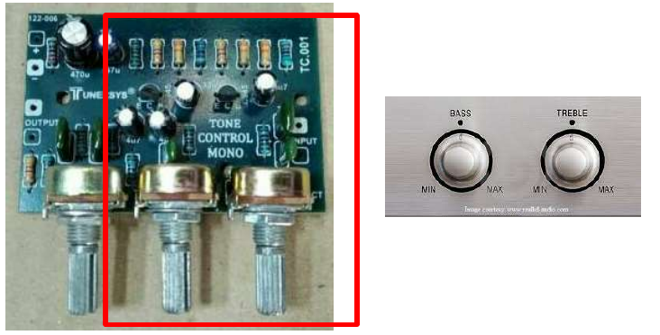
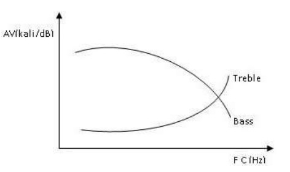
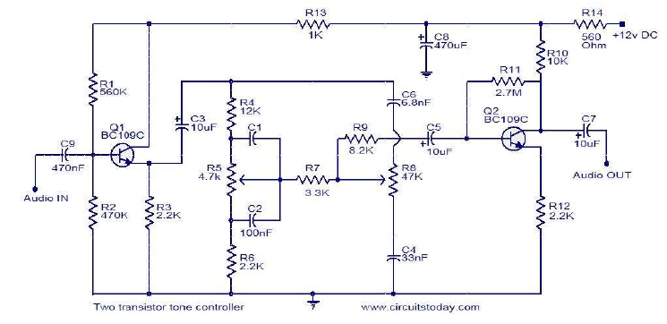
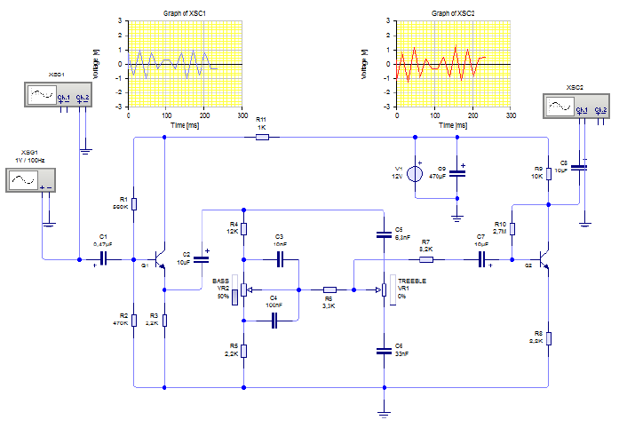
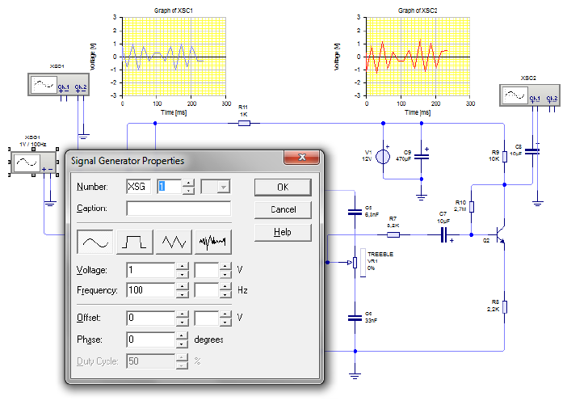
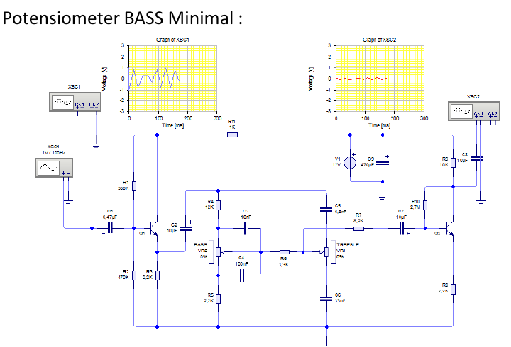
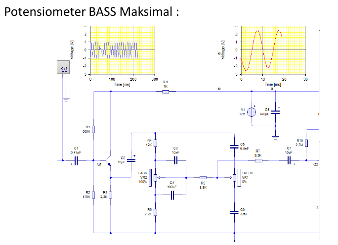

# Respon Frekuensi Tone Ctrl Treble & Bass

Saat menggunakan **Tone Ctrl**, anda menghadapi kata-kata seperti **Treble & Bass** sebagai berikut:

## Tone Ctrl

Rangkaian Tone control adalah sirkuit elektronika yang berfungsi untuk mengatur nada pada input audio. Input biasanya berasal dari Mic, Mp3,Mp4. Rangkaian ini efisien karena rangkaiannnya sederhana.

Tone control terdiri dari 2 macam, yaitu tone control pasif dan aktif. Perbedaannya adalah pada tone control pasif input audio diatur tanpa dikuatkan kembali. Sedangkan pada tone control aktif input audio yang diatur dan dikuatkan kembali menggunakan transistor atau IC.

## Frekuensi pada Tone Ctrl

Tone Ctrl berfungsi untuk mengatur nada rendah (Bass) dan nada tinggi (Treble) secara terpisah. Pada bagian pengatur nada Bass, menguatkan sinyal frekuensi rendah, sedangkan pada bagian nada treble menguatkan sinyal frekuensi tinggi. Kurva penguatan terhadap fekuensi yang dikuatkan dapat digambarkan sbb:

## Treble & Bass

### Apa Arti Bass ?

Bass mengacu pada nada dengan frekuensi yang lebih rendah. Rentang bass dari 16 hingga 256 Hz. Instrumen seperti bass, cello, tuba, trombone, dan timpani digunakan untuk menghasilkan suara bass.

### Apa Arti Treble ?

Treble mengacu pada nada dengan frekuensi yang lebih tinggi. Rentang Treble dari 2.048 kHz-16.384 kHz. Instrumen seperti gitar, biola, dan seruling dapat menghasilkan suara treble.

## Kendali Nada Suara (Tone Ctrl) Treble & Bass

Kendali nada suara Treble & Bass menggunakan Tone Ctrl.

## Prinsip Kerja

Prinsip kerja rangkaian diatas adalah sebagai berikut:

1. Transistor Q1 sebagai buffer (penyangga) input audio yg kecil.
2. Transistor kedua Q2 bertindak sebagai pengatur nada aktif yang sebenarnya. Transistor membentuk filter utk frekwensi tinggi dan rendah dalam spektrum audio.
3. Pada pengaturan treble, apabila VR1(R8) berada pada posisi maksimum maka kondensator 6,8nF akan seri dengan variabel resistor 47k (Hight Pass Filter) sehingga melewatkan frekwensi tinggi.
4. Pada pengaturan bass, apabila VR2(R5) berada pada posisi maksimum maka kondensator 10nF akan paralel dengan variabel resistor 4k7 (Low Pass Filter) sehingga melewatkan frekwensi rendah.

## Respon Frekuensi Tone Control

perioda 1 gelombang (T) = 10s
F = 1/T
F = 1/10/1000
F = 1000/10 = 100Hz

