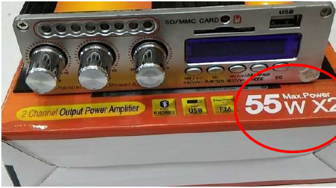
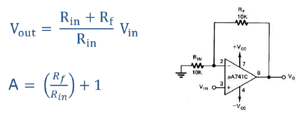
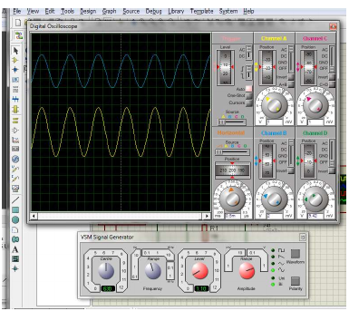
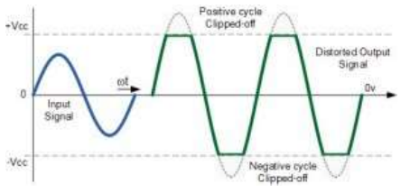
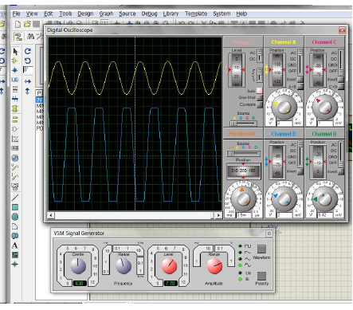
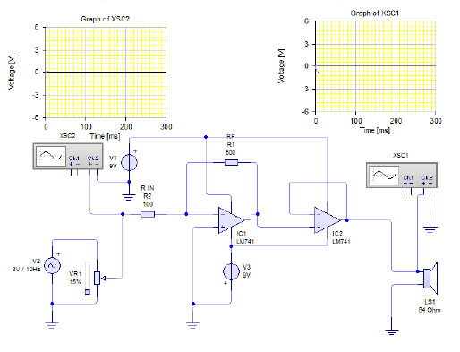
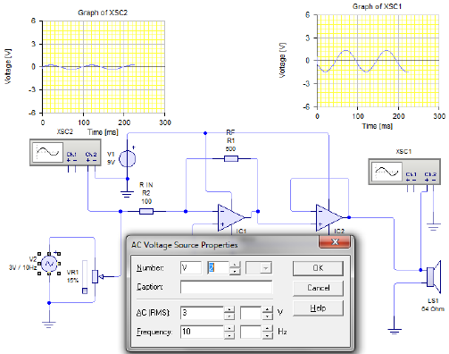

# Mengukur Power Amplifier

## Power Amplifier

Saat menggunakan peralatan Amplifier, Anda menghadapi kata-kata Power atau Watt sbb:

## Daya Listrik dan Rumus untuk Menghitungnya

- Sumber Energi seperti Tegangan listrik akan menghasilkan daya listrik sedangkan beban yang terhubung dengannya akan menyerap daya listrik tersebut.
- Daya listrik adalah tingkat konsumsi energi dalam sebuah sirkuit atau rangkaian listrik.
- Contoh : Speaker menyerap arus Amplifier yang diterimanya dan mengubahnya menjadi suara.
- Rumus Daya : **P = V \* I** *atau* **P = I²R** *atau* **P = V²/R**
- Dimana:
- P : Daya Output Amplifier dengan satuan Watt (W)
- V : Tegangan Output Amplifier dengan Satuan Volt (V)
- I : Arus Output Amplifier dengan satuan Ampere (A)
- R : Hambatan dengan satuan Ohm (Ω)

## Penguat Non-Inverting

Adalah penguat sinyal dengan karakteristik dasar sinyal output yang dikuatkan memiliki fasa yang sama dengan sinyal input.

## Penguat Inverting

Adalah penggunaan op-amp sebagai penguat sinyal dimana siyal outputnya berbalik fasa 180 derajat dari sinyal input.

## Distorsi Amplitudo Pada Amplifier

Distorsi amplitudo sinyal output pada sebuah amplifier dapat berupa terpotingnya sinyal output pada sisi puncak positif maupun puncak negatif atau keduanya. Pada dasarnya suatu amplifier dikatakan memiliki gelombang output yang distorsi apabila sinyal output memiliki bentuk tidak sesuai dengan sinyal inputnya. Distorsi amplitudo sinyal output tersebut. Distorsi amplitudo pada suatu amplifier pada umumnya disebabkan oleh : **Penguatan Yang Melebihi Kapasitas (Over Drive)**

## Penguatan Yang Melebihi Kapasitas (Over Drive)

Distorsi amplitudo pada amplifier karena penguatan yang berlebih (over drive) ini akan menyebabkan sinyal output yang terpotong pada kedua sisi punyak gelombang positif dan negatif. Distorsi amplitudo dengan terpotingnya kedua sisi puncak gelombang negatif dan positif secara bersamaan ini disebut dengan istilah *clipping disortion*. Clipping disortion pada suatu amplifier pada umumnya disebabkan oleh :

1. Seting faktor penguatan yang melebihi kapasitas tegangan sumber amplifier.
2. Sinyal input yang terlalu besar, sehingga melebihi kapasitas tegangan sumber amplifier bentuk output amplifier dengan Clipping Disortion.

Bentuk output Amplifier dengan Clipping Disortion sbb:

Gelombang output amplifier dengan *Clipping Disortion* dapat dihindari dengan menurunkan level tegangan sinyal input atau menurunkan faktor penguatan tegangan rangkaian amplifier.

## Distorsi Amplitudo Pada Amplifier

### Mengukur Power Amplifier

### Daya Power Amplifier

- Hasil pengukuran :
  * Tegangan (Vpeak) = 1.8 V AC
  * Vrms = Tegangan efektif
  * Vrms = Vpeak/√2
  *      = 1.8/1.414
  *      = 1.27 Vrms
  * Speaker = 64 Ω
- Rumus Daya :
  * P = V.I dan I = V/R
  * P = Vrms²/R
  * P = (1.27)²/64
  * P = 1.6129/64
  * P = 0.025 Watt

