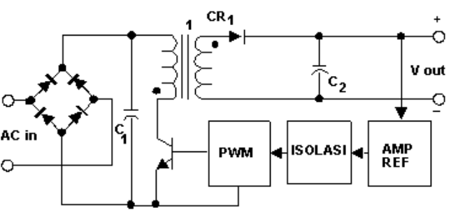
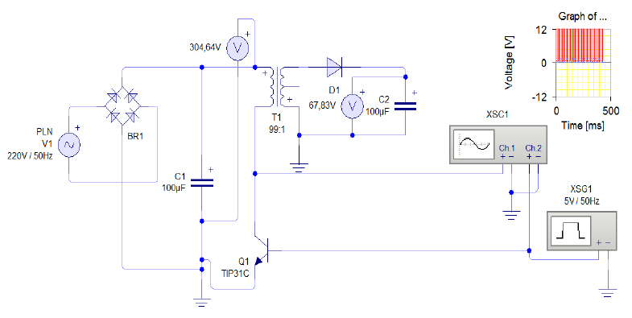
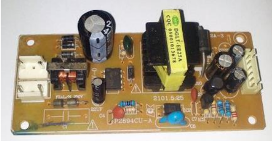
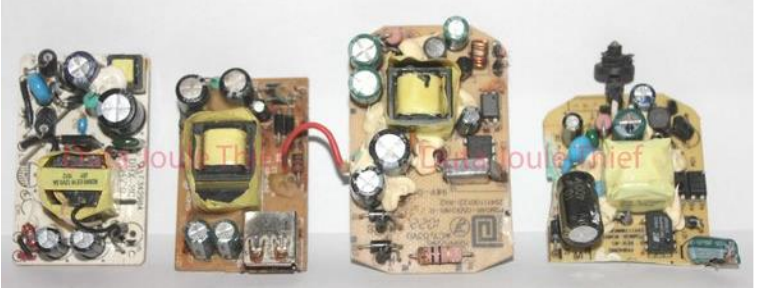

# Pertemuan 6 Cara Mengukur Tegangan Adaptor Switching

## Adaptor Mensuplay arus satu arah Dicet Current (DC)

Perangkat yang mensuplay Arus searah (DC).

## Catu Daya Switching

**Catu Daya Switching** adalah sebuah sistem catu daya / Regulator / Power Suplay yang pengaturan dayanya menggunakan piranti switcing Elektronik (saklar).

## Kelebihan Catu Daya Switching

- Efisiensi besar antara 65% - 85%.
- Kecil dan ringan.
- Kemampuan untuk dapat berpotensi pada kisaran tegangan input yang besar dan kecil (Auto Voltage) degnan range antara 80-240 volt.
- Tegangan (voltage) dan Arus (Ampere) yang di hasilkan catu daya switcing sangat akurat.

Pengertian Auto Voltage adalah, misal pada personal komputer ketika tegangan voltage turun (bisanya terjadi pada daerah tertentu terutma pada sore hari). Jika Anda menggunakan power supplay yang bagus, maka saat terjadi voltage turun personal komputer anda tidak akan mengalami Restart.

Dan sebaliknya jika anda menggunakan Power Suplay bisa, maka ketika terjadi voltage turun personal computer computer akan mengalami Restart, atau pada beberapa kasus tertentu komputer malah tidak bisa hidup atau mengalami Restart terus menerus.

## Inverter

Tegangan DC dialirkan sambung-putus ke Kumparan sehingga mampu menginduksi medan elektromagnetik untuk menurunkan tegangan.

## Cara Kerja Catu Daya Switching

1. Arus dari sumber tegangan (PLN) masuk ke bagian regulated berupa 4 Dioda dan Elco Primer, dan di blok ini Tegangan AC dirubah menjadi Tegangan DC.
2. Kemudian tegangan masuk blok Switching berupa Trafo dan Transistor / Mosfet / FET. Tegangan masuk ke blok Inverter (Trafo Inti Feris) di blok ini akan kembali terjadi perubahan tegangan DC dirubah kembali menjadi Tegangan AC.
3. Fase ini merupakan pengaturan daya dengan cara menggunkan frkuensi switcing Elektronik.
4. Kemudian tegangan masuk ke bagian regulated berupa Dioda dan Elco Sekunder, di blok ini akan kembali terjadi perubahan tegangan yang tadinya Tegangan AC dirubah lagi menjadi DC.
5. Tegangan masuk ke beban dan masuk ke blok Komporator sebagai tegangan umpan balik mengatur frkuensi.

## Alternating Current (AC) dirubah menjadi Direct Current (DC) menggunakan Inverter.

Adaptor atau power supplay

## Ukuran Tegangan Adaptor Switching

**Cara Mengukur Tegangan Regulator / Cara Cek Regulator**

Seperti yang kita ketahui bahwa regulator adalah pusat tegangan perangkat elektronika sehinggga yang tersimpan dalam blok regulator sangat besar.

Untuk itu saya sangat menyarankan agar selalu hati-hati jika ingin melakukan pengukuran tegangan ataupun melakukan perbaikan blok regulator, jangan sampai anda tersangat aliran listrik yang berada di bagian blok regulator karena bisa membuat anda kaget, bahkan jika ada kesalahan sedikit saja atau konslet bisa mengakibatkan listrik **NJEGLEK**.

Berikut adalah cara aman mengecek tegangan regulator.

1. Cek kondisi sekering.
2. Selajutnya lepas FET / Mosfet.
3. Kemudian ukur Tegangan pada Eco Induk, kika OK, silahkan pasang kembali Mosfet.
4. Tahap berikutnya, ukur tegangan output trafo inventer.

## Power Suplay Switching

