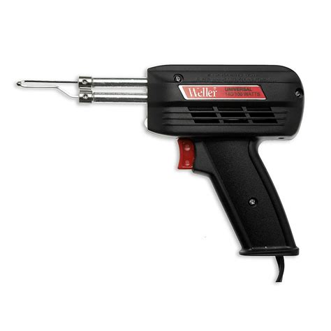
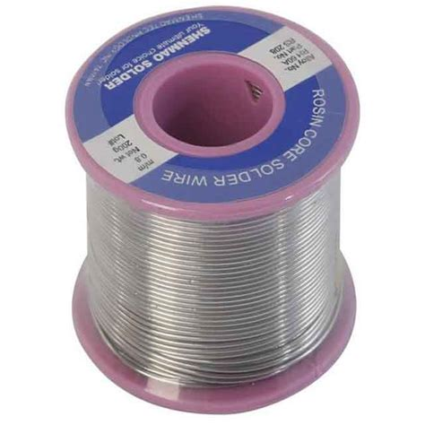
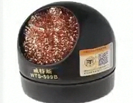

# Alat Kerja Elektronika

## Solder

Dipasaran banyak dijual berbagai macam jenis bentuk soler, ada yang berbentuk pensil dan juga ada yang berbentuk pistol. Biasanya sodel memiliki dua macam teganan, pada posisi standby biasanya teganannya kecil dan saat ditekan pada bagian tertentu teganannya menjadi lebih besar.

Solder berbentuk pensil biasanya dipakai untuk pekerjaan terusan, sedangkan soler pistol biasanya dipakai untuk pekerjaan yang tidak terusan. Solder dengan ukuran 30 watt biasanya sudah cukup baik dipakai untuk mematri komponen elektronik.

## Timah / Tenol

Tenol / Timah adalah campuran logam atau sering dikenal dengan istilah alloy. Tenol adalah campuran antara timah dan timbal yang berfungsi untuk perkerat antara komponen dan PCB

## Penyedol Timah / Attractor

Alat Penyedol Timah Solder (Attractor) merupakan alat yang tergolong vital bagi seorang teknisi elektronika, karena attractor atau penyedot timah solder lazim dan hampir 90% digunakan sebagai alat bantu dalam melepaskan atau mencabut komponen elektronik dari PCB yang telah terpatri kuat.

Kenapa komponen elektronika perlu dicabut? Dalam dunia reparasi elektronika, komponen elektronika yang telah mengalami kerusakan tentunya kita ganti dengan yang masih dengan kondisi bagus, nah disini perlunya mengguanakn soler untuk juga memperlukan alat bantuan yakini alat penyedot timah solder (attractor) ini.

## Pembersih Solder / Flux Pasta

Flux pasta solder merupakan sejenis senyawa yang memiliki fungsi untuk meminimalisir terjadinyalapisan oksidasi pada saat aktifitas menyolder, kenapa oksidasi ini perlu dihilangkan ? Jawabanya adalah karena lapisan oksidasi menyebabkan korosif pada timah sehingga sambungan timah menjadi tidak awet dan berakibat pada jeleknya kontak antara komponen ke papan circuit PCB.

