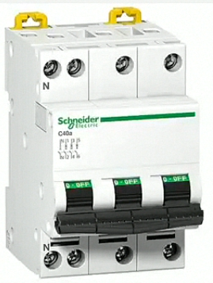

# Mengenal komponen Instalasi Listrik Part 1

## MCB (Miniature Circuit Breaker)

Komponen ini berfungsi sebagai sistem proteksi dalam instalasi listrik bila terjadi beban lebih dan hubung singkat arus listrik *(short circuit atau konsleting)*. Pada instalasi listrik rumah, MCB terpasang di kWh meter listrik PLN dan juga di MCB *box*, MCB memiliki 3 macam fungsi yakni :

- Pemutus Arus Listrik
- Proteksi Hubung Singkat (Short Circuit Konsleting)
- Protekisi Bebean Lebih
- 

##  Fuse Box (Kotak Sekring)

Penggunaaan pada rumah, sekring bisanya terhubung ke kotak sekring pusat dimana semua rangkaian kabel melewatinya. Ketika listrik mengalir normal, sekring mengizinkan daya untuk melewati penghalang filamen diantara sirkuit. Jika terjadi kelebihan beban, filamen akan meleleh dan menghentikan aliran listrik

## Kabel Listrik

Kabel digunakan untuk menghantarkan aliran listrik dari sumber listrik menuju ke perangkat pengguna listrik, sehingga perangkat tersbut dapat bekerja dengan baik sesuai fungsinya.

Dari berbagai jenis kabel listrik yang dijual berdasarkan tegangannya, dapat dikelompokan menjadi : 

- Kabel Listrik tegangannya rendah.
- Kabel Listrik tegangannya menegah.
- Kabel Listrik tegangannya tinggi.

### Arde (Grounding)

- **Menurut WikiPeida** - Grounding adalah satu jalur langsung dari arus listrik menuju bumi atau konseksi fisik langsung ke bumi. Dipasannya koneksi grounding pada instalasi litrik adalah sebagai pencegahan terjadinya kontak antara mahluk hidup dengan teganan litrik berbahanya yang terkspos akibat terjadi kegagalan isolasi.
- **Menurut PUIL 2000** (Persyaratan Umum Instalasi Listrik) - dipakai istilah pembumian yang artinya penghubungan antara titik sirkuit listrik atau suatu penghantar yang bukan bagian dari sirkuit, dengan bumi menurut cara tertentu. PUIL adalah kenentuan standar internasional, dan sebagai pedoman dan pelaksanaan dalam pekerjaan instalasi listrik

## Pemasangan Arde Yang Baik

- Secara umum Kabel grounding terkonksi di KWH meter PLN. Pada saat pemasangan listrik oleh petugas PLN maka label grounding akan dipasang ke KWH bahkan sampai penamaan pipa yang terpasang di dalam tanah. Namun ada pula pemasangan grounding dilaksanakan oleh pekerja proyek perumahan, sehingga saat akan dipasang listrik oleh pihak PLN petugasnya akan menyambungkan kabel dari pipa yang terlah terpasang ke bumi menuju KWH.

## Fungsi Arde

- Untuk keselamatan, grounding berfungsi sebagai penghantar arus listrik langsung ke bumi atau tanah saat terjadi kebocoran isolasi atau percikan api pada konsleting, misalnya grounding yang terpasang pada badan/statis alat elektronik seperti setrika akan mencegah tersengat listrik saat rangkaian di dalam setrika bocor dan menempel ke badan setrika
- Dalam instalasi penagkal petir, system grounding grounding berfungsi sebagai penghantar kabel grounding untuk instalasi rumah dan grounding untuk penagkal petir pemasangannya harus terpisah.
- Sebagai proteksi peralatan elektronik atau instrumentasi sehingga dapat mencegah kerusakan akibat adanya bocor teganan.

## T-DUS (Tempat Percabangan Kabel)

- Penyambungan atau pencegahan hantaran listrik pada instalasi dengan pipa harus dilakukan dalam kotak sambung.
- Hal ini dimadsudkan untuk melindungi sambung atau percabangan hantaran dari gangguan yang membahanyakan. Pada umumnya bentuk sambung yang digunakan pada kontak sambung yang digunakan pada kontak sambung ialah sambung ekor babi (pig tail), kemudian setiap sambungan ditutup dengan las dop setelah diisolasi.

