# Pertemuan 13

## Saklar Lampu

**Saklar** adalah sebuah perangkat yang digunakan untuk memutuskan jaringan listrik atau untuk menghubungkannya. Jadi saklar pada dasarnya adalah alat penyambung atau pemutus aliran listrik. Selain untuk jaringan listrik arus kuat, saklar berbentuk kecil juga dipakai untuk alat komponen elektronika arus lemah.

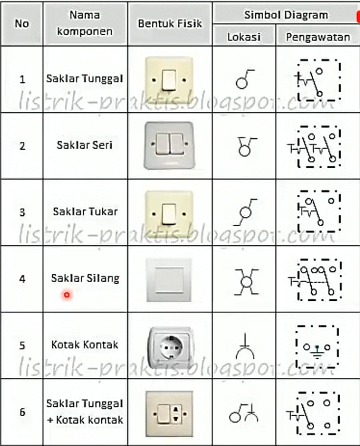

## Fitting Lampu

Pengertian **Fitting Listrik**. **Fitting** atau tempat dudukan lampu adalah suatu alat untuk menghubungkan lampu dengan kawat-kawat jaringan listrik agar aman. Berdasarkan pemakaiannya bentuk fitting dibedakan menjaddi beberapa macam, yaitu fitting tempel, fitting yang digantung, fitting bayonet, gabungan fitting dengan stop kontak dan lain-lain.

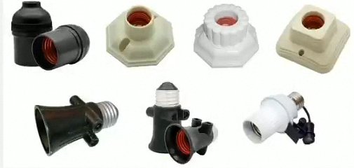

## Stop Kontak

Fungsi **Stop Kontak** adalah untuk penghubung arus listrik atau jaringan ke perangkat lain sehingga penrangkat rumah bisa aktif dengan sempurna. Bisanya stop kontak tertempel di dinding ada juga yang diluar dipasang langsung dengan kabel.

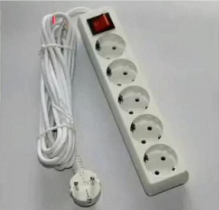

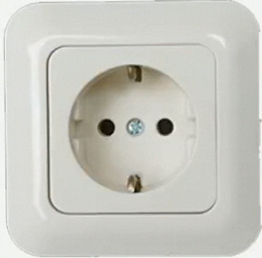

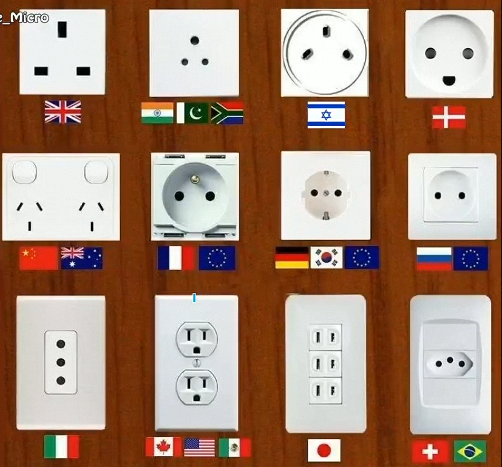

## Steker

Mungkin anda mengenal aksesoris listrik ini dengan *colokan listrik* tak ada salahnya memang, namun, alat listrik tersebut memiliki nama yakini **Steker**. Fungsinya adalah sebagai penghantar listrik menuju tempat lain atau stop kontak.

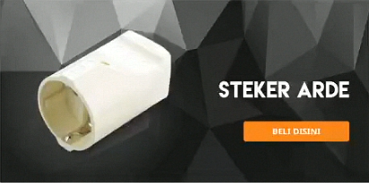

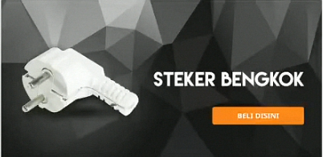

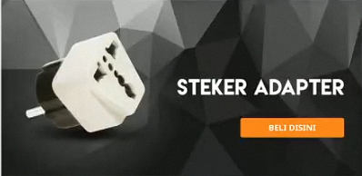

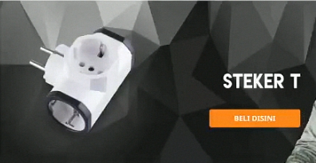

## Lampu

**lampu** adalah komponen yang berfungsi sebagai sumber penerangan pada ruangan.

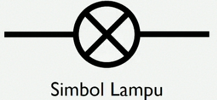

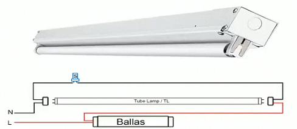

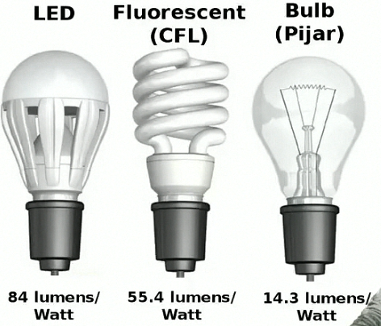

