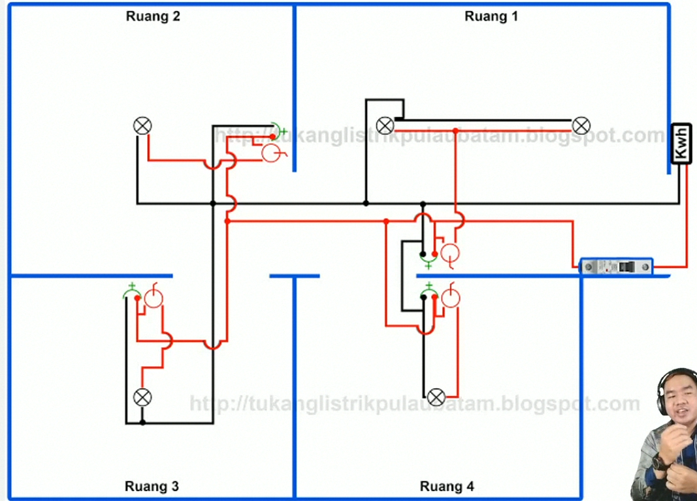
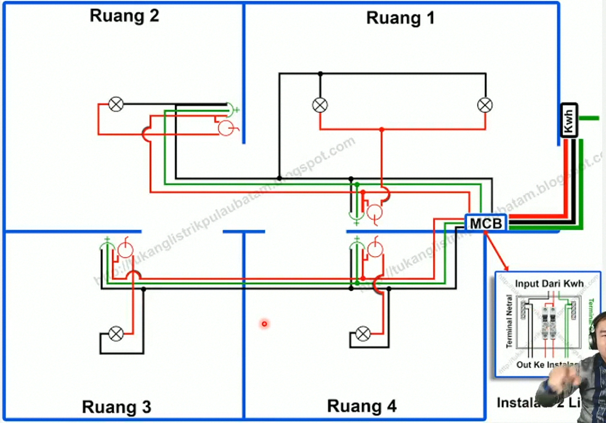
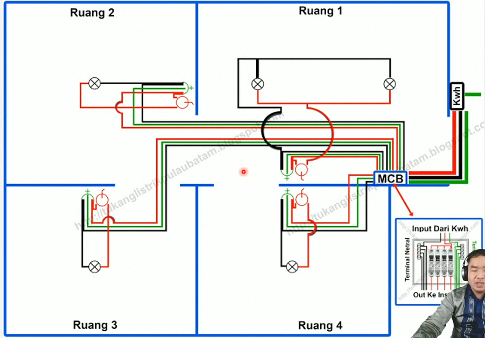

# Mengenal Instalasi Listrik Rumah

## Instalasi Listrik Single Line (1 MCB) 

- **Instalasi Listrik Single Line** banyak terdapat pada rumah-rumah lama dan tidak memerlukan pemakaian listrik yang cukup besar, kisaran pemakaian listrik hanyak 4 A hingga 6 A saja. Contoh instalasi listrik single line seperti gambar dibawah ini, dimana semua beban pemakaian listrik hanyak di bebankan kepada single line saja. 
- 

## Instalasi Listrik Double Line (2 MCB) 

- **Instalasi Listrik** seperti ini akan sedikir lebih mahal dan juga lebih aman serta lebih tahan lama dari instalasi listrik single line. Karena instalasi listrik seperti ini memerlukan komponen rangkaian instalasi listrik yang lebih juga, beban pemakaian listrik dibagi menjadi 50%-50% dengan menggunakan dua pengaman instalasi listrik yaitu MCB *(Miniature Circuit Breaker).* Contoh instalasi listrik dua line. Seperti digambar di bawah ini.
- 

## Instalasi Listrik Multi Line (Multi MCB) 

- **Instalasi listrik multi line** ini adalah jenis rangkaian  instalasi listrik yang sangat aman dan sangat profesional. Karena jenis *(type)* rangkaian Instalasi multi line ini jauh lebih aman dari kedua rangkaian instalasi listrik di atas, selain itu jenis instalasi multi line ini akan memanjakan konsumen (pemilik rumah) ketika suatu saat terjadi konsleting listrik, tidak semua listrik padam (mati), melainkan hanya pada bagian yang konlet saja, sehingga terhindar dari kebakaran yang disebabkan oleh konsleting listrik. MCB akan memblokir pasokan arus listrik yang mengarah ke tempat terjadinya konsleting listrik dan membiarkan yang lain menyala dengan baik.
- 

