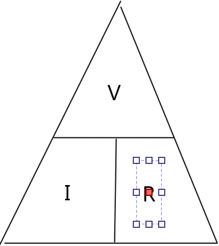
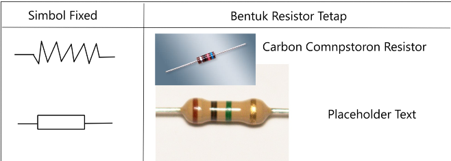
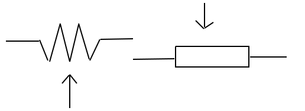
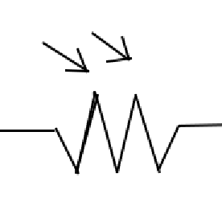

# Pertemuan 2

## Resistor

merupakan salah satu jenis komponen elektronika pasif, berfungsi sebagai penghambar arus listrik dalam sebuah rangkaian elektronika. Setiap Resistor mempunyai nilai hambatan yang berbeda-beda. Satuan hambatan arus listrik adalah Ohm Ω.

## Hukum Ohm Ω

I. Yang mengalir sebuah penghantar / konduktor akan berbanding lurus denganbeda potensial / tegangan (V) yang kepadanya dan berbanding terbalik dengan hambatannya.

V = I \* R, I = V/R, R = V/I

- V : Voltage (Beda potensial / tegangan volt(V))
- I : Current (Arus listrik Ampere (A))
- R : Resistance (Hambatan / resistansi Ohm Ω)

## Jenis-Jenis Resistor

- Resistor yang memiliki Resistance tetap.
- 
- Resistor yang nilai resistansinya dapat diatur (variabel reistor) + Potensiometer
- 
- resistor yang dapat diubah berdasarkan intesitas cahaya (LDR)
- 
