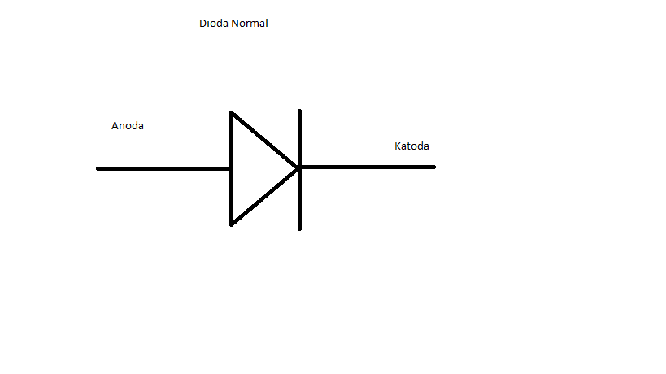
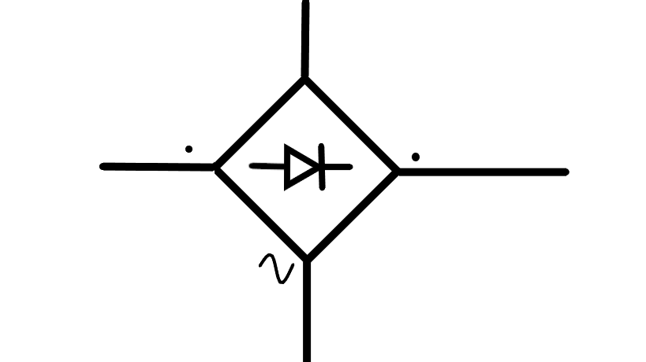
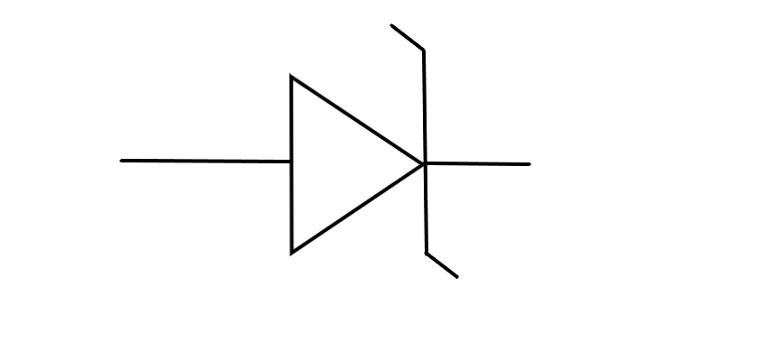
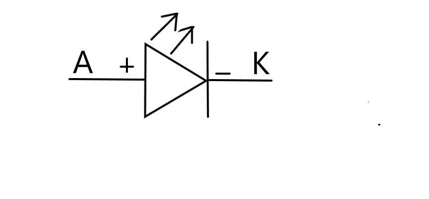
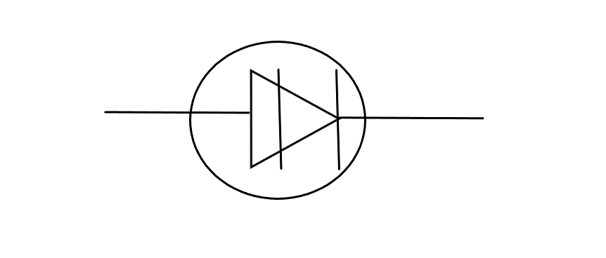
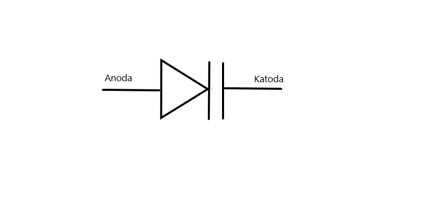
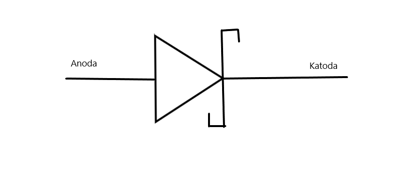
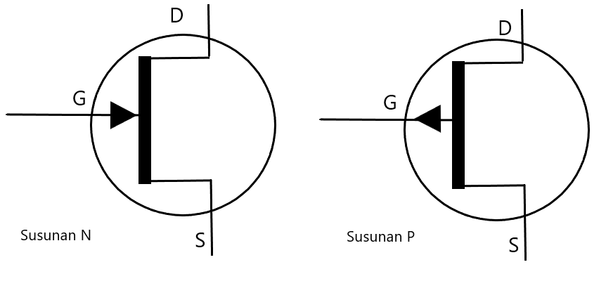

# Transistor & Dioda Menjadi Teknologi Pertama (Intergeted Circuit)

## Komponen Dioda Elektronika dan Simbol Masing-Masing Komponen
- Dioda Normal
- 
- Dioda Bridge
- 
- Dioda Zener
- 
- Dioda Led
- 
- Dioda foto
- 
- Dioda Laser
- 
- Dioda Varactor
- 
- Dioda Tunner
- 
- Dioda Schottky
- 

## Dioda
- Dioda atau diode termasuk salah satu dari komponen-komponen elektronika aktif.
- Komponen ini memiliki fungsi sebagai pengantar arus satu arah, dan menghentikan arus yang menuju arah lainnya.
- Dioda memiliki dua kaki yakini kaki anoda dan katoda.

### Jenis-Jenis Dioda
1. Dioda Penyearah alias dioda bisa, yang berfungsi menyearahkan arus listrik bolak balik (AC), menjadi searah (DC).
2. Dioda Zener merpakan jenis dioda yang berfungsi sebagai pengaman rangkaian dari tegangan yang telah ditentukan.
3. Light Emitting Diode atau bisa disebut dengan LED, merupakan salah satu jenis dioda yang berfungsi memancarkan bahaya monokron.
4. Photo Dioda atau dioda foto merupakan salah satu jenis dioda yang sangat peka terhadap cahaya. Bisanya jenis dioda ini digunakan sebagai sensor cahaya.
5. Dioda Schottky bisa disebut juga dengan dioda pengendali.
6. Dioda Laser merupakan salah satu jenis dioda yang mampu memancarkan cahaya laser.

## Transistor
- Transistor merupakan salah satu komponen elektronika aktif.
- Komponen yang satu ini memiliki banyak fungsi dalam sebuah rangkaian elektronika, mulai dari penguat arus, switch, penyetabil tengangan, sampai dengan modulasi sinyal
- Komponen ini banyak digunakan dalam elektronika moderen.
- Pada umumnya transistor memiliki 3 kaki, yakini kaki ***Basis (B)***, ***Eitor (E)***, dan ***Colektor (C)***.

### Jenis-Jenis Transistor 
1. Transistor bipolar, adalah transistor yang memiliki dua kutup. Transistor ini bisa dibagi menjadi 2, yakini PNP (positif negatif positif),dan NPN (negatif positif negatif).
  * 
2. Transistor unipolar, atau bisa disebut dengan transistor efek medan (FET). Transistor jenis ini hanya memiliki sebuah kutup saja.
  * 

### Transistor FET (Field Effect Transistor)
- Field Effect Transistor atau disingkat dengan FET adalah komponen Elektronika aktif yang menggunakan medan listrik untuk mengendalikan konduktifitasnya.
- FET dalam bahasa indonesia dengan Transistor Efek Medan.
- DIkatakan Transistor Efek Medan karena pengoperasian Transistor jenis ini tergantung pada tegangan (medan listrik) yang terdapat pada input Gerbangnya.
- FET merupakan komponen elektronika yang tergolong dalam keluarga Transistor yang memiliki tiga terminal kaki yaitu 
- *Gate (G), Drain (D), dan Source (S).*

### Cara Kerja Transistor JFET (Junction FET)
- Cara Kerja JFET pada prinsipnya seperti kran air yang mengatur aliran air pada pipa. Elektron atau Hole akan mengalir dari Terminal Source (S) ke Terminal Drain (D), Arus pada Outputnya yaitu Arus Drain (I0) akan sama dengan Arus inputnya yaitu Arus Source (Is). Prinsip kerja tersebut sama dengan prinsip kerja sebuah pipa air di rumah kita dengan asumsi tidak ada kebocoran pada pipa air kita
- Bersarnya arus listrik tergantung pada tinggi rendahnya Tegangan yang diberikan pada Terminal Gerbangnya (GATE (G)). Fluktuasi Tegangan pada Terminal Gate (Vg) akan menyebabkan perubahan pada arus listrik yang melalui saluran Is atau Io. Fluktuasi yang kecil dapat menyababkan variasi yang cukup besar pada arus aliran pembawa muatan yang melalui JFET tersebut. Dengan demikian terjadi penguatan Tegangan pada sebuah rangaian Elektronika
- JFET memiliki 2 tipe berdasarkan tipe bahan semikonduktor yang digunakan pada saluran atau kanalnya. JFET tipe N-Channel (Kanal N) terbuat dari bahan Semikonduktor tipe N dan P-Channel (Kanal P) yang terubat dari Semikonduktor tipe P

### Cara Kerja MOSFET (Metal Oxide Semiconducion FET)
- Seperti halnya JFET, Saluran pada MOSEFT juga dapat berupa semikonduktor tipe-N ataupun tipe-P. Terminal atau Elektroda Gerbangnya adalah sepotong logam yang permukaannya dioksidasi
- Lapisan oksidasi ini berfungsi untuk menghambat hubungan listrik antara Terminal Gerbang dengan Salurannya. Oleh karena itu, MOSFET sering disebut juga dengan nama Insulated-Gate FET (IGFET). Karena lapisan Oksidasi ini bertidak sebagai dielektrik, maka pada dasarnya tidak akan terjadi aliran arus antara Gerbang dan Saluran. Dengan demikian, impedansi input pada MOSFET menjadi sangat tinggi dan jauh melebihi impendasi input pada JFET. Dalam bahasa Indonesia, MOSFET disebut juga dengan Transistor Efek Medan Semikonduktor Logam-Oksida.
- Salah satu kelemahan pada MOSFET adalah tipisnya lapisan oksidasi sehingga sangat rentan rusak karena adanya pembuangan elektrostatik (Elektrostaic DisCharge).

