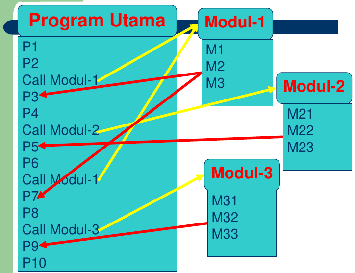
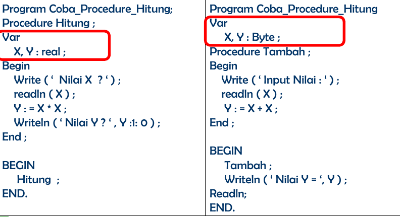

# Procedure & Function

## Tujuan Pembelajaran

- Setelah menyelesaikan perkuliahan pada bab ini diharapkan mahasiswa:

  * Mengerti dan memahami fungsi procedure / modul dan function dalam pemrograman.
  * Mampu dan menjalaskan fungsi procedure / modul dan function dalam pemrograman pada umumnya dan pascal khususnya.
  * Mampu dan dapat menerapkan atau mengimplementasikan fungsi modul dalam pembuatan program baik untuk skala kecil maupun besar.

## Materi Pokok

- Modul (Pengertian, Struktur, Bentuk dan Penerapan).
- Paramenter dan Procedure (Jangkauan variabel local dan global, Perbedaan dan Pengiriman procedure).
- Procedure dalam Procedure.
- Procedure memanggil dirinya sendiri (recrisive).
- Function.

## Pemrograman Modular

- **Modul** adalah suatu teknik untuk memecah program yang besar menjadi beberapa program kecul (modul).
- Program besar dipecah menjadi bebrappa subprogram yang kecil, tiap subprogram kadangkala independen dengan program utama.
- Tiap subprogram disebut dengan **Modul** sehingga suatu program utama dapat dibuat menjadi beberapa modul.
- Bahasa pemrograman menamakan modul: subroutine, procedure atau function.
- **Modul** dapat dipanggil *(called)* dari program utama.

## Struktur



## Keterangan

Pemanggilan Modul dari Program Utama\
Anak panah **Kuning** ke modul : Memanggil Modul dari Program Utama.\
Anak panah **Merah** dari modul : Kembali dari Modul Ke instruksi setelah pemanggilan modul.
 
## Keuntungan

1. Program jadi lebih pendek.
2. Mudah menulis dan mendokumentasikan.
3. Mudah dibaca dan dimengerti (dibandingkan dengan non modular yang banyak instruksi)
4. Mengurangi kesalahan dan mudah mencari kealahan *(debug)* program.
5. Kesalahan yang terjadi bersifat "local".

## Dua Bentuk Pemrograman Modular: Procedure dan Function

- Struktur setiap subprogram tersebut pada hakekatnya sama, yaitu:

  * Nama modul (subprogram).
  * Bagian deklarasi.
  * Algoritma (instruksi yang akan dilaksanakan).

- Perbedaan penggunaannya dalam bahasa pemrograman pascal:

  * Procedure merupakan modul (subprogram) yang melakukan aktifitas tertentu tanpa adanya pengembalian *(return)* nilai.
  * Fungsi terdapat pengembalian *(return)* nilai

## Procedure

- Procedure dalam pascal dapat berbentuk:

  * Procedure yang didefinisikan dan dibuat sendiri oleh programmer.
  * Procedure yang telah disediakan oleh pascal *(Standard Procedure)*.

- Procedure yang dibuat sendiri oleh programmer harus dideklarasikan terlebih dahulu di deklarasi procedure.

## Deklarasi Procedure

- Procedure merupakan bagian yang terpisah dari program dan dapat diaktifkan dimanapun di dalam program.
- Kata kunci `procedure` digunakan sebagai judul dari bagaian deklarasi procedure, diikti oleh identifier yang merupakan nama dari procedurenya dan secara optional dapt diikuti oleh kumpulan parameter yang diakhiri dengan titik koma (;).

## Bentuk Umum Procedure

```pascal
procedure nama-prosedur[(deretan-parameter)];
  {bagian deklarasi kostanta, tipe, variabel, dan procedure / fungsi}
  begin
    {statement dalam bandan prosedur}
  end;
```

## Penerapan Procedure

```pascal
program Judul_Program;
var
  {Bagian deklarasi procedure, sifatnya global ...}

procedure Nama_Prosedur;
  var
    {Bagian deklarasi procedure yang sifatnya local}
  begin
    {statement}
  end;

{program utama}
begin
  {statement}
end.
```

## Contoh program

```pascal
program Contoh_Prosedur;
uses crt;

procedure Coba;
begin
  writeln('Saya ada dalam Procedure Coba');
  readln;
end;

{Program Utama}
begin
  clrscr;
  writeln('Alu diluar procedure, di dalam Program Utama');
  Coba;
end.
```

---

```pascal
program Hitung_Luas_Segi_Tiga;
uses crt;

var
  alas, tinggi : integer;
  luas : real;

procedure luas_segitiga;
begin
  luas := alas*tinggi/2;
  writeln('Luas Segi tiga adalah : ', luas:4:2);
end;

begin
  clrscr;
  write('Masukan berapa Alasnya : ');readln(alas);
  write('Masukan berapa Tingginya : ');readln(tinggi);
  luas_segitiga;
end.
```
---

```pascal
program Hitung_Pembayaran_Kontah;
uses crt;
var
  nama : string;
  pot, bayar, harga, total : real;
  jml : integer;

procedure hitung;
begin
  pot := 0.15 * total;
  bayar := total - pot;
  writeln('Jadi dapat potongan sebesar : ', pot:5:2);
  writeln('Jumlah Pembayarannya adalah : ', bayar:6:2);
end;

begin
  clrscr;
  write('Nama Barang           : '); readln(nama);
  write('Masukan Harga Barang  : '); readln(harga);
  write('Masukan Jumlah Barang : '); readln(Jumlah);

  total := harga * jumlah;
  writeln('Jadi totalnya Harga adalah : ' total:6:2);
  hitung;
  readln;
end. 
```

## Latihan

1. Buatlah Procedure yang lebih dari satu procedure tiga atau empat procedure dalam programa utama.
2. Buatlah Procedure untuk menghitung  Luas dan keliling Lingkaran sendiri-sendiri.
3. Buatlah Program untuk menghitung luas Segitiga yang intput, proses dan laporan dibuatkan procedure (masuk, proses, laporan).

## Paramenter Dalam Procedure

- Nilai di dalam suatu modul program pascal sifatnya **local** (hanya dapat digunakan pada modul atau unit program yang besangkutan saja, tidak dapat digunakan pada modul / unit program yang lain).
- Untuk bersifat **global** harus dideklarasikan di luar modul atau unit program.

## Jangkauan variabel Global dan Local

```pascal
program Judul_Program;
var
  X : real;

procedure Nama_Prosedur;
  var
    Y : integer;
  begin
    {statement}
  end;

{program utama}
begin
  {statement}
  Nama_Prosedur;
end.
```

X adalah variabel global\
Y adalah variabel local

var X blok program utama sedangkan var Y berada di dalam procedure Nama_Prosedur; 

## Perbedaaan Local dan Global



## Contoh Program

**LOCAL**

```pascal
program Hitung_Luas_Segi_Empat;
uses crt;
procedure Empat;
var
  lebar, panjang, luas : integer;

begin
  clrscr;
  write('Masukan Lebar : ');readln(lebar);
  write('Masukan Panjang : ');readln(panjang);
  luas := lebar * panjang;
  writeln('Jadi Luas Segi Empat Adalah : ', luas);
  readln;
end;

begin
  Empat;
end.
```

**GLOBAL**

```pascal
program Hitung_Luas_Segi_Empat;
uses crt;
var
  lebar, panjang, luas : integer;

procedure Empat;
begin
  clrscr;
  write('Masukan Lebar : ');readln(lebar);
  write('Masukan Panjang : ');readln(panjang);
  luas := lebar * panjang;
end;

begin
  Empat;
  writeln('Jadi Luas Segi Empat Adalah : ', luas);
  readln;
end.
```

## Procedure Manggil Procedure-Procedure Bersarang

- Di dalam suatu procedure yang dibuat sendiri dapat memanggil procedure lainya atau istilahnya adalah procedure memanggil procedure.
- Disebut *Nested Procedure* (Procedure Bersarang).
- Procedure yang berada di dalam prosedur yang lainnya.

## Procedure Panggil Procedure

```pascal
program Procedure_Panggil_Procedure;
uses crt;

procedure satu;
  begin
    writeln('Halo kawan aku di procedure ke satu');
  end;

procedure dua;
  begin
    writeln('Halo sobat aku di procedure ke dua');
  end;

procedure tiga;
  begin
    writeln('Halo teman aku di procedure ke tiga dan panggil satu dan dua');
    satu;
    dua;
  end;

procedure empat;
  begin
    writeln('Halo boys aku di procedure ke empat');
  end;

begin
  clrscr;
  writeln('Aku di program Utama mau panggil procedureku');
  writeln('Aku panggilin procedure tiga dan empat');
  tiga;
  empat;
  readln;
end.
```

## Prosedur Memanggil Dirinya Sendiri (recrisive)

```pascal
program Panggil_Diri_Sendiri;
uses crt;

var
  i : integer;

procedure ulang;
  begin
    writeln('Aku Lagi Belajar Pascal');
    i := i + 2;
    if i <= 10 then
      ulang;
      writeln('aku ada dalam procedure ke ', i);
  end;

begin
  clrscr;
  i := 1;
  ulang;
  readln;
end.
```

## Function (Fungsi)

Fungsi secara garis besar sama dengan procedure baik parameter maupun pemanggilan parameternya hanya yang membedakan adalah nama fungsi harus dideklarasikan dengan type datanya sehingga dikatakan function dapat mengmbalikan nilai.

## Bentuk Umum

```pascal
function identifier(daftar parameter):type;
```

## Paramenter nilai dalam fungsi

- Paramenter dalam function dalam dikirimkan secara nilai atau secara acuan.
- Penulisan judul function yang menggunakan parameter secara nilai adalah :
- `function besar(a,b : real) : real;`

## Contoh Program

```pascal
program Penggunaan_parameter;
uses crt;

function besar(a, b : real) : real;
  begin
    if a > b then
      besar := A
    else
      besar := b;
  end;

var
  nil1, nil2 : real;

begin
  clrscr;
  write('Bilangan pertama = ')readln(nil1);
  write('Bilangan kedua = ')readln(nil2);
  writeln('Bilangan terbesar = ', besar(nil1, nil2):4:2);
  readln;
end.
```

## Penutup

- Modul adalah suatu teknik untuk memecah program yang besar menjadi beberapa program kecil(modul).
- Program besar dipecah menjadi beberapa sub-program yang kecil, tiap sub-program kadangkala independen dengan Program Utama.
- Prosedur merupakan bagian yang terpisah dari program dan dapat diaktifkan dimanapun di dalam program.
- Variable local hanya di kenal dalam area tersebut sendangkan variabel global di kenal diseluruh program Utama.
- Jika variabel tersebut dideklarasikan di dalam procedure maka variabel tersebut adalah local.
- Jika variabel tersebut di deklarasi di dalam program utama maka variabel tersebut adalah global.

