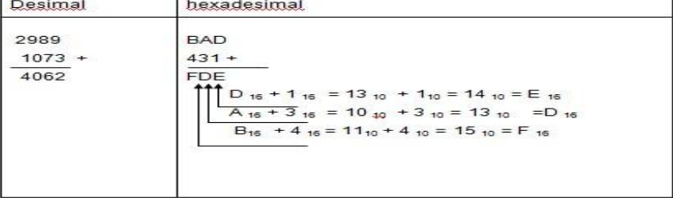
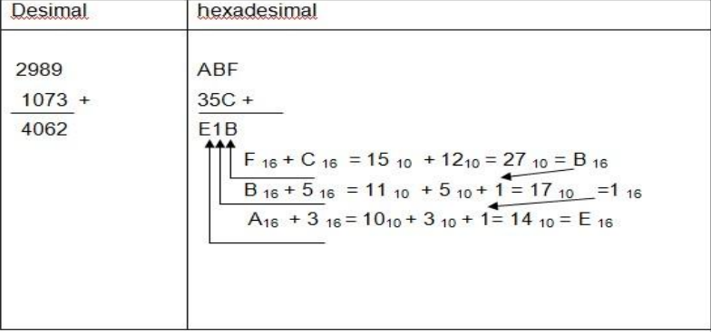
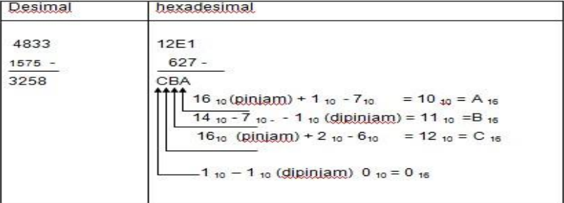

# Bilangan Hexadecimal

- Sistem bilangan heksadesimal merupakan sistem bilangan basis 16. Meskipun pada sistem digital dan komputer operasi secara fisik dikerjakan secara biner, namun untuk representasi data banyak digunakan format bilangan heksadesimal karena format ini lebih praktis, mudah dibaca dan mempunyai keungkinan timbil kesalahan lebih kecil. Penerapan format heksadesimal banyak digunakan pada penyajian memori, penyajian isi memori, kode instruksi dan kode yang mempresentasikan alfanumeric dan karakter nonnumeric.
- Pada sistem bilangan ini terdapat 16 lambang, yaitu:
- **H = {0, 1, 2, 3, 4, 5, 6, 7, 8, 9, A, B, C, D, E, F}**
- Ciri suatu bilangan menggunakan sistem bilangan *heks* atau 16 atau tambahan huruf *H* di akhir suatu bilangan. Contoh :
- 271 *heks*, 271 *16*, 271 *H*

## Konversi Bilangan Heksadesimal ke Desimal

- Konversi bilangan heksadesimal ke desimal dilakukan dengan menjumlahkan hasil perkalian sema digit heksadesimal dengan beratnya.
- Tabel bantu

+--------+----+----+----+----+----+----+----+----+----+----+----+----+----+----+----+----+
|Desimal |  0 |  1 | 2  | 3  |  4 | 5  | 6  | 7  | 8  | 9  | 10 | 11 | 12 | 13 | 14 | 15 |
+--------+----+----+----+----+----+----+----+----+----+----+----+----+----+----+----+----+
|Hex		 |  0 |  1 | 2  | 3  |  4 | 5  | 6  | 7  | 8  | 9  | A  | B  | C  | D  | E  | F  |
+--------+----+----+----+----+----+----+----+----+----+----+----+----+----+----+----+----+
|Biner	 |0000|0001|0010|0011|0100|0101|0110|0111|1000|1001|1010|1011|1100|1101|1110|1111|
+--------+----+----+----+----+----+----+----+----+----+----+----+----+----+----+----+----+

271H = 625 Des
2   7   1
271 = 2*16² + 7*16¹ + 1*16º 
		= 512 + 112 + 1
		= 625 Des

0,C = 
C = 12
0,C = 0*16º + 12 * 16-¹
		= 0+0.75
		= 0.75

## Konversi Bilangan Desimal ke Heksadesimal

Konversi bilangan desimal bulat ke heksadesimal dilakukan dengan membagi secara berulang-ulang suatu bilangan desimal dengan 16. Sisa setiap pembagian merupakan digit heksadesimal yang didapat.

Contoh :

1.
625des = 271heks
625/16 = 39 sisa 1
39 /16 = 2  sisa 7
2  /16 = 0  sisa 2
625des = 271heks

2.
958 des = 3BE heks
958 /16 = 59 sisa 14
59  /16 = 3	 sisa 11
3   /16 = 0  sisa 3
jadi		= 3BE

## Konversi Bilangan Heksadesimal ke Biner

Konversi bilangan heksadesimal ke biner lebih mudah dibandingkan konversi bilangan heksadesimal ke desimal. Satu digit heksadesimal dikonversi ke 4 bit.

Contoh:
1.
0x271 = 0b1001110001
2 = 0010
7 = 0111
1 = 0001
0x271 = 0b001001110001

2.
0x0.19 = 0b0.00011001
0 = 0000
1 = 0001
9 = 1001
0x0.19 = 0b0.00011001

## Konversi Bilangan Biner ke Heksadesimal

Konversi bilangan biner ke heksadesimal lebih mudah diandingkan konversi bilangan desimal ke heksadesimal. Untuk bagian bulat, kelompokan setiap empat bit biner dari paling kanan, kemudian konversikan setiap kelompok ke satu digit heksadesimal. dan untuk bagian pecahan, kelompokkan setiap empat bit biner dari paling kiri, kemudian konversikan setiap kelompok ke satu digit heksadesimal. Proses ini merupakan kebalikan dari proses konversi bilangan heksadesimal ke biner.

Contoh:
1.
0b1001110001 = 0x271
10 0111 0001
2		7		 1

2. 
0b0.00011001 = 0x0.19
0000 0001 1001
0     1		9

## Operasi Aritmatika Pada Bilangan Hexadecimal (penjumlahan)

- Langkah-langkah penjumlahan hexadecimal
- Tambahkan masing-masing kolom secara desimal.
- Rubah dari hasil desimal ke hexadecimal.
- Tuliskan hasil dari digit paling kanan dari hasil hexadecimal.
- Kalau hasil penjumlahan tiap-tiap kolom terdiri dari dua digit, maka digit paling kiri merupakan carry of untuk penjumlahakan kolom selanjutnya.
- 
- 

## Operasi Aritmatika Pada Bilangan Hexadecimal (Pengurangan)

Pengurangan bilangan hexadecimal dapat dilakukan secara sama dengan pengurangan bilangan desimal.

## Soal Latihan

1. Heksa Ke Desimal
	* 0x5B  = 91
	* 0x93A = 2362
2. Desimal Ke Heksa
	* 45  = 2D
	* 145 = 91
3. Heksa Ke Biner
	* 0x4B  = 0b10010111
	* 0x41F = 0b10000011111
4. Biner Ke Heksa
	* 0b1010011   = 0x53
	* 0b110001101 = 0x18D

## Penjumlahakn dan Pengurangan

1. 0x17B + 0x19A = 0x315
2. 0x32F + 0x12E = 0x45D
3. 0xADE + 0x11A = 0x9C3
4. 0xBA7 + 0x12F = 0xA78

