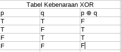
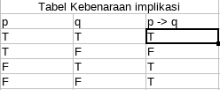
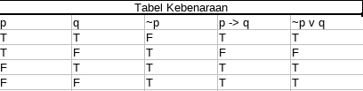

# Pertemuan 2

## Disjungsi Esklusif

Kata atau *(or)* dalam operasi logika digunakan salah satu dari dua cara :

- **Inclusive OR**

  - *atau* berati "p atau q atau keduanya".
  - Contoh : Tenaga IT Perlu menguasai bahasa C++ atau Java.

- **Exlusive OR (XOR)**

  - *atau* berati "p atau q tapi bukan keduanya".
  - Contoh : ia dihukum 5 tahun penjara atau denda 10 juta rupiah.

## Tabel Kebenaran XOR



- Bentuk Proposisi : "Jika p, maka q".
- Notasi : p -> q.
- Proposisi p disebut hipotesis, antesden, premis atau kondisi.
- Proposisi q di sebut kolusi / konsekuaen

## Contoh

1. Jika saya lulus ujian, maka saya mendapat hadiah dari ayah.
2. JIka suhu mencapau 80 derajat, maka alaran akan berbunyi.
3. Jika anda tidak mendaftar ualng, maka anda diangap mengundurkan diri.

## Cara-cara mengekspresikan implkasi p -> q

1. Jika p, maka q.
2. Jika p, q.
3. p mengakibatkan q *(p implies q)*.
4. q jika p.
5. p hanya jika q.
6. p syarat cukup untuk q *(suffient condition)*.
7. q syarat perlu untuk p *(necessaru condition)*.
8. q bilamana p *(q whenever p)*.

## Tabel Kebenaran implikasi



## Buktikan p -> == ~ v q



## Implikasi didalam bahasa pemrograman

```pascal
if C then S
```

C : ekspresi logika yang memerlukan syarat.
S : Satu atau lebih pernyataan.

- Struktur if-then pada bahasa pemrograman berbeda dengan implikasi if-then yang digunakan pada logika
- Penyataan if-then dalam bahasa pemrograman bukan proposisi karena tidakk ada respondansi antara pernyataan tersebut dengan operator implikasi (->)
- Interpreter & Compiler tidak melakukan penilaian kebenaran pernyataan if-then secara logika intepreter hanya memeriksa kebenaran kondisi C, jika benar C maka S akan dieksekusi.

## Latihan

(m ^ ~n) -> r

i = dapat mengakases internet
m = mahasiswa informatika
s = seorang sarjana
(m ^ ~s) -> i


