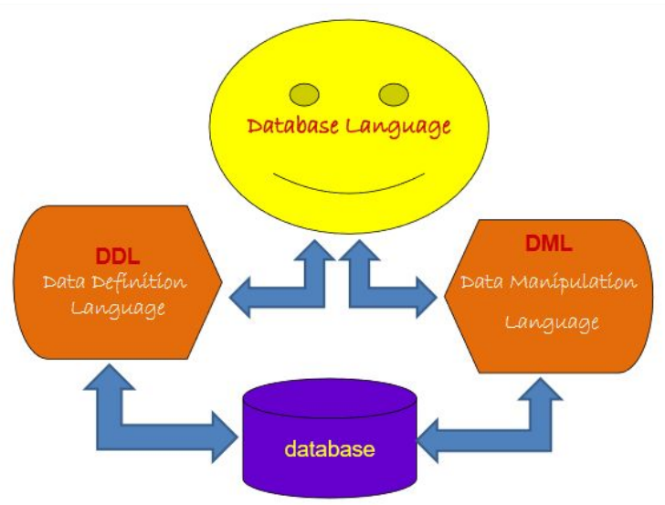

# Pertemuan 5

## Database Languague

- Merupakan perantara bagi pemakai untuk berinteraksi dengan database yang tersimpan pada data store
- SQL, dBASE, QUEL, dll



## Database Languague terdiri dari 2 bentuk

- Data Definition languague (DDL)
  - Bahasa untuk mendekripsikan data (Metada atau Data Dictionary)
- Data Manupulation languague (DML)
  - Bahasa yang digunakan untuk melakukan manipulasi dan pengambilan data pada suatu database (inseting, deleting, updating, searching, loading)

## DDL (Data Definition Languague)

- Struktur database menggambarkan desain database secara kesuluruhan, dimana kita dapat membuat tabel baru, membuat indeks, mengubah tabel, menentukan struktur penyimpanan tabel.
- Hasil dari kompikasi tabel yang disimpan dalam file khusus yang disebut kamus Data (Data Dictionary)
- Kamus Data merupakan suatu metadata yang mendekripsikan data yang sesunggunya
- Bahasa query yang digunakan adalah `CREATE`(membuat database maupun tabel), `ALTER`(perubahan database/tabel baik penamabahan kolom, mengganti nama field, memodifikasi kolom, dll), `DROP`(Menghapus database atau tabel)

---

- `CREATE` untuk membentuk basis data tabel atau index
- `ALTER` untuk mengubah struktur tabel
- `DROP` untuk menghapus basis data, tabel, atau index

## Contoh DDL (Data Definition Languague)

- Membuat tabel dalam database, `create table pasien(no_rm char(10)) not null primary key, nm_pas char(25), alm_pas char(40);`
- Merubah data tabel, `Alter TABLE pasien add kata varchar(25);` `Alter TABLE pasien Drop Column kata;`
- Menghapus sebuah tabel `DROP TABLE Buku;`

## DML (Data Manupulation Languague)

- Terdiri dari perintah-perintah yang disediakan untuk melakukan manipulasi data dan pengambilan data pada suatu database. Manipulasi data berupa:
  - Penyisipan / Penambahkan data baru ke suatu database.
  - Penghapusan data dari tabel
  - Pengubahan data dari tabel

DML merupakan bashas yang bertujuan memudahkan pemakai untuk mengakses data(untuk kemudian menapilkannya atau memanipulasinya sebagaimana direpresentasikan oleh model data.)

## Jenis DML

- Ada 2 jenis prosedur DML yaitu:
  - Perosedur yang mensyaratkan agar pemakai menentukan data apa yang diinginkan serta bagaimana cara mendapatkannya
  - Non Perosedural yang membuat pemakai dapat menentukan data apa 

## Contoh Perosedural

```sql
?try{
  Statement st=connection.createStatement();
  ResultSetrs = st.executeQuery("SELECT * FROM mahasiswa");
  while (rs.next){
    String s = rs.getString(1);
    // dst ..
  }
} catch (SQLExecptione) {

}
```

## Contoh Non Perosedural

- `SELECT ... FROM ... WHERE ...`
- `INSERT INTO ... VALUES ...`
- `UPDATE ... SET ... WHERE ...`
- `DELETE FROM ... WHERE ...`

## DCL (Data Control Languague)

- DCL singkatan dari Data Control Languague, konsep ini digunakan untuk merubah hak akses, memberikan roles(peran manajerial), dan isu lain yang berhubungan dengan keamanan database.
- Contoh DCL dalam database
  - Ada dua perintah **SQL** yang termasuk dalam DCL yaitu `GRANT` dan `REVOKE`.
  - `GRANT SELECT, UPDATE ON Nama_Database TO user1, user2;` 
  - `REVOKE SELECT, UPDATE ON Nama_Database FROM user1, user2;` 

---

- Penjelasan:
  - Perintah `GRANT` memberikan kewenangan terhadap pengguna untuk melakukan operasi pada suatu databse.
  - Perintah `REVOKE` berfungsi untuk menghulangkan hak peringah kepada user tertentu terhadap objek atau schema databse.

## TCL (Transaction Control Languague)

- __TCL__ Singkatan dari Transaction Control Languague, digunakan untuk mekanisme dalam pemrosesan seba ransaksi dalam database.
- Dua perintah __SQL__ yang paling populer untuk __TCL__ adalah `ROOLBACK` dan `COMMIT`
- Contoh __TCL__ dalam database

```tcl
BEGIN TRAN
  DELETE FROM Buku WHERE id = 1125;
  ROOLBACK
  // COMMIT

```

---

- Penjelasan:
  - __BEGIN TRAN__ digunakan untuk perintah bahwa akan dimulai suatu transaksi / query, pada bagian akhir terdapat perintah `ROOLBACK` dan `COMMIT`.
  - __ROLLBACK__ artinya query yang ada diantara begin tran tidak akan dieksekusi dalam database secara langsung, dalam artian data sesunggunya tidak berubah.
 
---

- Penggunakan __TCL__ ini untuk melihat apakah query yang dijalankan sudah benar atau belum.
  - Jika masih salam programmer atau BDA dapat memperbaikinya lagi sehingga tidak membahanyakan data dalam tabel fisiknya.
  - Jisa sudah benar, maka DBA dapat meremark __TCL__ `ROOLBACK` dan mengaktifkan perintah __TCL__ `COMMIT` untuk memberikan perubahan pada tabel fisik.

