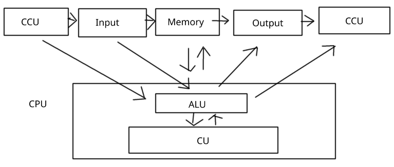
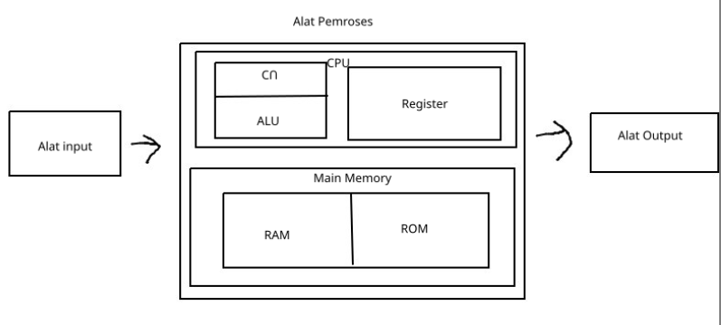

# Pertemuan 1

## Definisi Komputer

`computate -> compute -> menghitung`

adalah alat elektronik yang dapat menerima input data dan mengolah data dengan memberikan informasi yang menggunakan suatu program yang tersimpan pada memori dan dapat menyipan program hasil pengolah dengan otomatis.

## Siklus Pengolahan Data

`input -> processing -> output`

- data : Kumpulan kejadian yang diakngat pada suatu karyawan.
- Pengolahan : Manipulasi dari data kedalam bentuk yang lebih berguna dan bearti.
- informasi : Hasil dari kegiatan pengolahan data yang memberikan bentuk yang lebih berati dari suatu kejadian.

## Pengembangan Siklus Pengolahan data

`organisasi -> input -> processing <-> storage`

- Organitation : tahap yang berhubungan dengan proses pengumplan data.
- Input : Tetap proses pengolahan dari data yang sudah diamasukan yang dilakukan oleh alat proses.
- Processing : Tahap prosess pengolahan dari data yang sudah dimasukan yang dilakukan oleh alat prosess.
- Output : Tahap proses menghasilkan output dari hasil pengolahan data ke alat output.
- Distribution : Tahap penyebaran output kepihak yang membutuhkan informasi.
- Storage : Tahap proses perekaman pengolahan kesimpan luar.

## Pengenalan Hardware

### Alat input/output

* Secara langsung : Keyword, printer, mouse, monitor.
* Secara Tidak langsung : Punch card, Pita Magnetik, Disk Magnetik.

### Alat pemroses

* Tugas aritmethic Logic Unit (ALU)
  - Melakukan semua proses perhitungan alritmatika yang terjadi sesuai instruksi program.
  - Melakukan penrmabilan keputusan dari operasi logika sesuai dengan instruksi program.
 
* Tugas Control Unit
  - Mengatur dan mengendalikan alat I/O.
  - Mengambil instruksi dari main memory.
  - Mengambil data dari main memori jika diperlukan oleh proses.
  - Mengirim instruksi ke ALU bila ada perhitungan aritmatika / perbandingan logika serta mengawasi kerja ALU.
  - Menyimpan hasil proses ke main memory.

* Alat penyimpanan
  - Main Memory : dipergunakan untuk menyimpan instruksi dan data yang akan diproses dan hasil pengolahan.
  - Register : DIpergunakan untuk menyimpan instruksi dan data yang sedang diproses.
  - External Memory : Dipergunakan untuk menyipan program dan data secara permanen (Simpanan luar).

* Main Memory, main storage, internal memory, internal storage, primary storage, temporary storage, immediate storage:
  - Merupakan tempan penyimpanan tersebar dalam komputer.
  - Ukuran dari main memory ditunjukan olleh satuan Byte:
  - 1 KB  = 1024 Byte.
  - 1 MB  = 1024 KB.
  - 1 GB  = 1024 MB.
  - 1 Byte memory terdiri dari 8 Bit (Binary digit), dimana setiap digit diwakili oleh digit 1 atau 0, sehingga membentuk kode pada lokasi memory (address).
  - SIstem pengkodeanya dapat berbentuk BCD, SBCDIC, EBDIC, atau Kode ASCII.
  - 

* RAM (Random Access Memory) ialah penyimpanan yang dapat diisi dan diambil disinya oleh programmer.
  - Struktur RAM
  - Input Storage : Untuk menampung input yang dimasukan oleh alat input.
  - Program Storage : Untuk menyimpan semua instruksi yang akan diproses.
  - Working Strorage : Untuk menyimpan data yang akan diolah dan dari hasil proses.
  - Output strorage : Untuk menampung hasil akhir dari pengolahan data yang akan ditampilkan ke alat output.

