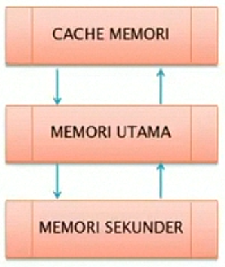
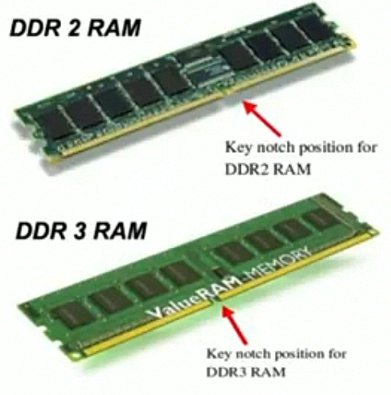
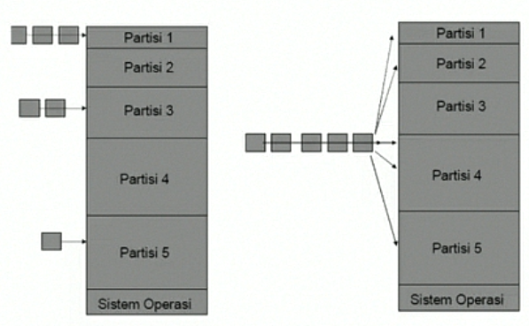

# Manajemen Memori Pemartisian Statis

## Fungsi Memori

- Mengelola informasi memori yang dipakai dan tidak sedang dipakai.
- Mengalokasikan memori ke proses yang diperlukan.
- Mendealokasikan (menata ulang) memori dari proses yang telah selesai.
- Mengelola swapping antara memori utama dan disk.

## Manajemen Memori Pada Sistem MultiProgramming

Sistem operasi harus mendukung dua kebutuhan yang saling bertentangan yaitu :

- Pemisahan ruang-ruang alamat.
- Pemakaian bersama memori.

## Manajemen Memori Berdasarkan Keberadaan Swapping

- Manajemen tanpa swapping (Manajemen memori tanpa pemindahan citra proses antara memori utama dan disk selama eksekusi).
- Manajemen dengan swapping (Manajemen memori dengan pemindahan citra proses antara memori utama dan disk selama eksekusi).

## Hirarki Memori

- Pemakaian memori 2 tingkat menggunkaan cache memori dapat meingkatkan kinerja dan utilisasi memori secara dramatik. Cache memori lebih mahal dibandingkan memori utama sehingga cache relatif kecil.

## Jenis Memori

## Manajemen Memori Tanpa Swapping

- Monoprograming.
- MultiProgramming dengan pemartisian statis.

## Manajemen Memori Mono Programming

- Hanya 1 proses pada satu saat.
- Hanya satu proses menggunkaan semua materi.
- Pemakai muatankan program ke seluruh memori dari disk atau tape.
- Program mengambil kendali semua mesin.

## MultiProgramming Dengan Pemartisian Statis

- Mempermudah pemogram.
- Agar dapat memebrikan layanan interaktif ke beberapa orang secara simlutan.
- Efisiensi pengunaan sumber daya.
- Eksekusi lebih mudah jika proses besar dipecah menjadi beberapa proses kecil.
- Dapat mengerjakan sejumlah job secara simultan.

## Pemartisian Menjadi Partisi-partisi Berukuran sama 

- Beberapa proses yang ukurannya kurang atau sama dengan ukuran partisi dimasukan ke sembarang partisi yang berbeda.
- Kekuranganya bila program ukurannya lebih besar dari dibanding partisi yang tersedia maka program tidak dapat dimuatkan.
- Kekuranganya juga untuk program yang ukurannya kecil dibanding ukuran partisi maka banyak ruang yang tidak terpakai.

## Strategi Penempatan pada partisi-partisi yang ukurannya berbeda 

- Satu antrian untuk tiap partisi.
- Satu antrian untuk semua partisi.

## Satu Antrian untuk tiap proses

- Proses ditempatkan ke partisi yang paling kecil yang dapat memuatnya.
- Keuntungan : meminimalkan pemborosan memori.
- Kelemahan : dapat terjadi antrian panjang disuatu partisi sementara antrian partisi-partisi yang lain kosong.

## Satu Antrian untuk tiap proses

- Proses-proses dianrikan tungggal untuk semua partisi. Proses segera ditempatkan di partisi bebas paing kecil yang dapat memuat.
- Keunggulan : lebih fleksibel seta implementassi dan operasi lebih minimal karena hanya mengelola satu antrian.
- Kekurangan : Proses dapat ditempatkan dipartisi yang banyak diboroskan, yaitu proses kecil ditepatkan dipartisi yang sangat besar.

## Antian antar Partisi

