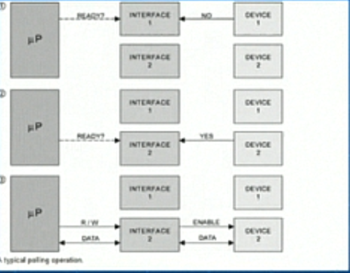
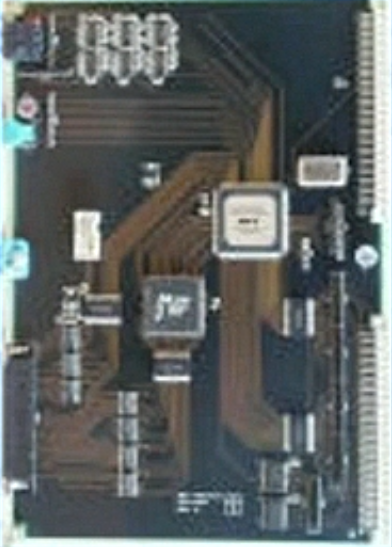

# Perangkat Keras I/O

## Pooling

* *Busy-Waiting/ polling* adalah ketika *host* mengalami *looping* secara terus menerus sampai status *busy* di clear.
* Pada dasarnya *pilling* dapat dikatakan efisien. Akan tetapi polling menjadi tidak efisien ketika setelah berulang-ulang melakukan *looping* hanya menemukan sedikit *device* yang siap untuk  *men-service*, karena CPU *processing* yang tersisa belum selesai.
* 

## Interupsi

- **Mekanisme Dasar Interupsi**
	* Ketika CPU mendeteksi bahwa sebuah *controller* telah mengirimkan sebuah sinyal ke *interrupt request line* (membangkitkan sebuah interupsi), CPU kemudian menjawab interupsi tersebut (juga disebut menangkap interupsi) dengan menyimpan beberapa informasi mengenai *state* terkini CPU, Contohnya nilai instruksi *pointer*, dan memanggil *interrupt handler* agar *handler* tersebut dapat melayani *controller* atau alat yang mengirim interupsi tersebut.
- **Fitur Tambahan pada komputer Modern**
	* Pada arksitektur komputer modern, tiga fitur disediakan oleh CPU dan **interrupt controller** (pada perangkat keras) untuk dapat menangani interrupsi dengan lebih bagus. Fitur-fitur ini antara lain adalah kemampuan menghambat sebuah proses *interrupt handling* selama prosesi berada dalam *critical state*, efisiensi oenanganan interupsi sehingga tidak perlu dilakukan polling untuk mencari *device multilevel* sedemikian rupa sehingga terdapat prioritas dalam penanganan interupsi (diimplementasi dengan *interrupt priority level state*)
- **Interrupt Request Line**
	* Pada piranti keras CPU terdapat cable yang disebut *interrupt request line*, kebanyakan CPU memiliki dua macam *interrupt request line*, yaitu *nonmaskable interrupt* dan *maskable interrupt*. *Maskable interrupt* dapat dimatikan/dihentikan oleh CPU sebelum pengeksekusian deretan *critical instruction (critical instruction squence)* yang tidak boleh diinterupsi. Biasanya, interrupt jenis ini digunakan oleh *device controller* untuk meminta pelayanan CPU.
- **Interrupt Vector dan Interrupt Chaining**
	* Sebuah mekanisme interupsi akan menerima alamat *interrupt handling routine* yang spesifik dari sebuah set, pada kebanyakan arksitektur komputer yang ada sekarang ini, alamat ini biasanya berupa sekumpulan bilangan yang menyatakan *offset* pada sebuah tabel (biasa disebut *interrupt vector*). Tabel ini menyimpan alamat-alamat *interrupt handler* spesifik di dalam memori. Keuntungan dari pemakaian vektor adalah untuk mengurangi kebutuhan akan sebuah *interrupt handler* yang harus mencarari semua kemungkinan sumber interupsi untuk menemukan pengirim interupsi.
- **Penyebab Interupsi**
	* Interupsi dapt disebabkan berbagai hal, antara lain *exception, page fault,* interupsi yang dikirimkan oleh *device controller*, dan *system call Exception* adalah suatu kondisi dimana terjadi sesuatu atau dari sebuah operasi didapat hasil tertentu yang dianggap khusus sehingga harus mendapat perhatian lebih, contohnya pembagian dengan 0 (nol), pengaksesan alamat memori yang *restricted* atau bahkan tidak valid, dan lain-lain.
	* *System Call* adalah sebuah fungsi  pada aplikasi (perangkat lunak yang dapat mengeksekusikan instruksi khusus berupa *software interrupt* atau *trap*).

## DMA

**DMA** adalah sebuah prosesor khusus (special purpose processor) yang berguna untuk menghindari pembebanan CPU utama oleh program I/O (PIO).

**Trnasfer DMA**

- Untuk memulai sebuah transfer DMA, *host* akan menuliskan sebuah DMA *command block* yang berisi *pointer* yang menunjuk ke sumber transfer *pointer* yang menunjuk ke tujuan / destinasi transfer, dan jumlah *byte* yang ditransfer, ke memori. CPU kemudian menuliskan alamat *command block* ini ke DMA *controller*, sehingga DMA *controller* dapat kemudian mengoperasikan *bus* memori secara langsung dengan menempatkan alamat-alamat pada *bus* tersebut untuk melakukan transfer tanpa bantuan CPU. Tiga langkah dalam transfer DMA:
	* Prosesor menyiapkan DMA transfer dengan menyediakan data-data dari *device*, operasi yang akan ditampilkan, alamat memori yang menjadi sumber dan tujuan data, dan banyaknya byte yang ditransfer.
	* DMA *controller* mulai operasi (menyiapkan bus, menyediakan alamat, menulis dan membaca data), sampai seluruh blok sudah di transfer.
	* DMA *controller* meng-interupsi prosesor, dimana selanjutnya akan ditentukan tindakan berikutnya.
- Pada dasarnya, DMA mempunyai dua metode yang berbeda dalam mentransfer data. Metode yang pertama adalah metode yang sangat baku dan simple disebut **Halt**, atau *Burst Mode* DMA, karena DMA *controller* memegang kontrol dari sistem bus dan mentransfer semua blok data ke atau dari memori pada *single burst*. Selagi transfer masih dalam progres, sistem mikroprosessor di-set *idle*, tidak melakukan instruksi operasi untuk menjaga internal register. Tipe operasi DMA seperti ini ada pada kebanyakan komputer.
- Metode yang kedua, mengikutsertakan DMA *controller* untuk memegang kontrol dari sistem bus untuk jangka waktu yang lebih pendek pada periode dimana mikroprosessor sibuk dengan operasi internal dan tidak membutuhkan akses ke sistem bus. Metode DMA ini disebut *cycle stealing mode*, *Cycle Stealing* DMA lebih kompleks untuk diimplementasikan dibandingkan **Halt** DMA, karena DMA controller haus mempunyai kepintaran untuk merasakan waktu pada saat sistem bus terbuka.

### Handshaking

- Porses *handshaking* antara DMA controller dan *device controller* dilaukan melalui sepasang kabel yang disebut DMA-request dan DMA-acknowlage. Device controller mengirim sinyal melalui DMA- *request* ketika akan mengakibatkan mentransfer data sebanyak satu *word*. Hal ini kemudian akan mengakibatkan DMA *controller* memasukan alamat-alamat yang diinginkan ke kabel alamat memori, dan mengirimkan kabel DMA- *acknowlage* diterima, *device controller* mengirimkan data yang dimaksud dan mematikan sinyal pada DMA- *request*.
- Hal ini berlangsung berulang-ulang sehingga disebut *handshaking*. Pda saat DMA *controller* mengambil alih memori, CPU sementara tidak dapat mengakses memori (dihalangi), walaupun masih dapat mengakses data pada cache primer dan sekunder. Hal ini disebut dengan *cycle stealing*, yang walaupun memperlambaat komputasi CPU, tidak menurunkan kinerja karena memindahkan pekerjaan data transfer ke DMA *controller* meningkatkan performa sistem secara keseluruhan.

### Cara-cara Implementasi DMA

- Dalam pelaksanaan, beberapa komputer menggunakan memori fisik untuk proses DMA, sedangkan jenis komputer lain menggunakan alamat virtual dengan melalui tahap "penerjemahan" dari alamat memori virtual menjadi alamat memori fisik, hal ini disebut *direct virtual-memori address* atau DVMA.
- Keuntungan dari DVMA adalah dapat mendunkung transfer antara dua *memory mapped device* tanpa intervensi CPU.

# Interface Aplikasi I/O

## Pendahuluan

- Ketika suatu aplikasi ingin membuka data yang ada dalam suatu jenis disk, sebenarnya aplikasi tersebut harus dapat membedakan jenis disk apa yang akan diaksesnya. Untuk mempermudah pengaksesan, sistem pada peralatan I/O. Pendekatan inilah yang dinamakan *interface* aplikasi I/O.
- *Interface* aplikasi I/O melibatkan abstraksi, enkapsulasi, dan *software layering*. Abstraksi dilakukan dengan membagi-bagi detail peralatan-peralatan I/O ke dalam kelas-kelas yang lebih umum. Dengan adalnya kelas-kelas yang umum ini, maka akan lebih mudah untuk membuat fungsi-fungsi standar (interface) untuk mengaksesnya. Lalu kemudian adanya *device driver* pada masing-masing peralatan I/O, berfungsi untuk enkapsulasi kelas-kelas yang umum tadi. *Device driver* mengenkapsulasi tiap-tiap peralatan I/O ke dalam masing-masing 1 kelas yang umum tadi (interface standar). Tujuan dari adanya lapisan *device driver* ini adalah untuk menyembunyikan perbedaan-perbedaan yang ada pada *device controller*dari subsistem I/O pada kernel. Karena hal ini subsistem I/O dapat bersifat independen dari *hardware*

## Peralatan Block Dan Karakter

- Peralatan block diharapkan dapat memenuhi kebutuhan akses pada berbagai macam disk drive dan juga peralatan *block* lainnya. *Block Device* diharapkan dapat memenuhi/mengerti perintah baca, tulis dan juga perintah pencarian data pada peralatan yang memiliki sifat *random-access*.
- Keyboard adalah salah satu contoh alat yang dapat mengakes *stream-* karakter. *System call* dasar dari *interface* ini dapat membuat sebuah aplikasi mengerti tentang bagaimana cara untuk mengambil dan menuliskan sebuah karakter. Kemudian pada pengembangan lanjutannya, kita dapat membuat *library* yang dapat mengakses data/pesan perbaris.

## Peralatan Jaringan

- Karena adanya perbedaan dalam kinerja dan pengalamatan dari jaringan I/O, maka bisanya sistem operasi memiliki *interface* I/O yang berbeda dari baca, tulis dan pencarian pada disk. Salah satu yang banyak digunakan pada sistem operasi adalah *interface socket*.
- *Socket* berfungsi untuk menghubungkan komputer ke jaringan. *System Call* pada *socket* interface dapat memudahkan suatu aplikasi untuk membuat *local socket*, menghubungkan komputer ke socket, maka komunikasi antar komputer dapat dilakukan.

## Jam dan Timer

- Adanya jam dan timer pada *hardware* komputer, setidaknya memiliki tiga fungsi memberi informasi waktu saat ini, memberi informasi lamanya waktu sebuah proses, sebagai trigger untuk suatu operasi pada suatu waktu tertentu. Fungsi-fungsi ini sering digunakan oleh sistem operasi. Sayangnya, *system call* untuk pemanggilan fungsi ini tidak distandarisasi antar sistem operasi.
- *Hardware* yang mengukur waktu dan melakukan operasi *trigger* dinamakan *programmable interval timer*. Dia dapat di set untuk menunggu waktu tertentu dan kemudian melakukan interupsi. Contoh penerapanya ada pada *scheduler*, dimana dia akan melakukan interupsi yang akan memberhentikan suatu proses pada akhir dari bagian waktunya.
- Sistem operasi dapat mendukung lebih dari banyak *timer request* dari pada banyaknya jumlah *hardware timer*. Dengan kondisi seperti ini, maka kernel atau *device driver* mengatur list dari interupsi dengan urutan yang duluan datang yang duluan dilanyai.

## Blocking dan Nonblocking I/O

- Ketika suatu apliksai menggunakan sebuah blocking *system call*, eksekusoi aplikasi itu akan diberhentikan untuk sementara. Apliasi tersebut akan dipindahkan ke *wait queue*. Dan setelah *system call* tersebut selesai, aplikasi tersebut dikembalikan ke *run queue*, sehingga pengeksekusian aplikasi tersebut akan dilanjutkan.
- *Physical action* dari peralatan I/O bisanya bersifat *asynchronous*. Akan tetapi, banyak sistem operasi yang bersifat *blocking*, hal ini terjadi karena *blocking application* lebih mudah dimengerti dari paa *nonblocking application*.

