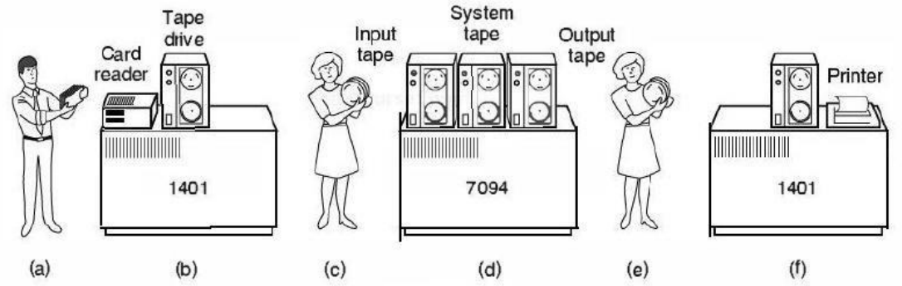

# Peremuan 6 Sistem Operasi Konsep Dasar Sistem Operasi

## Point-point Pembahasan

1. Batch System
2. Multiprograming System
3. Time Sharing System Multiporcessing System
4. Real Time System
5. SO Terpusat dan Terdistibusi

### Batch System

Suatu System job-job yang mirip dikumpulkan dan dijalankan secara kelompk kemudian setelah kelompk yang dijalankan taddi selesai maka secara otomatis kelompok lain dijalankan
**Tujuan**
unutk meningkatkan penggunaan CPU dalam menangani job-job (tugas-tugas) yang ada.

1. Programmer membawa card ke-1401
2. 1401 membaca batch jobs pada tape
3. Operator membawa input tape ke 7094
4. 7094 melakukan perhitungan
5. Operator membawa output tape ke 1401
6. 1401 melakukan print

### Multiprogramming System

Suatu system dimana job-job disimpan di memory utama di waktu yang sama dan CPU dipergunakan bergantian.

**Tugas SO dalam multiprograming**

- Menempatkan proses-proses dalam memori uatama sesuai urutan prioritasnya(bentuk antrian)

- Memasukan proses ke CPU untuk di ksekusi

- Mengatur pergantian proses

### Time Sharing System

Suatu system dimana job-job (program) disimpan dalam suatu memory utama dan bisa dijalankan secara bersamaan (banyak pengguna)

##### Keuntungan

- Tingkat kebersaan semua proses dalam penggunaan CPU semakin tinggi

- Proses bisa dikerjakan secara bergantian

## Multiprocessing System

Pemrosesan ataupun penggunaan sebuah program dengan cara serentak dari beberapa CPU (Suatu System yang memiliki lebih dari satu CPU)

#### Pararel System

Menggunakan bus, clock, memori & hardware lainya secara bersamaan.

#### Distributed System

## Real Time System

Suatu System yang mangharukan menyelesaikan suatu komutasi dalam waktu tetentu.

#### Hard RTS

Menjamin critikal taks selesai tepat waktu

#### Soft RTS

Membicarakan prioritas pada critikal taks dibanding dengan taks yang lainnya

## SO Terpusat & Terdistribusi

### SO Terpusat

SO yang dapat menangani multi pocessor dimana semua processor menggunakan satu memori

#### Kelebihan

- Hanya memiliki sedikit perbaikan pada SO multiprocessing, simple processing

- Menguasai konflik lebih mudah (CPU memiliki control seluruh sumber daya)

#### Kekurangan

- Kegagalan master dapat menyababkan kinerja sistem secara keseluruhan

- Master dapat menjadi penyabab terjadinya "Bottleneck"

### SO Terdistribusi

SO yang dapat menangani multiprocessor dimana masing-masing processor mempunyai memori utama sendiri

#### Kelebihan

- Kecepatan komputasi yang tinggi

- Kegagalan proces pada suatu processor dapat diambil oleh processor lain.

#### Kekurangan

- Kinerja SO menjadi kompleks karena harus bisa menjamin 2 CPU tidak memiliki proces yang sama

